# 两两交换链表中节点


今天分享的内容是LeetCode #24两两交换链表中节点这个题目，主要内容是迭代法和递归解法的详细思路分享：

**题目描述：**

给定一个链表，两两交换其中相邻的节点，并返回交换后的链表。

你不能只是单纯的改变节点内部的值，而是需要实际的进行节点交换。

**示例:**


输入：head = [1,2,3,4]

输出：[2,1,4,3]

**01 迭代法**

示例给出的链表示意图如下：


题目要求是两两交换链表中的相邻节点，因此，对于两个相邻节点分别用变量node1和变量node2表示，如下图。

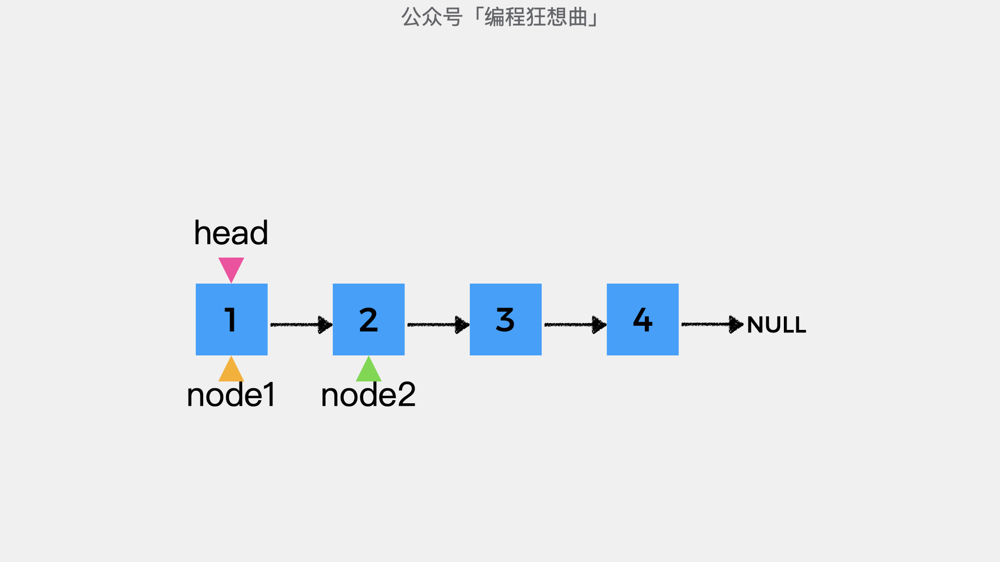


接着要做的是将变量node2指向的节点的后继指针指向变量node1指向的节点，即node2.next=node1，如下图所示：

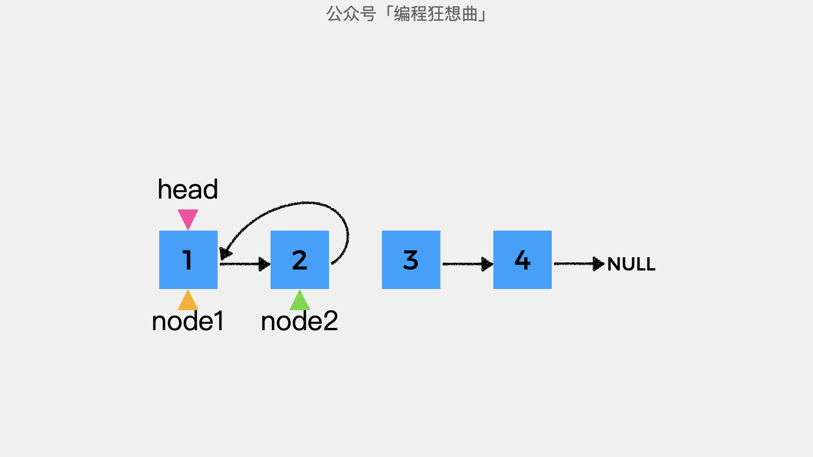


然后，需要将变量node1指向的节点的后继指针指向变量node2指向的节点的下一个节点。在这里我们用变量subHead表示变量node2指向的节点的下一个节点。

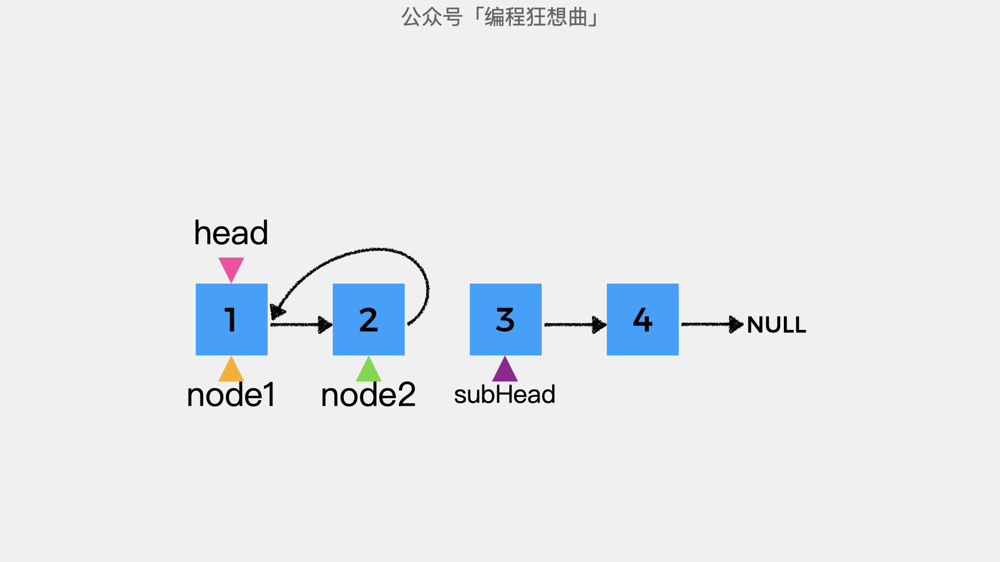


在将变量node1指向的节点的后继指针指向变量node2指向的节点的下一个节点，即node1.next=subHead，链表结构如下图所示：

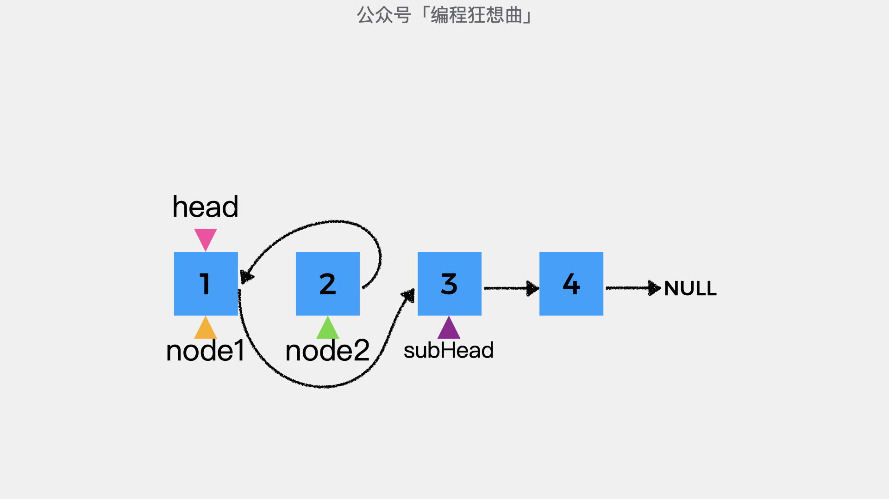


这时，变量node2指向的节点变为了链表的头节点，由于变量node2需要继续指向后续未考察的节点。所以，这里引入虚拟头节点dummyHead，其下一个节点初始为节点head。

然后，定义变量prev，初始指向虚拟头节点dummyHead。

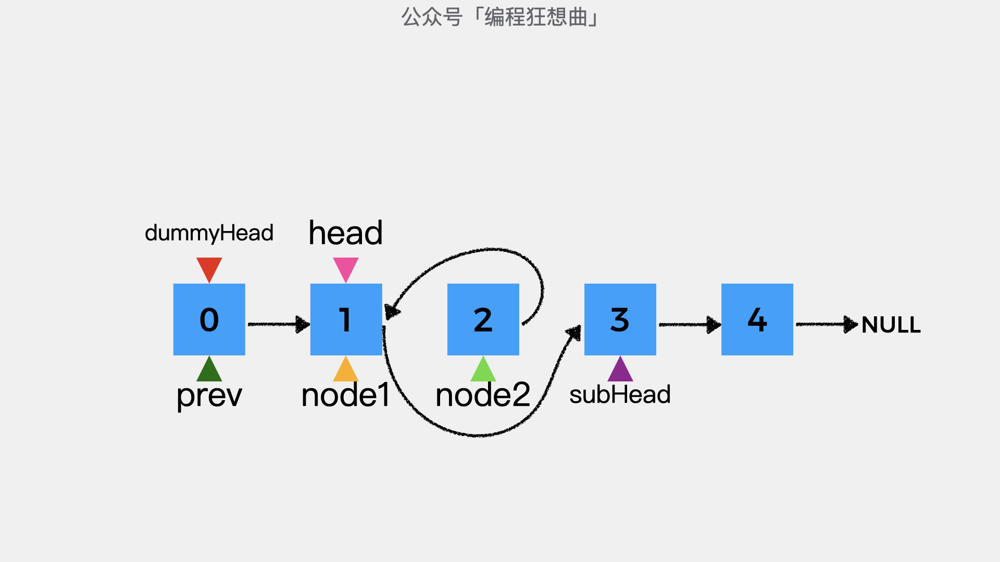


之后，由于变量node2指向的节点是新的头节点，因此，prev指向的节点的后继指针指向变量node2指向的节点，即prev.next=node2。

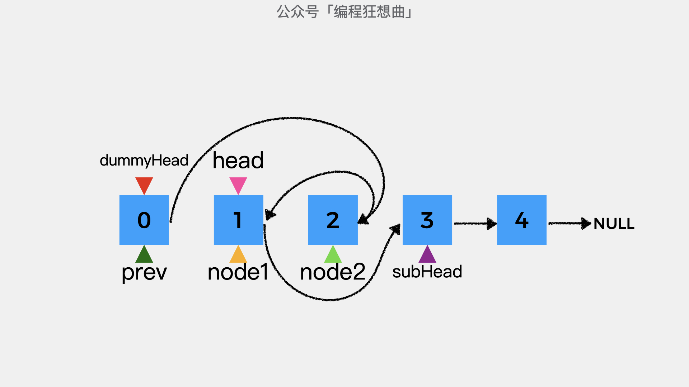


将上图规整一下，链表结构如下图所示，这时变量node1指向的节点和变量node2指向的节点就完成了交换。

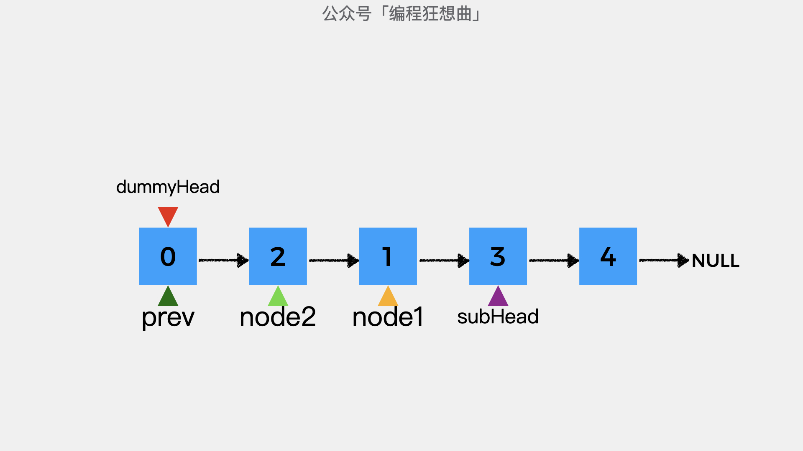


接着将变量prev指向变量node1指向的节点。这时，下一组待交换的节点3和4，分别用node1和node2表示。

其中，node1=prev.next，node2=node1.next。同样的重复上述步骤，即可完成节点3和节点4的交换。

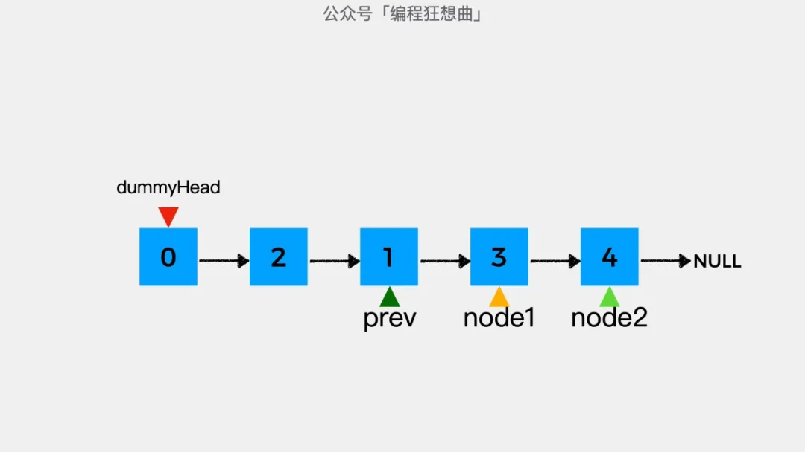


**动画演示：**


**代码实现：**

```java
public ListNode swapPairs(ListNode head) {
    ListNode dummyHead = new ListNode(0);
    dummyHead.next = head;

    ListNode prev = dummyHead;
    // 只有当prev指向的结点之后有两个结点时才需要交换
    while (prev.next != null && prev.next.next != null) {
        ListNode node1 = prev.next;
        ListNode node2 = node1.next;
        ListNode subHead = node2.next;

        node2.next = node1;
        node1.next = subHead;
        prev.next = node2;

        // prev指向交换后的结点的第二个结点，
        // 即未交换结点的前一个结点
        prev = node1;
    }
    return dummyHead.next;
}
```


**02 递归**

先看具体代码实现：

```java
public ListNode swapPairs(ListNode head) {
    // 如果当前结点为null或当前结点下一个结点为null
    // 则递归终止
    if (head == null || head.next == null)
        return head;

    // subResult是head.next.next之后的结点两两交换后的头结点
    ListNode subResult = swapPairs(head.next.next);
    ListNode headNext = head.next;
    headNext.next = head;
    head.next = subResult;
    return headNext;
}
```

接着，我们以示例给出的链表从递推公式和递归终止条件两个方面进行分析。示例给出的连接结构示意图如下：

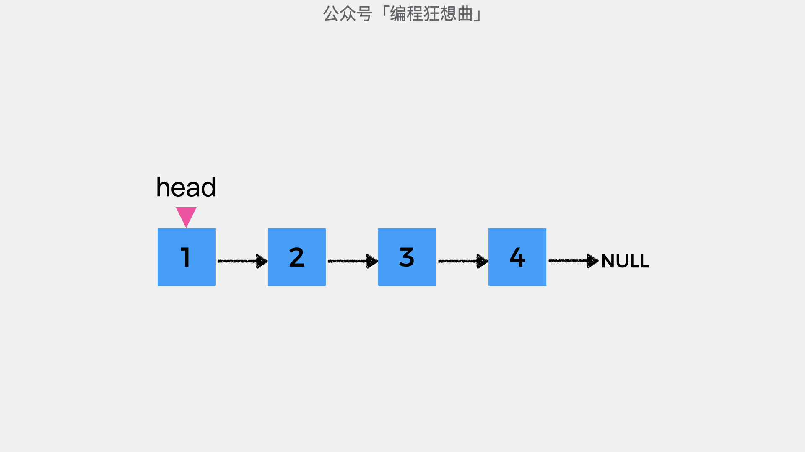


递归解题首先要明确的是递推公式的含义，在这里递推公式swapPairs()的含义是：将给定的链表中的相邻节点两两交换后返回，返回的是交换完成的链表的头节点。


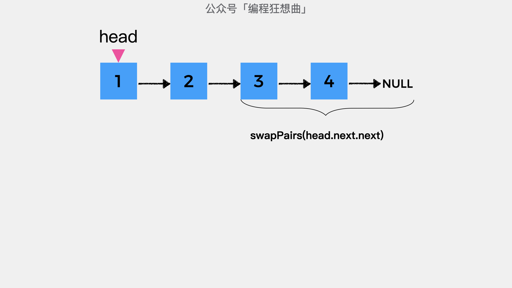


上图中的节点3和节点4及其之后的节点经过递推公式swapPairs处理后，结果如下图，变量subResult指向的节点是处理后的链表的头节点。这里不要试图去理解递归的每一个步骤，只要知道递推公式处理后的结果是什么就可以了。

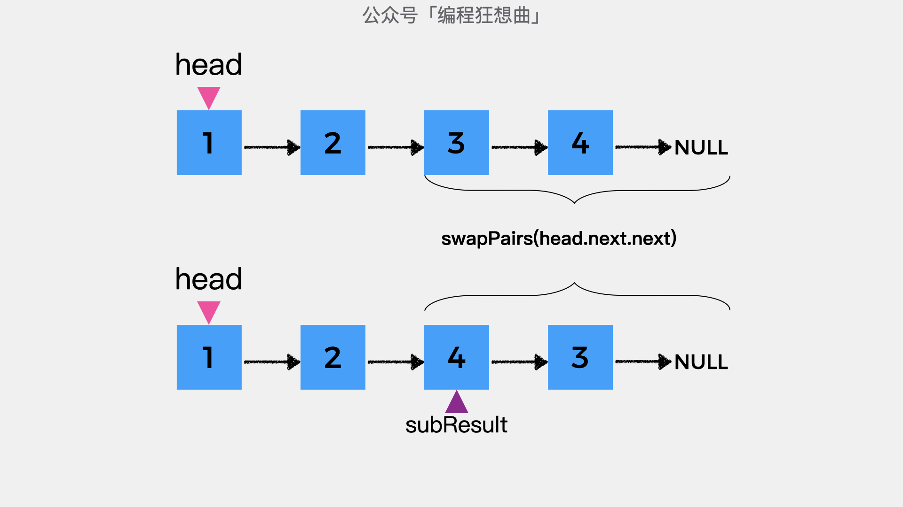


在知道节点2之后的所有节点两两交换的结果后，接着要做的就是将节点1和节点2进行交换了。

在这里节点1即变量head指向的节点，节点2我们用变量headNext表示，即headNext=head.next。

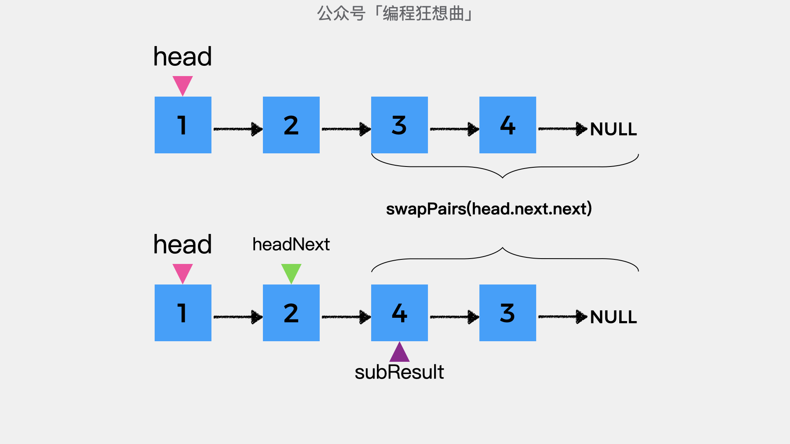


接着要做的是将变量headNext指向的节点的后继指针，指向变量head指向的节点；然后变量head指向的节点其后继指针指向变量subResult指向的节点，如下图所示。

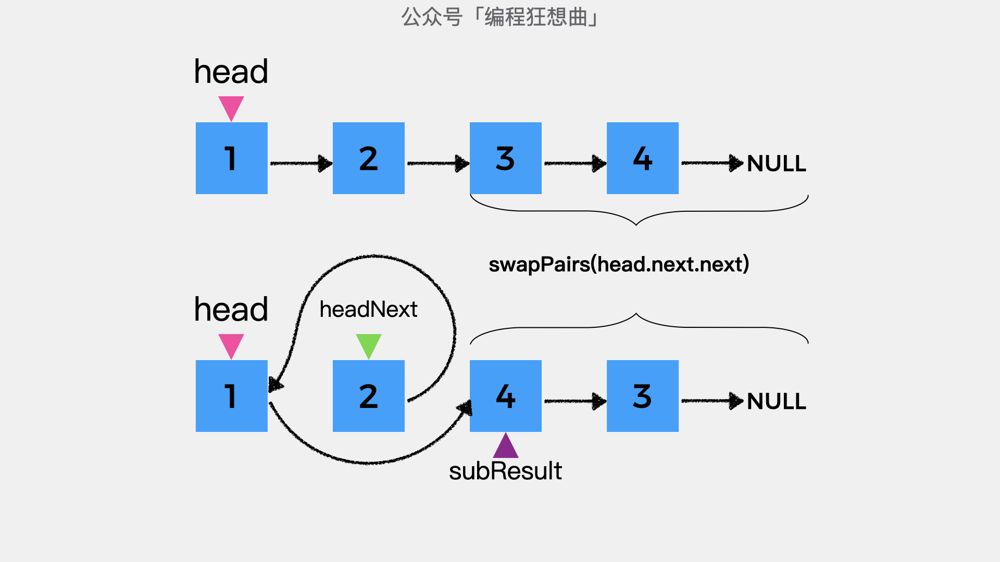


至此，就通过递归完成了链表中的相邻的交换，交换后的链表的头节点时变量headNext指向的节点。
递归中的递推公式已经分析完了，另一个重要的步骤是递归终止条件，在这道题目里，递归终止条件是节点为null或当前节点的下一个节点为null，这意味着没有节点需要交换。

**动画演示：**

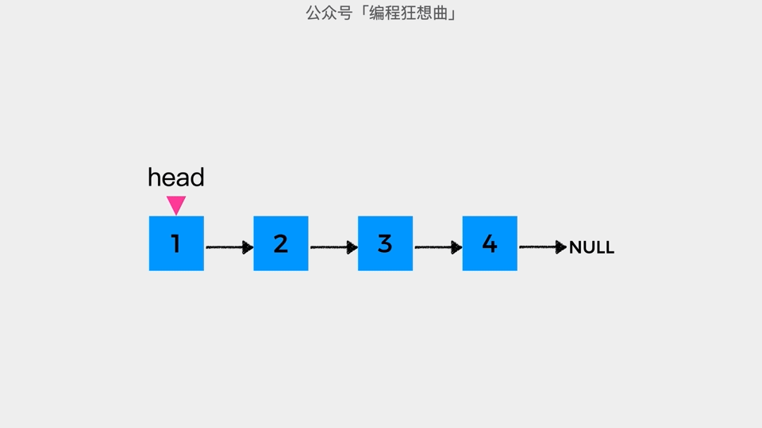

**更多内容扫描下方二维码关注公众号「编程狂想曲」查看**,如有错误可在公众号加我个人微信后指出
<p align='center'>

</p>
