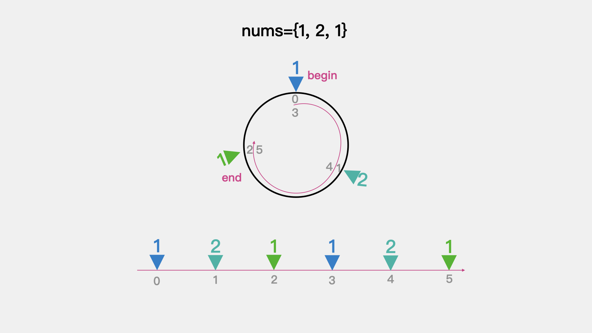

# 单调栈巧解下一个更大元素


今天分享的内容是单调栈，主要内容有：

* LeetCode #155 最小栈

* LeetCode #496 下一个更大元素I

* LeetCode #503 下一个更大元素II


## 01 LeetCode #155 最小栈

**题目描述：**

设计一个支持 push ，pop ，top 操作，并能在常数时间内检索到最小元素的栈。

push(x) —— 将元素 x 推入栈中。

pop() —— 删除栈顶的元素。

top() —— 获取栈顶元素。

getMin() —— 检索栈中的最小元素。

**示例:**

输入：
["MinStack","push","push","push","getMin","pop","top","getMin"]
[[],[-2],[0],[-3],[],[],[],[]]

输出：
[null,null,null,null,-3,null,0,-2]

**解释：**
MinStack minStack = new MinStack();
minStack.push(-2);
minStack.push(0);
minStack.push(-3);
minStack.getMin();   --> 返回 -3.
minStack.pop();
minStack.top();      --> 返回 0.
minStack.getMin();   --> 返回 -2.

**思路分析:**

题目中的push(x)，pop()，top()操作都可以直接调用Java中Stack的API实现。getMin()检索栈中最小元素这个方法的实现，可以借助一个辅助栈。

初始化两个栈，一个是xStack用于对元素x进行入栈、出栈操作；一个是辅助栈minStack，用于存储xStack中已存元素中的最小元素。这里辅助栈的入栈操作是和元素x放入栈xStack同步的，**也就说xStack中每入栈一个元素，minStack中相应的要存入当前最小元素。**

详细步骤可看如下动画演示：


**代码实现：**

```java
public class MinStack {
    Stack<Integer> xStack = null;
    Stack<Integer> minStack = null;

    public MinStack() {
        xStack = new Stack<>();
        minStack = new Stack<>();
    }

    public void push(int x) {
        xStack.push(x);
        if (minStack.isEmpty()) { // 如果栈为空则将元素直接入栈
            minStack.push(x);
        }else {// 栈不为空，则入栈元素为xStack中所有元素中的最小元素
            minStack.push(Math.min(x,minStack.peek()));
        }
    }

    public void pop() {
        xStack.pop();
        minStack.pop();
    }

    public int top() {
        return xStack.peek();
    }

    public int getMin() {
        return minStack.peek();
    }
}
```


## 02 LeetCode #496 下一个更大元素I**

**题目描述：**

给你两个 没有重复元素 的数组 nums1 和 nums2 ，其中nums1 是 nums2 的子集。

请你找出 nums1 中每个元素在 nums2 中的下一个比其大的值。
nums1 中数字 x 的下一个更大元素是指 x 在 nums2 中对应位置的右边的第一个比 x 大的元素。如果不存在，对应位置输出 -1 。

**示例:**

输入: nums1 = [4,1,2], nums2 = [1,3,4,2].
输出: [-1,3,-1]

**解释:**

    对于 num1 中的数字 4 ，你无法在第二个数组中找到下一个更大的数字，因此输出 -1 。
    对于 num1 中的数字 1 ，第二个数组中数字1右边的下一个较大数字是 3 。
    对于 num1 中的数字 2 ，第二个数组中没有下一个更大的数字，因此输出 -1 。

**思路分析:**

由于数组nums1是nums2的子集，整体思路是先求解出数组nums2中每个元素对应的下一个更大元素。然后存入map中，其中key是nums2中的元素值，value是下一个更大的元素。最后，遍历数组nums1，拿当前考察的元素作为key在map中获取value即可。

至此，关键问题是如何求解出数组nums2中每个元素对应的下一个更大元素。

**方法一：借助栈，正序遍历**

我们正序遍历数组nums2，对于当前考察的元素nums[i]来说：

* 如果栈不为空且其值大于栈顶元素，由于是正序遍历所以当前考察的元素nums[i]是栈顶元素的下一个更大元素。所以，栈顶元素出栈作为key，nums[i]作为value存入map。随后，将nums[i]入栈，看后面考察的元素会不会有大于nums[i]的。

* 如果栈为空，则将nums[i]入栈，看后面考察的元素会不会有大于nums[i]的。

最后，当数组nums2中所有元素都考察完毕时，如果栈不为空，说明栈中的元素没有找到下一个更大的元素，原因在于我们是正序遍历数组，如果有其下一个更大的元素，在上面的判断中已经将其出栈了。

所以对于栈中的元素来说，不存在下一个更大的元素，根据题意其对应的value为-1。

**动画演示：**


**代码实现：**

```java
public int[] nextGreaterElement(int[] nums1, int[] nums2) {
    int[] result = new int[nums1.length];
    Map<Integer, Integer> map = helper(nums2);
    for(int i = 0; i < nums1.length; i++) {
        result[i] = map.get(nums1[i]);
    }

    return result;
}

private Map<Integer,Integer> helper(int[] nums){
    Map<Integer,Integer> map = new HashMap<>();
    Stack<Integer> stack = new Stack<>();
    for(int i = 0; i < nums.length; i++) {
        // 栈不为空且当前元素大于栈顶元素
        // 说明当前元素是栈顶元素的下一个更大元素
        // while循环表示当前元素是栈中所有已存元素的下一个更大元素
        while (!stack.isEmpty() && nums[i] > stack.peek()) {
            map.put(stack.pop(), nums[i]);
        }
        // 将当前考察元素入栈，看后面是否有其下一个更大元素
        stack.push(nums[i]);
    }

    // 栈中剩余的元素是没有下一个更大元素的元素
    while (!stack.isEmpty()) {
        map.put(stack.pop(), -1);
    }
    return map;
}
```

**方法二：借助栈，逆序遍历**

我们逆序遍历数组nums2，对于当前考察的元素nums[i]来说：

如果栈不为空且nums[i]大于等于栈顶元素，说明栈中元素不会是其之前某个元素的下一个更大元素，所以将栈中元素出栈。原因在于，这里是逆序遍历，如果当前元素nums[i]大于栈中元素，那么对于其前面的元素来说，肯定nums[i]更可能是其下一个更大元素。
如果栈不为空且nums[i]小于栈顶元素，由于是逆序遍历，说明栈顶元素是nums[i]的下一个更大元素，所以将nums[i]作为key，栈顶元素作为value存入map。

如果栈为空，说明nums[i]没有下一个更大元素，所以将nums[i]作为key，-1作为value存入map。
最后，将nums[i]存入map，看其是否可能是之前某个元素的下一个更大元素。

**动画演示：**


**代码实现：**

```java
public int[] nextGreaterElement(int[] nums1, int[] nums2) {
    int[] result = new int[nums1.length];
    Map<Integer, Integer> map = helper(nums2);
    for(int i = 0; i < nums1.length; i++) {
        result[i] = map.get(nums1[i]);
    }

    return result;
}

private Map<Integer,Integer> helper(int[] nums){
    Map<Integer,Integer> map = new HashMap<>();
    Stack<Integer> stack = new Stack<>();
    for(int i = nums.length - 1; i >= 0; i--) {
        // 如果栈不为空且大于栈顶元素
        // 由于是逆序遍历，所以栈中元素不可能是其之前某个元素的
        // 下一个更大元素，所以将栈中元素清空
        while (!stack.isEmpty() && nums[i] >= stack.peek()) {
            stack.pop();
        }
        // 1.如果栈不为空，且nums[i]小于栈顶元素，由于是逆序遍历
        // 所以栈顶元素是nums[i]的下一个更大元素
        // 2.如果栈为空，说明nums[i]没有下一个更大元素,value=-1
        map.put(nums[i], stack.isEmpty() ? -1 : stack.peek());
        // 存入栈，看其是否可能是之前某个元素的下一个更大元素
        stack.push(nums[i]);
    }
    return map;
}
```

## 03 LeetCode #503 下一个更大元素II

**题目描述：**

给定一个循环数组（最后一个元素的下一个元素是数组的第一个元素），输出每个元素的下一个更大元素。数字 x 的下一个更大的元素是按数组遍历顺序，这个数字之后的第一个比它更大的数，这意味着你应该循环地搜索它的下一个更大的数。如果不存在，则输出 -1。

**示例:**

输入: [1,2,1]

输出: [2,-1,2]

解释: 第一个 1 的下一个更大的数是 2；

数字 2 找不到下一个更大的数； 

第二个 1 的下一个最大的数需要循环搜索，结果也是 2。

**思路分析:**

这道题目与题目#496的区别是这里给定的是循环数组，所谓循环数组就是最后一个元素的下一个元素是数组的第一个元素。对于题目示例给出的数组[1,2,1]可以拆解为如下图所示的样子：




也就是说如果我们将循环数组[1,2,1]拆分为数组[1,2,1, 1,2,1]，那么该题目直接用#496这道题目的求解思路就可以了。

问题的关键在于如何在代码中模仿循环数组，答案是将数组长度翻倍，然后对数组长度n取模就可以了。

**正序遍历的代码实现：**

```java
public int[] nextGreaterElements(int[] nums) {
    int n = nums.length;
    int[] res = new int[n];
    // 先将结果数组中的值赋值为-1
    Arrays.fill(res, -1);
    Stack<Integer> stack = new Stack<>();
    for (int i = 0; i < n * 2; i++) {
        // 如果栈不为空，且栈中元素小于当前考察的元素
        // 则当前考察的元素是栈中元素的下一个更大元素
        // i % n 对数组长度取余，模拟循环数组
        while (!stack.isEmpty() && nums[stack.peek()] < nums[i % n]){
            res[stack.pop()] = nums[i % n];
        }
        // 当前元素的索引取余后入栈，看后面是否有其下一个更大元素
        stack.push(i % n);
    }
    return res;
}
```

**逆序遍历的代码实现：**

```java
public int[] nextGreaterElements(int[] nums) {
    int[] res = new int[nums.length];
    Stack<Integer> stack = new Stack<>();
    for (int i = 2 * nums.length - 1; i >= 0; --i) {
        // 如果栈不为空且栈中索引对应的元素小于等于当前考察元素
        // 由于是逆序遍历，所以栈中索引对应的元素不可能是其之前某个元素的
        // 下一个更大元素，因此将其出栈
        while (!stack.empty() && nums[stack.peek()] <= nums[i % nums.length]) {
            stack.pop();
        }
        // 当前考察的元素为nums[i % nums.length]
        // 1.如果栈不为空，且nums[i % nums.length]小于栈顶索引对应的元素，由于是逆序遍历
        // 所以栈顶索引对应的元素是nums[i % nums.length]的下一个更大元素
        // 2.如果栈为空，说明nums[i % nums.length]没有下一个更大元素,value=-1
        res[i % nums.length] = stack.empty() ? -1 : nums[stack.peek()];
        // 当前元素的索引取余后入栈，看其是否是前面某个元素的下一个更大元素
        stack.push(i % nums.length);
    }
    return res;
}
```

**更多内容扫描下方二维码关注公众号「编程狂想曲」查看**,如有错误可在公众号加我个人微信后指出
<p align='center'>

</p>