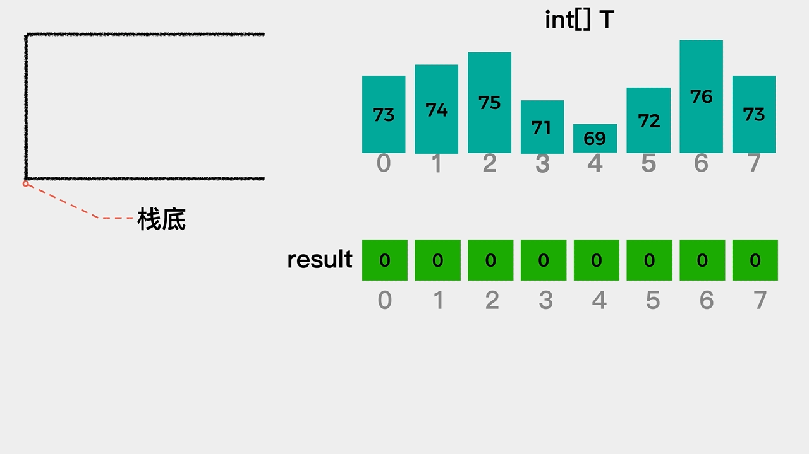
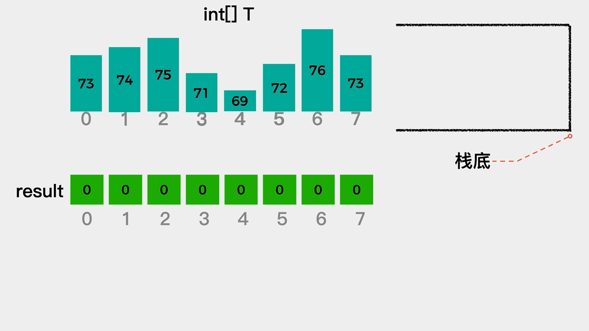
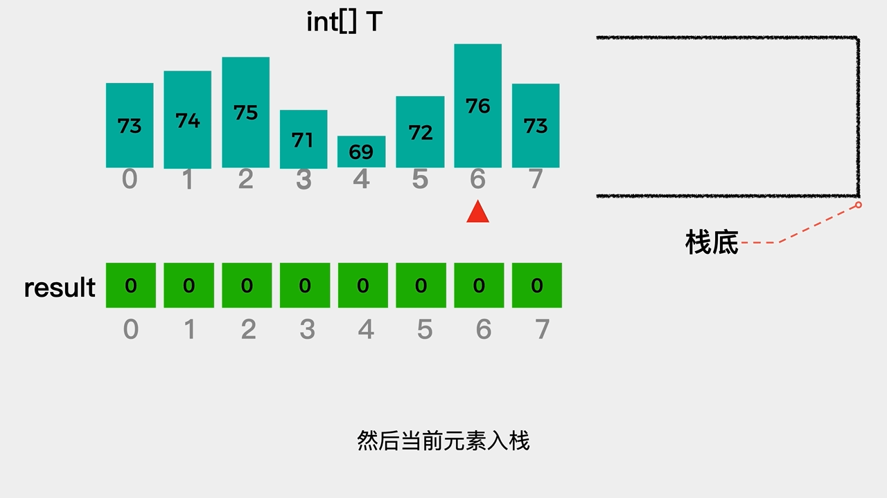

# 单调栈巧解每日温度


你好，我是微木。

这篇文章分享的内容是LeetCode中739.每日温度这个题目。

**题目描述：**

给你一个链表，删除链表的倒数第 n 个结点，并且返回链表的头结点。

请根据每日 气温 列表，重新生成一个列表。对应位置的输出为：要想观测到更高的气温，至少需要等待的天数。如果气温在这之后都不会升高，请在该位置用 0 来代替。

例如，给定一个列表 temperatures = [73, 74, 75, 71, 69, 72, 76, 73]，你的输出应该是 [1, 1, 4, 2, 1, 1, 0, 0]。

提示：气温 列表长度的范围是 [1, 30000]。每个气温的值的均为华氏度，都是在 [30, 100] 范围内的整数。

**题目分析:**

对于题目给定的列表 temperatures = [73, 74, 75, 71, 69, 72, 76, 73]，最终的输出是 [1, 1, 4, 2, 1, 1, 0, 0]。

这表示对于第一天的温度73来说，要想观察到比它高的气温，需要等待的天数是1，即第二天的温度74。

对于第二天的温度74来说，要想观察到比它高的气温，需要等待的天数是1，即第三天的温度75。

对于第三天的温度75来说，要想观察到比它高的气温，需要等待的天数是4，即第七天的温度76。

分析到这里，我们就知道由于题目给出的是一个由每日温度组成的数组，而对于某天的温度来说，如果其后有一天温度高于其温度，则它需要等待的天数就是那个更高温度所在的索引值与当前温度所在的索引值的差值；如果其后没有比其更高的温度，则等待天数为0。

至此，这个问题的关键就是对于某天温度来说，如何找出其后面的更高温度？ 又，最终结果是索引的差值。因此，过程中记录的应该是索引值。


## 01 单调栈 正序遍历

**代码实现**

```java
    public int[] dailyTemperatures(int[] T) {
        int[] result = new int[T.length];
        // 根据题目要求如果之后气温不再升高
        // 该位置用0代替，因此默认值设置为0
        Arrays.fill(result,0);

        Stack<Integer> stack = new Stack<>();
        // 开始正向遍历
        for(int i = 0; i < T.length; i++) {
            // 栈不为空且当前索引对应的温度大于栈顶索引对应的温度
            // 说明当前索引对应的温度是比栈顶索引对应的温度更高
            // while循环表示：
            // 当前索引对应的温度比栈中已存索引对应温度高时，则栈顶元素出栈
            while (!stack.isEmpty() && T[i] > T[stack.peek()]) {
                // 栈顶索引出栈
                int prevIndex = stack.pop();
                // 当前索引与栈顶索引的差值表示的就是需要等待的天数
                result[prevIndex] = i-prevIndex;
            }
            // 将当前考察温度的索引入栈，看后面是否有比其高的温度
            stack.push(i);
        }

        return result;
    }
```

**思路分析**

接着，我们看下单调栈求解的具体思路。

对于第一天的温度73来说，它是第一个被考察的温度，这时我们还不知道其后面是否有比其高的温度，所以需要将其对应的索引0入栈。

接着，考察第二天的温度74。这时，我们发现第二天温度74大于第一天温度73。因此，对于第一天温度73来说，找到了比它更高的气温，两者索引差值是1。这时，第一天温度73对应的索引0就可以出栈了，接着需要将第二天温度74对应的索引1入栈，具体动画演示如下：




对于第二天的温度74来说，第三天温度75高于它，因此两者索引差值为1。
当第三天温度75对应的索引入栈之后，第四天温度71，第五天温度69，都是小于75且逐渐递减的，对于这种情况，我们将其对应的索引直接入栈就好。

直到其后某一天温度高于栈顶索引对应的温度时，需要将栈顶索引出栈，计算其和当前温度索引间的差值。然后，继续看当前考察的温度值是否大于栈顶索引对应的温度值，如果是，则栈顶索引出栈，计算其与当前温度索引间的差值；如果不是，则将当前温度对应索引入栈，继续考察下一天的温度，动画演示如下：


按上述步骤考察完列表中所有温度即可计算出最终结果，完整动画演示如下。

**动画演示**


## 02 单调栈 逆序遍历

**代码实现**


```java
    public int[] dailyTemperatures(int[] T) {
        int[] result = new int[T.length];
        // 根据题目要求如果之后气温不再升高
        // 该位置用0代替，因此默认值设置为0
        Arrays.fill(result,0);

        Stack<Integer> stack = new Stack<>();
        for(int i = T.length - 1; i >=0; i--) {
            // 如果栈不为空且当前温度大于栈顶温度
            // 由于是逆序遍历，所以栈中索引对应的温度不可能比其之前某天温度高
            // 所以将栈中存取的温度出栈，直到栈为空或当前温度小于栈顶索引对应温度
            while (!stack.isEmpty() && T[i] >= T[stack.peek()]) {
                stack.pop();
            }
            // 1.如果栈不为空，且当前温度小于栈顶温度，由于是逆序遍历
            // 所以栈顶温度是比当前温度高的一天，
            // 栈顶温度对应的索引减去当前温度的索引就是差的天数
            // 2.如果栈为空，说明当前温度之后没有比其高的温度，根据题意值为0
            result[i] = stack.isEmpty() ? 0 : stack.peek() - i;
            stack.push(i);
        }
        return result;
    }
```

**思路分析**

对于题目给定的列表 temperatures = [73, 74, 75, 71, 69, 72, 76, 73]，最终的输出是 [1, 1, 4, 2, 1, 1, 0, 0]。

这里我们是逆序遍历，即从列表中最后一天的温度开始考察。对于最后一天的温度73来说，它是第一个考察的温度，此时不确定它是不是比其前面某一天的温度高，因此先将其对应的索引7入栈，然后继续考察前一天的温度。

前一天温度是76高于栈顶索引7所对应的温度，由于是逆序遍历，所以栈顶索引7对应的温度不会是其前面某天的最近的更高气温。因此将其出栈，动画演示如下：




这时，栈为空，因此将温度76对应的索引6入栈。继续考察前一天的温度72，这时72小于栈顶索引6对应的温度76，因此对于温度72来说，其需要等待的天数是栈顶索引6减去其自身索引5的值，即1天。
这时，由于当前考察温度72小于栈顶索引6对应温度76，因此栈顶索引不用出栈。接着要做的是当前考察的温度72对应的索引5入栈，动画演示如下：




对于剩余未考察的温度，按上述思路逐一考察即可得到最终结果，完整动画如下。

**动画演示**


**更多内容扫描下方二维码关注公众号「编程狂想曲」查看**,如有错误可在公众号加我个人微信后指出
<p align='center'>

</p>