# 对撞指针在数组中的应用


今天分享的内容是对撞指针在数组中的应用。

分享的题目是LeetCode中的：
* 167.两数之和||-输入有序数组
* 125.验证回文串
* 11.盛最多水的容器

接下来，逐一看下如何用对撞指针的思想来解答这三道题目。


## 01 LeetCode #167 两数之和||

**题目描述：**

给定一个已按照升序排列的有序数组，找到两个数使得它们相加之和等于目标数。

函数应该返回这两个下标值 index1 和 index2，其中 index1 必须小于 index2。

说明:
返回的下标值（index1 和 index2）不是从零开始的。
你可以假设每个输入只对应唯一的答案，而且你不可以重复使用相同的元素。

**示例:**
输入: numbers = [2, 7, 11, 15], target = 9
输出: [1,2]
解释: 2 与 7 之和等于目标数 9 。因此 index1 = 1, index2 = 2 。

**思路分析:**

对于该题目可以用暴力解法来解决，使用双重for循环，第一重for循环每次选取一个数，第二重for循环每次从剩余的数中选取一个数，然后计算两数之和，将其值与目标值比较。代码实现如下：

```java
public int[] twoSum(int[] numbers, int target) {
    int[] res = new int[2];
    for(int i = 0; i < numbers.length; i++) {
        for(int j = i + 1; j < numbers.length; j++) {
            if (numbers[i] + numbers[j] == target) {
                res[0] = i+1;
                res[1] = j+1;
            }
        }
    }
    return res;
}
```

接着，我们以数组{2,7,11,15}，目标值18来举例说明一下双重for循环这种实现方式的不足之处。

当第一重for循环考察的元素为2时，需要将其和剩余元素7、11、15分别进行求和。但是，剩余元素中最大值是15，其与元素2相加的结果是17，小于目标值18。

也就是说，由于数组是升序排列的，如果可以先计算元素2与元素15的和的话，那么元素2就没有必要与元素15之前的元素7、11再次进行求和计算了。

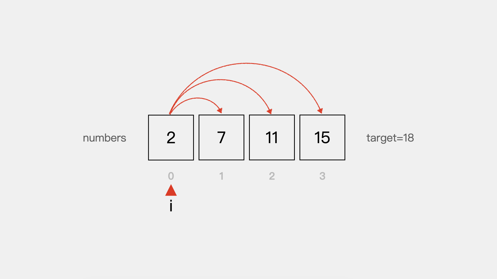


同样的对于元素15来说，按上述代码实现方式，它需要和元素2、7、11分别进行一次求和计算。但当元素15与元素7进行求和计算时，其和为22，已经大于目标值18。

又由于数组是升序排列的，那么元素7之后的元素11就没有必要与元素15进行求和计算了，因为其和必然大于目标值18。

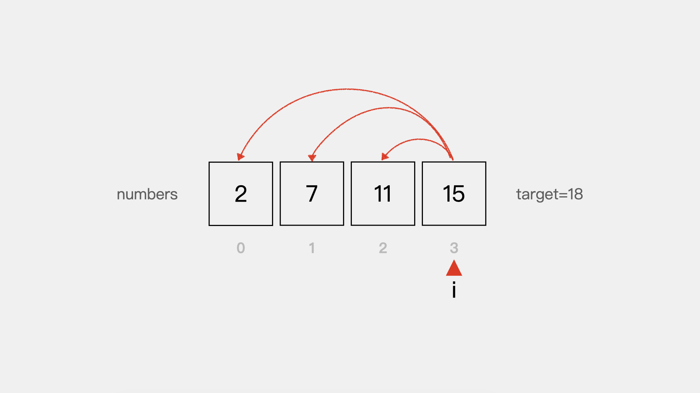


通过上述分析，由于题目中给定的是一个按照升序排列的数组，我们可以初步得出一个结论，那就是对于该题目来说：并不是数组中的每个数都需要和剩余的数逐一进行求和计算。

那么怎么避免这种情况呢？接下来看下如何用对撞指针的思路来优化上述实现方式。

我们还是以数组numbers = [2, 7, 11, 15], target = 18为例进行讲解。

首先，定义左侧指针left指向数组中第一个元素，右侧指针right指向数组中最后一个元素。

此时，numbers[left]+numbers[right]=17小于target=18。


因为数组是升序排列的，为了让两个数的和变大一些，应将左侧指针left向右移动一位，也就是元素2没有必要在与剩余的未考察元素7、11进行求和计算了。

此时，numbers[left]+numbers[right]=22大于target=18。

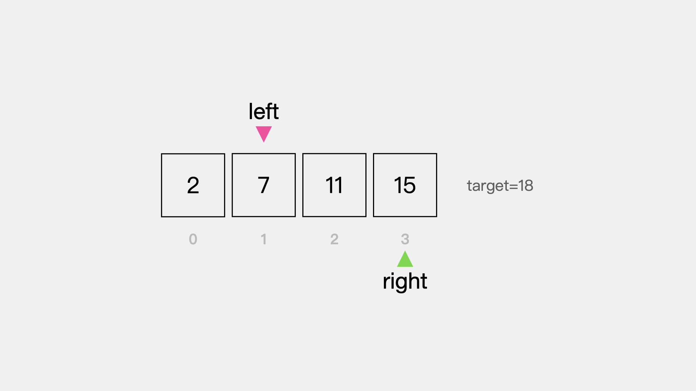


同样，由于数组是升序排列的，为了让两个数的和变小一些，应将右侧指针向左移动一位。同样的，右侧指针向左移动一位，表示元素15没有必要与剩余的未考察元素15进行求和计算了。

此时，numbers[left]+numbers[right]=18等于target=18。因此，找到了两个数7和11，其和等于目标值。

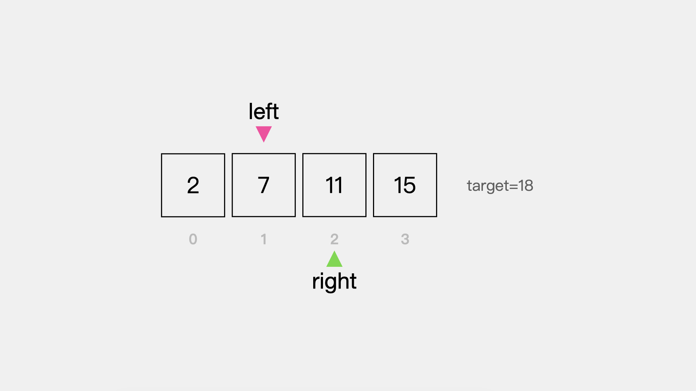


对撞指针**代码实现**思路如下：

```java
public int[] twoSum(int[] numbers, int target) {
    int[] res = new int[2];

    // 定义左侧指针left，指向数组中第一个元素
    int left = 0;

    // 定义右侧指针right，指向数组中最后一个元素
    int right = numbers.length - 1;

    while (left < right) {
        // 如果左侧指针与右侧指针所指向的元素和等于目标值，则返回结果
        if (numbers[left] + numbers[right] == target) {
            res[0] = left + 1;
            res[1] = right + 1;
            return res;
        }else if (numbers[left] + numbers[right] < target) {
            // 如果左侧指针与右侧指针所指向的元素和小于目标值
            // 因为数组是升序排列的，为了让两数之和变大一些
            // 因此应将左侧指针向右移动一位
            left++;
        }else if (numbers[left] + numbers[right] > target) {
            // 如果左侧指针与右侧指针所指向的元素和大于目标值
            // 因为数组是升序排列的，为了让两数之和变小一些
            // 因此应将右侧指针向左移动一位
            right--;
        }
    }

    return res;
}
```


## 02 LeetCode #125 验证回文串

**题目描述：**

给定一个字符串，验证它是否是回文串，只考虑字母和数字字符，可以忽略字母的大小写。
说明：本题中，我们将空字符串定义为有效的回文串

**示例:**
输入: "race a car"
输出:false

**思路分析:**

回文串是一种从左到右读和从右到左读都一样的字符串。题目中描述的回文串是忽略字母大小写并且只考虑字母和数字字符。

接下来以字符串"@CaTnAc#"为例来看一下如何用对撞指针的方法判断一个字符串是否是回文串。

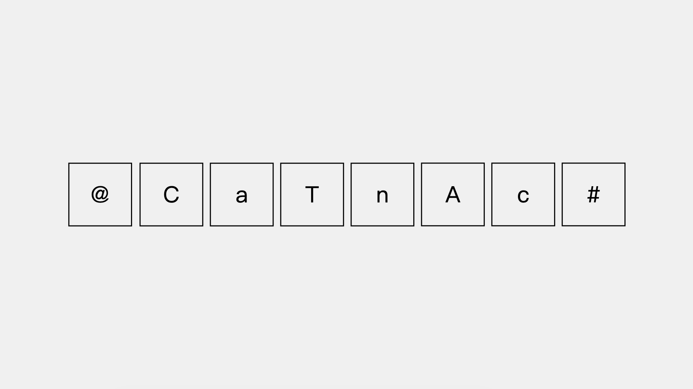


因为题目描述中是忽略字符串大小写的，因此先将字符串中所有字符转为小写字母。

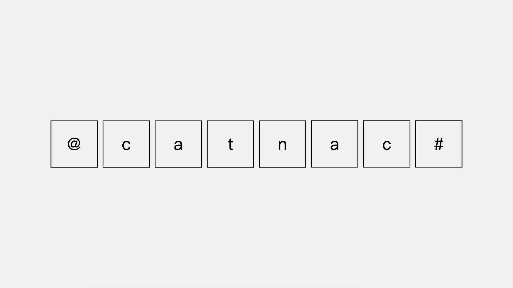


然后，分别定义左指针left，指向字符串左边第一个元素；右指针right指向字符串右边第一个元素。

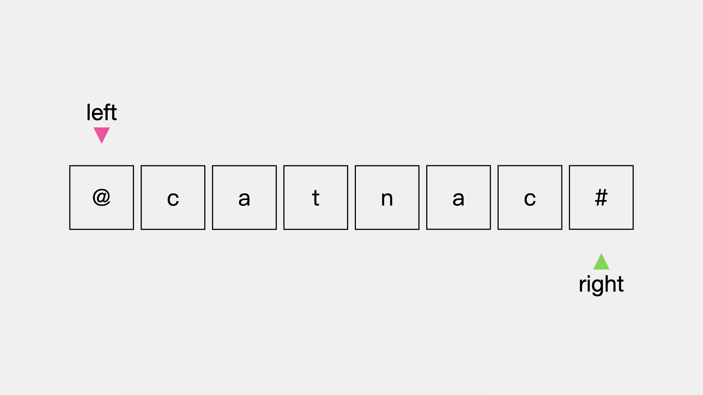


先看左指针left，当前指向的元素是”@“字符，不是字母也不是数字。因此，left需要向右移动一位。同理，指针right也应向左移动一位。

这时指针left指向的字符”c“与指针right指向的字符”c“是一样的。

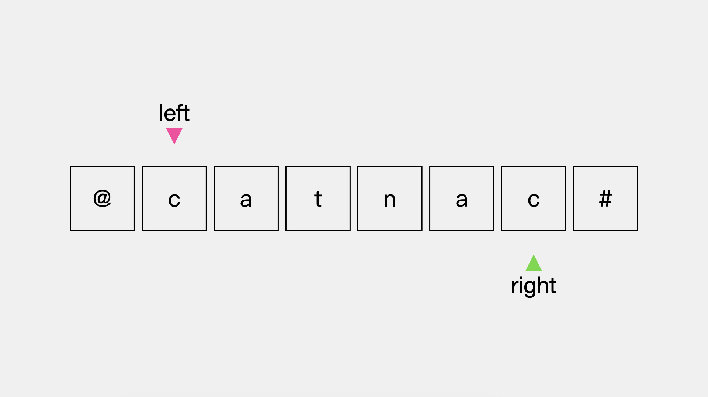


因此指针left向右继续移动一位，指针right向左继续移动一位，考察下一对字符。

同理，这时指针left指向的字符”a“与指针right指向的字符”a“是一样的。

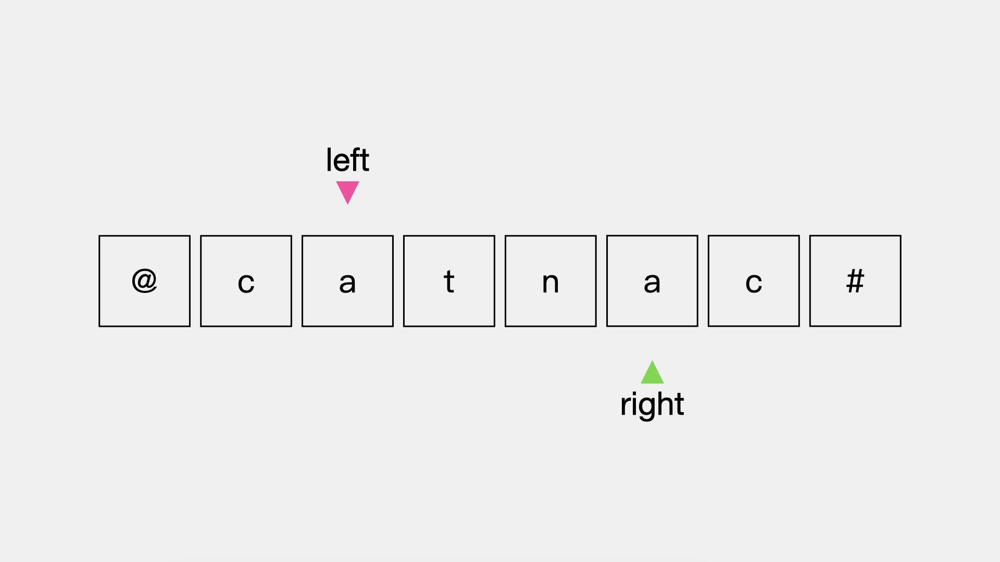


因此指针left向右继续移动一位，指针right向左继续移动一位，考察下一对字符。

这时，指针left指向的字符”t“与right指向的字符”n“是不同的，也就是说字符串"@CaTnAc#"不是回文串。至此，即使有剩余的字符也就不需要考虑了。

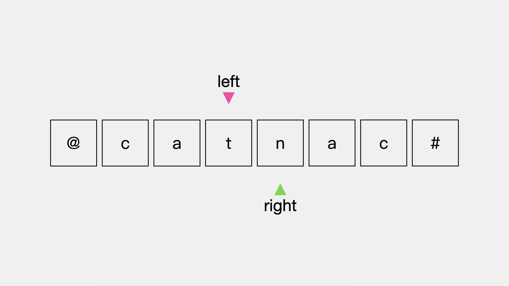


通过上述分析，不论左指针left还是右指针right，其向前移动的情况有两种：
* 一是当前考察的字符不是字母或数字
* 二是当前指针left与指针right指向的字符相同

最后如果指针left与指针right指向的字符不同，则该字符串不是回文串。当指针left指向的位置大于指针right指向的位置时，说明所有字符考察完毕，则所考察的字符串是回文串。代码实现如下:

**动画演示**


```java
public boolean isPalindrome(String s) {
    String lowerCase = s.toLowerCase();

    int left = 0;
    int right = lowerCase.length() - 1;
    while (left < right) {
        // 指针left小于指针right且当前考察的字符不是字母或数字，指针left向左移动
        while (left < right && !Character.isLetterOrDigit(lowerCase.charAt(left))) {
            left++;
        }

        // 指针left小于指针right且当前考察的字符不是字母或数字，指针right向右移动
        while (left < right && !Character.isLetterOrDigit(lowerCase.charAt(right))) {
            right--;
        }

        // 如果指针left指向的字符与指针right指向的字符不同，则不是回文串
        if (lowerCase.charAt(left) != lowerCase.charAt(right)) {
            return false;
        }

        // 指针left左移，指针right右移，继续考察下一对字符
        left++;
        right--;
    }

    return true;
}
```

## 03 LeetCode #11 盛最多水的容器

**题目描述：**

给你 n 个非负整数 a1，a2，...，an，每个数代表坐标中的一个点 (i, ai) 。在坐标内画 n 条垂直线，垂直线 i 的两个端点分别为 (i, ai) 和 (i, 0) 。找出其中的两条线，使得它们与 x 轴共同构成的容器可以容纳最多的水。
说明：你不能倾斜容器。

**示例:**


输入：[1,8,6,2,5,4,8,3,7]
输出：49
解释：图中垂直线代表输入数组 [1,8,6,2,5,4,8,3,7]。在此情况下，容器能够容纳水（表示为蓝色部分）的最大值为 49。

**思路分析:**

题目要求找出两条线使得它们与X轴共同构成的容器可以容纳最多的水，可以将其转换为找出两条线，使得它们与X轴构成的面积是最大的。

一种解法是通过暴力解法，即双重for循环。第一重for循环选取一条边，第二重for循环是从剩余的边中逐一选取，然后和第一重for循环选取的边进行面积计算。代码如下：

```java
public int maxArea(int[] height) {
    // 用于记录最大面积
    int maxArea = 0;
    for(int i = 0; i < height.length; i++) {
        for(int j = i + 1; j < height.length; j++) {
            // 当前考察的两条边与X轴构成的面积
            int currentArea = (j-i)*Math.min(height[j], height[i]);
            maxArea = Math.max(maxArea, currentArea);
        }
    }
    return maxArea;
}
```


接着，我们分析一下双重for循环这种解法的不足之处。

当第一重for循环选取的边是下图中i所指向的边时，其和剩余未选取的边构成的最大面积就是图中的阴影部分。因为，在该图中当选取i所指向的边为基准边时，由于其是最短边，且和j所指向的边之间的距离最大，因此构成的面积也是最大的。

但是在使用双重for循环时，在计算i所指向的基准边与j所指向的边和X轴构成的面积之前，需要先计算基准边与X轴上2、3、4、5、6、7、8这些边构成的面积。也就是说，这个过程存在很多无用的计算。

那么怎么减少这些无用计算呢？答案是：**如果能先计算i和j所指向的边与X轴所构成的面积，并确定接下来i所指向的基准边不再需要参与计算，就会减少很多无用的计算。**

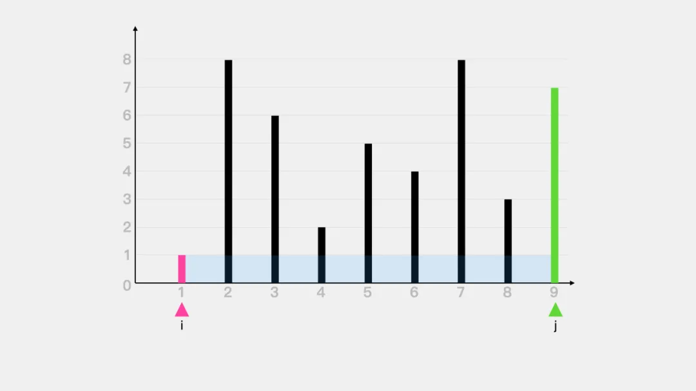

接下来看下如何用对撞指针的思想来减少不必要的计算。如下图，指针left和指针right所指向的两条边和X轴构成的面积是图中阴影部分。那么，为了减少不必要的计算，接下来需要向内侧移动一条边，那么是移动较长边指针right所指向的边呢？还是移动较短边指针left所指向的边呢？


首先看下如果向内移动较长边指针right所指向的边，会出现什么情况。向内侧移动指针right所指向的边时，有三种情况：

* 一是指针right所指向的边的长度减少且小于指针left所指向的边，如下图中指针right1所指向的边。

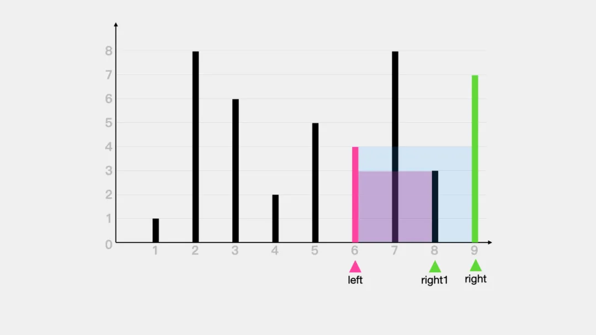

* 二是指针right所指向的边的长度增加且大于指针left所指向的边，如下图中指针right2所指向的边。

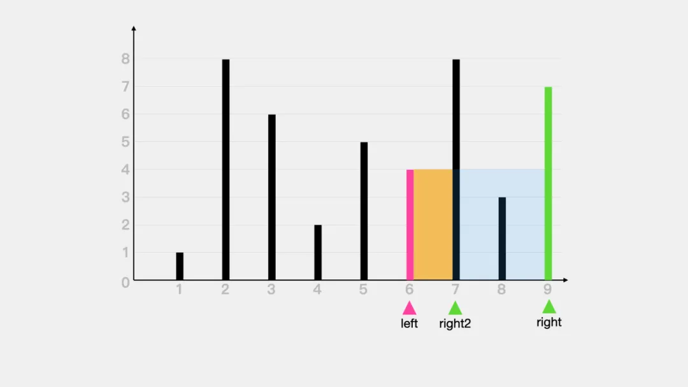

对于上述两种情况，不论是哪一种，指针left所指向的边与指针right向内移动后所指向的边与X轴构成的面积都是减少的。

* 三是指针right所指向的边的长度没有变化，对于这种情况来说，由于较长边的长度没有变化，但它与较短边在X轴之间的距离减少了，因此构成的面积也是减少的。

通过对向内侧移动较长边所对应的指针后出现的情况的讨论，可以得出这样一个结论：**向内侧移动较长边所对应的指针时，两边与X轴构成的面积一定是减少的。**

接着，看下如果向内移动较短边指针left所指向的边时，会出现什么情况。为了方便查看，还是以下图作为基准图来分析。


* 一是指针left所指向的边的长度增加且大于指针right所指向的边的长度，如下图中指针left1所指向的边。这时，指针left1所指向的边与指针right所指向的边与X轴构成的面积为14，大于指针left所指向的边与指针right所指向的边与X轴构成的面积12。


* 二是指针left所指向边的长度减少且小于指针right所指向的边的长度，如下图中指针left2所指向的边。对于这种情况，两边与X轴构成的面积是减少的。

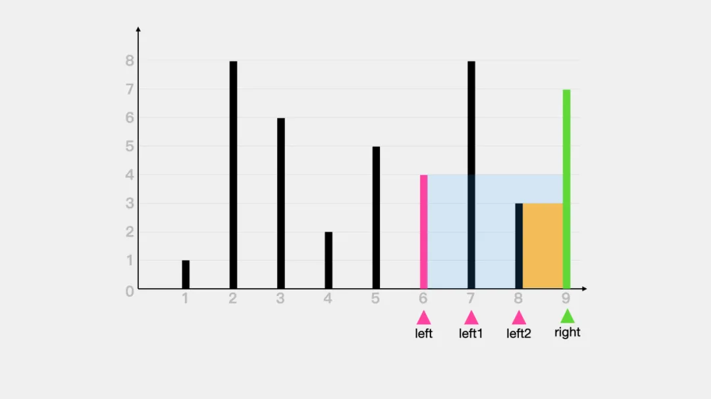

* 三是指针left所指向的边的长度没有变化，对于这种情况来说，由于较短边的长度没有，但它与较长边在X轴之间的距离减少了，因此构成的面积也是减少的。

通过对向内侧移动较短边所对应的指针后出现的情况的讨论，可以得出这样一个结论：**向内侧移动较短边所对应的指针时，两边与X轴构成的面积可能会变大。**

基于上述分析，可以得出结论：**对于指针left与指针right来说，每次在计算其与X轴构成的面积之后，应向内移动较短边所对应的指针，来使得较短边不再参与后续的计算。**

对撞指针思想的**代码实现**如下：

```java
public int maxArea(int[] height) {
    // 用于记录最大面积
    int maxArea = 0;
    int left = 0;
    int right = height.length - 1;
    while (left < right) {
        // 当前考察的两条边与X轴构成的面积
        int currentArea = (right - left)*Math.min(height[left], height[right]);
        maxArea = Math.max(maxArea, currentArea);
        if (height[left] < height[right]) {
            left++;
        }else {
            right--;
        }
    }
    return maxArea;
}
```


**更多内容扫描下方二维码关注公众号「编程狂想曲」查看**,如有错误可在公众号加我个人微信后指出
<p align='center'>

</p>