# 快慢指针在数组中的应用


今天分享的内容是快慢指针在数组中的应用。主要内容有：
* LeetCode #27 移除元素
* LeetCode #26 删除排序数组中的重复项
* LeetCode #80 删除排序数组中的重复项||


快慢指针解决数组问题的基本思路是：用慢指针记录可以复写数据的位置，快指针遍历整个数组。对于快指针什么时候停止，慢指针什么时候移动，后面具体题目中在做分析。

## 01.LeetCode #27 移除元素

**题目描述：**

给你一个数组 nums 和一个值 val，你需要 原地 移除所有数值等于 val 的元素，并返回移除后数组的新长度。

不要使用额外的数组空间，你必须仅使用 O(1) 额外空间并 原地 修改输入数组。

元素的顺序可以改变。你不需要考虑数组中超出新长度后面的元素。

**示例:**

给定 nums = [3,2,2,3], val = 3,

函数应该返回新的长度 2, 并且 nums 中的前两个元素均为 2。

你不需要考虑数组中超出新长度后面的元素

**思路分析**

首先，定义慢指针slow，规定在区间[0,slow)中的元素都是值不等于val=3的元素。


接着，定义指针fast用于遍历整个数组。

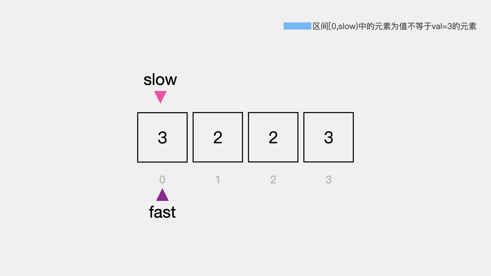


对于每一个当前所考察的元素，将其值和val=3进行比较。比较的结果，有两种情况。一是，当前考察的元素值等于val=3；二是，当前考察的元素值不等于val=3。

对于第一种情况，如下图所示，当前考察的元素为指针fast指向的元素3，其值与val相等。

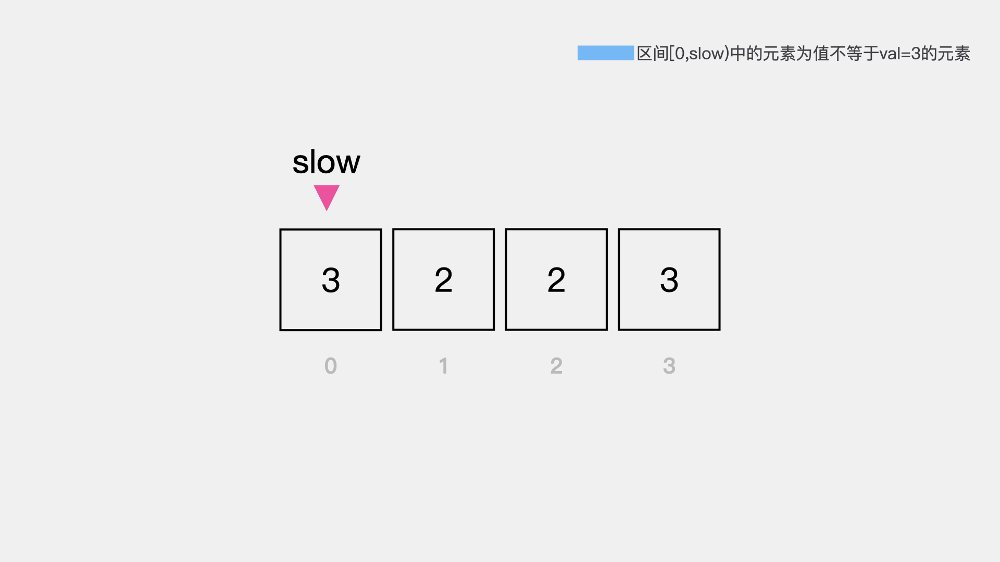


对于这种情况，要做的就是继续考察下一个元素，即指针fast向后移动一个位置。

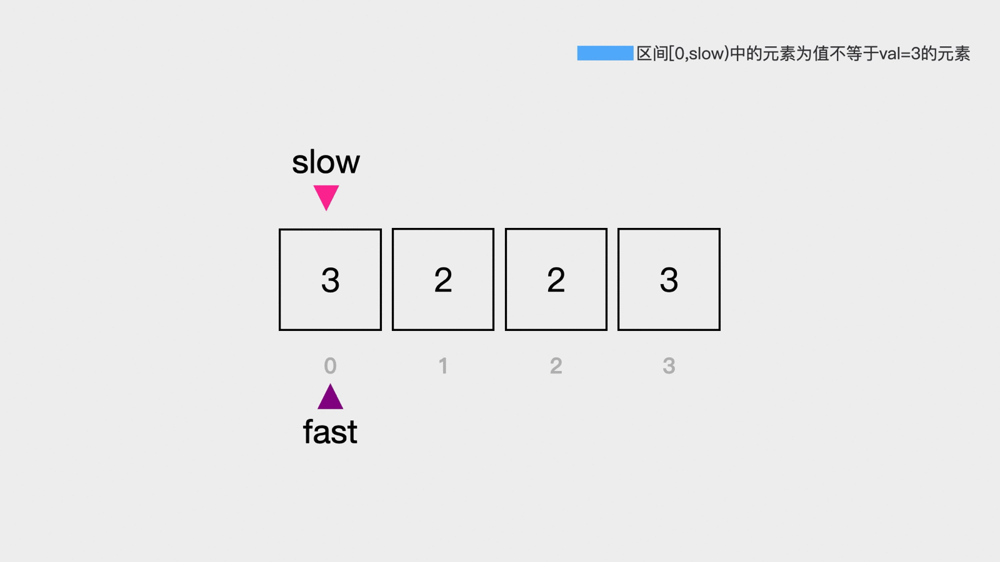


此时，指针fast指向的元素2不等于val=3，因此需要放入区间[0,slow]中，也就是说在这里快指针停止的条件的是当前考察的元素值与val=3不相等。


对于这种情况，首先要做的是将快指针fast所指向的元素值赋予慢指针所指向的元素位置，即nums[slow]=nums[fast]。

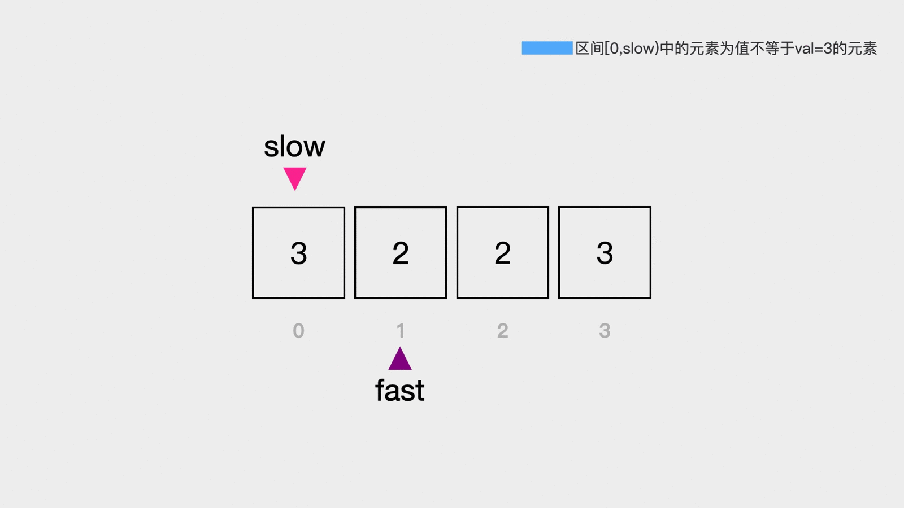


赋值完成之后，接着要做的是将慢指针slow向后移动一个位置，来保证区间[0,slow)中的元素都是值不等于val=3的元素。此时区间[0,slow)中的元素2就是值不等于val=3的元素。


对于数组nums中剩余的元素2和3，重复上述步骤，即可将所有数值等于val的元素移除。


**动画演示** 配有字幕


**代码实现**

```java
public int removeElement(int[] nums, int val) {
    // 慢指针slow 区间[0,slow)内的元素为值不等于val的元素
    int slow = 0;
    for(int fast = 0; fast < nums.length; fast++) {
        // 快指针fast所指向的元素值不等于val=3
        // 将其值赋值于慢指针所在位置
        if (nums[fast] != val) {
            nums[slow] = nums[fast];
            // 赋值完毕之后，慢指针右移一位，等待下一次赋值
            slow++;
        }
    }
    return slow;
}
```

## 02.LeetCode #26 删除排序数组中的重复项

**题目描述：**

给定一个排序数组，你需要在原地删除重复出现的元素，使得每个元素只出现一次，返回移除后数组的新长度。
不要使用额外的数组空间，你必须在原地修改输入数组并在使用 O(1) 额外空间的条件下完成。

**示例:**

给定数组 nums = [1,1,2], 
函数应该返回新的长度 2, 并且原数组 nums 的前两个元素被修改为 1, 2。 
你不需要考虑数组中超出新长度后面的元素。

**思路分析**

接下来我们以数组{1, 1, 2, 3, 3, 4}为例，看下如何删除排序数组中的重复项，使得每个元素只出现一次。
首先，定义慢指针slow，指向数组中的第一个元素。

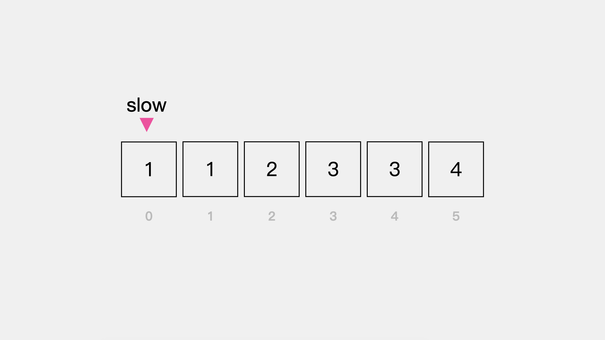


我们规定在区间[0,slow]中的元素都是排序数组中只出现一次的元素。慢指针slow的初始值为0，表示区间[0,0]中的元素，即数组中的第一个元素是只出现一次的元素。

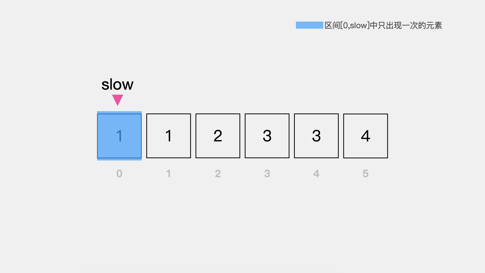


接着定义快指针fast，其所指向的元素为当前在考察的元素。因为数组是排好序的，因此数组中的第一个元素是一定存在于返回数组中的，所以从第二个元素开始考察，即快指针fast的初始值为1，如下图。
当前快指针fast=1所指向的元素值为1，与慢指针slow所指向的元素值相同。

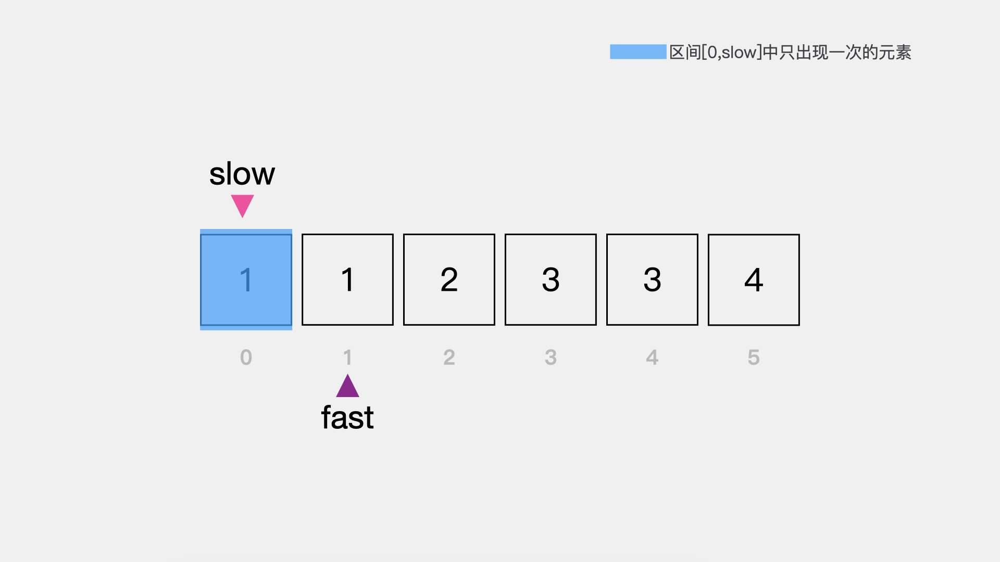

因此，快指针fast向后移动一位，继续考察下一个元素，如下图。这时，快指针fast=2所指向的元素值为2与慢指针slow所指向的元素值1不相同，应放到区间[0,slow]中，也就是说快指针停止的条件是当前考察的元素值与区间[0,slow]末尾元素值不等。

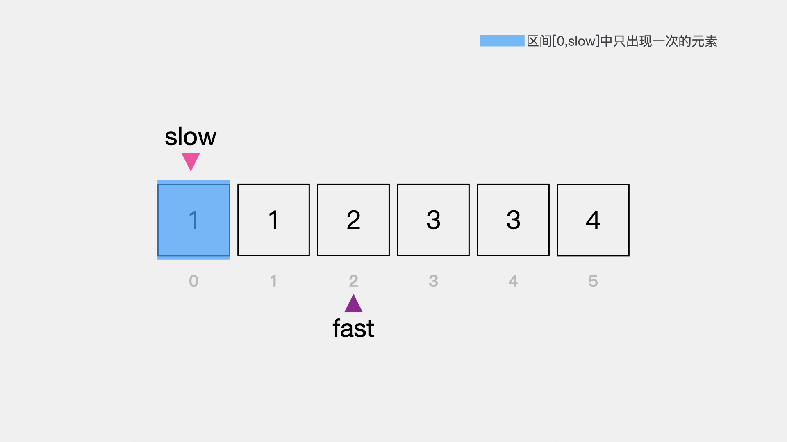


因为区间[0,slow]是左闭右闭区间，其中的元素是只出现一次的元素。因此，慢指针slow需要向后移动一个位置来扩大区间。然后，将快指针fast所指向的元素值赋予慢指针所指向的元素位置。

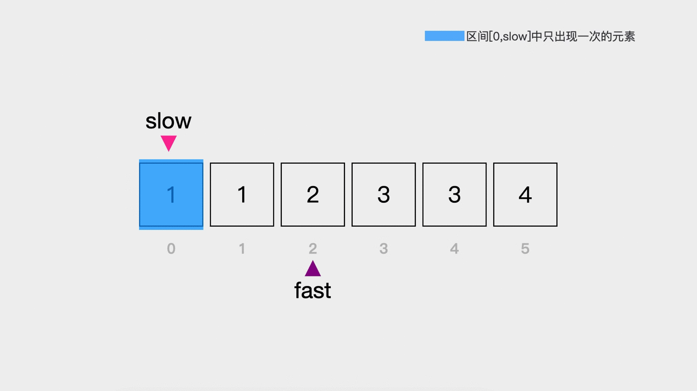


此时，区间[0,slow]，即[0,1]中包含的元素1，2都是排序数组删除重复项之后，只出现一次的元素。

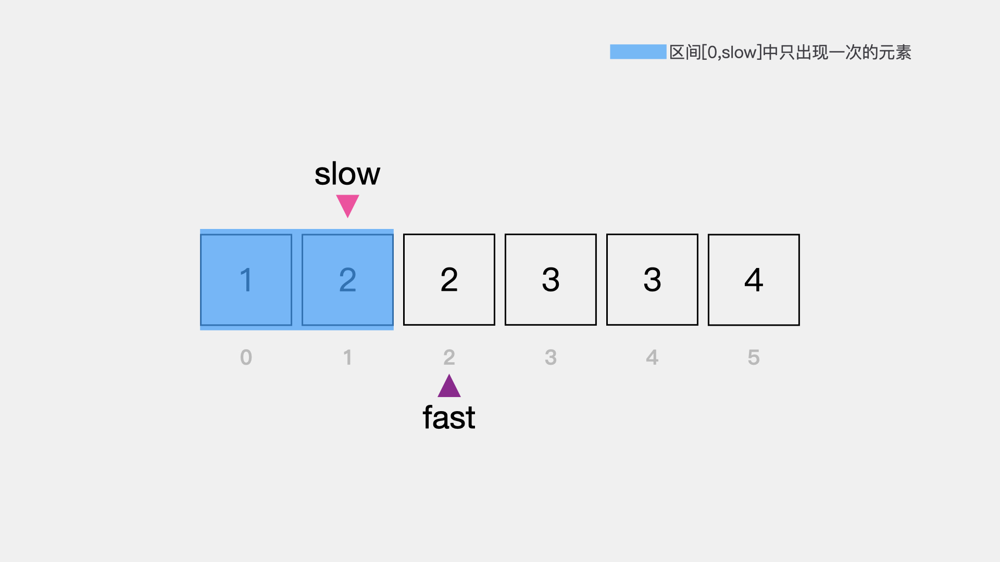


对于排序数组中剩余未考察的元素3，3，4重复上述步骤即可将重复项删除。

**动画演示** 配有字幕


**代码实现**

```java
public int removeDuplicates(int[] nums) {
    // 区间[0,slow]中的元素都是排序数组中只出现一次的元素
    int slow = 0;
    // 快指针fast的初始值为1，因为数组是排好序的
    // 因此数组中的第一个元素是一定存在于返回数组中的。
    for(int fast = 1; fast < nums.length; fast++) {
        // 当前考察的元素nums[fast]和nums[slow]不相等时
        // 说明nums[fast]是需要放入区间[0,slow]中的
        if (nums[fast] != nums[slow]) {
            // slow++是因为区间[0,slow]是左闭右闭的
            // 因此，在slow加1之后，在将nums[fast]的值赋予nums[slow]
            slow++;
            nums[slow] = nums[fast];
        }
    }
    // j指向的是新数组中末尾的元素，即新数组最后的索引
    // 而索引从0开始，题目要求返回新数组的长度，因此返回slow+1
    return slow + 1;
}
```

## 03.LeetCode #80 删除排序数组中的重复项||

**题目描述：**

给定一个增序排列数组 nums ，你需要在 原地 删除重复出现的元素，使得每个元素最多出现两次，返回移除后数组的新长度。
不要使用额外的数组空间，你必须在 原地 修改输入数组 并在使用 O(1) 额外空间的条件下完成。

**示例:**

输入：nums = [1,1,1,2,2,3]
输出：5, nums = [1,1,2,2,3]
解释：函数应返回新长度 length = 5, 并且原数组的前五个元素被修改为 1, 1, 2, 2, 3 。你不需要考虑数组中超出新长度后面的元素。

**思路分析**

首先，用变量maxRepeat=2来表示每个元素最多出现两次。定义指针slow，其初始值为maxRepeat-1=1。

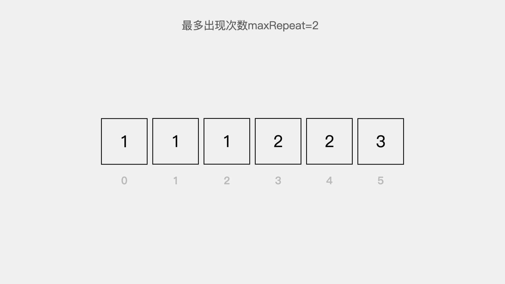


规定区间[0,slow]内的元素为最多出现两次的元素。

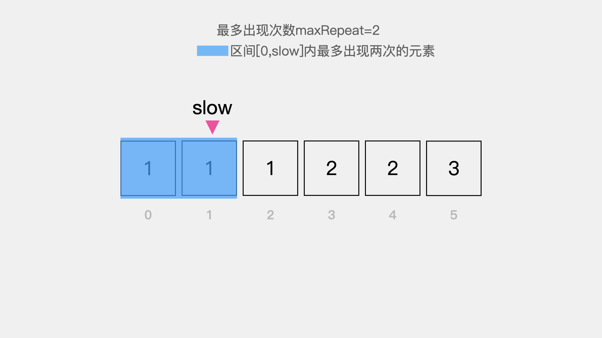


定义变量fast=maxRepeat=2，指向当前考察的元素。

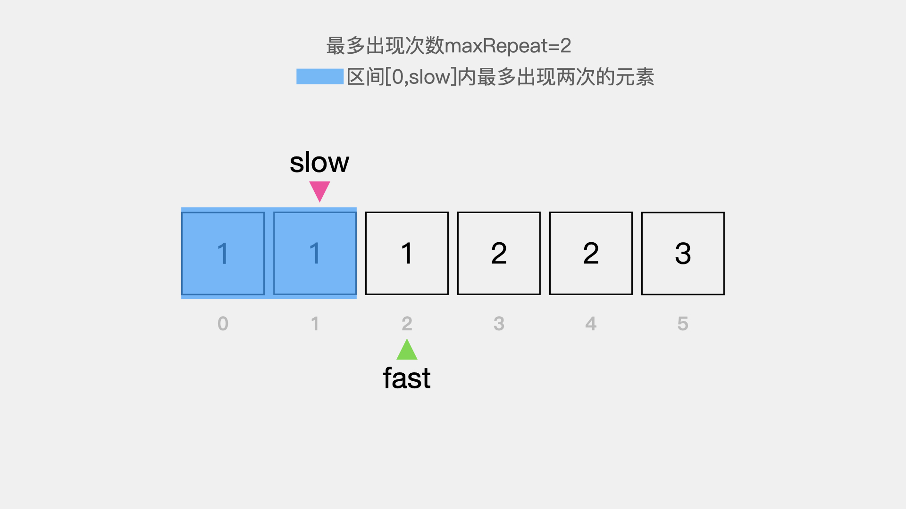


当前考察的元素nums[fast]与nums[slow-maxRepeat-1]相等，即变量fast所指向的元素1在区间[0,slow]中已出现两次。

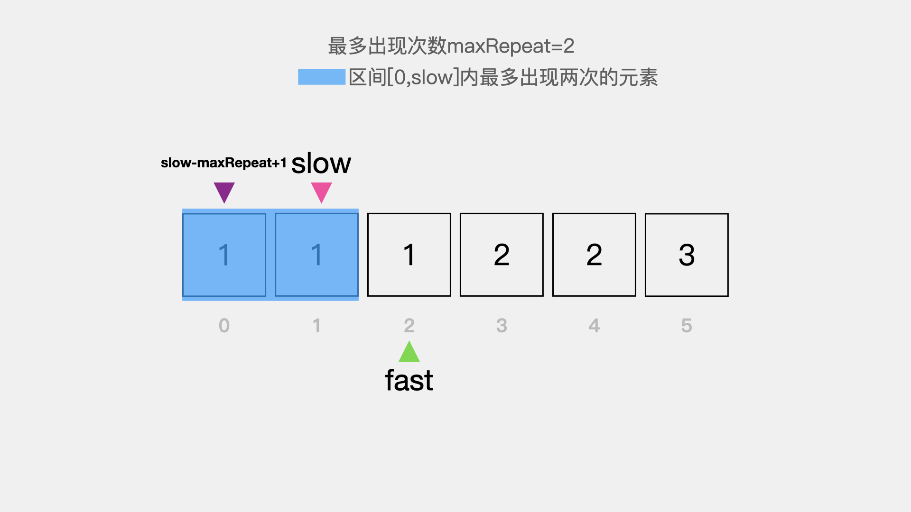


因此继续考察下一个元素，fast向右移动一位。此时nums[fast] != nums[slow - maxRepeat + 1]，即指针fast指向的元素2不等于指针slow - maxRepeat + 1所指向的元素1，这时快指针需要停下来等待。

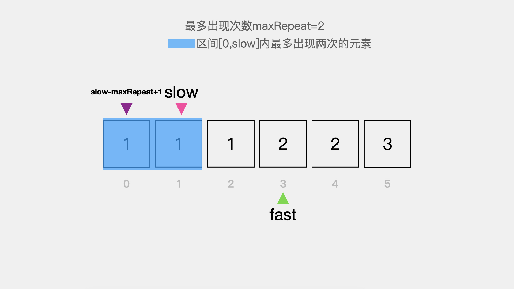


区间[0,slow]内的元素为最多出现两次的元素，因此需要将慢指针slow向右移动一位来扩大区间。

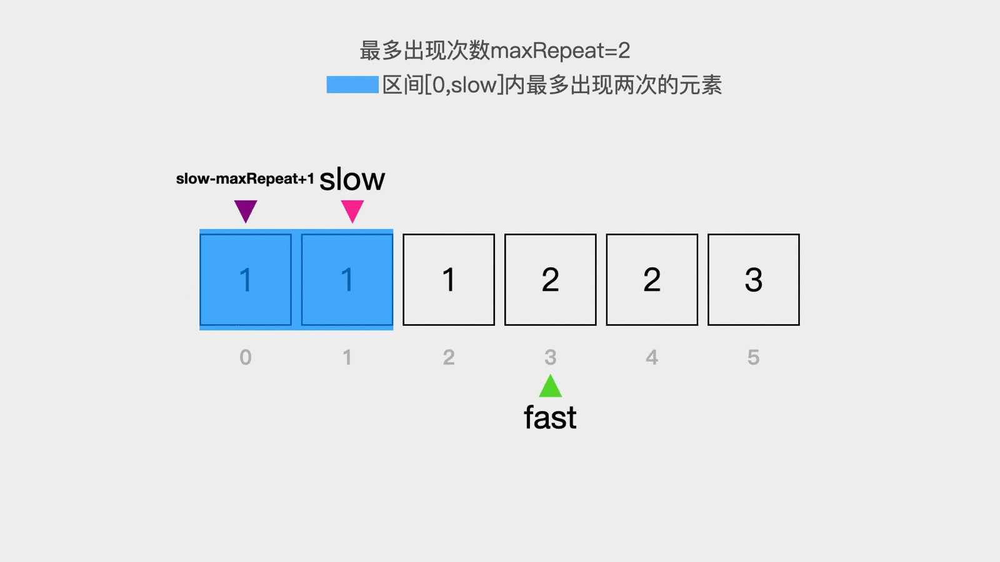


接着将快指针fast指向的元素值赋予慢指针slow所指向的位置。

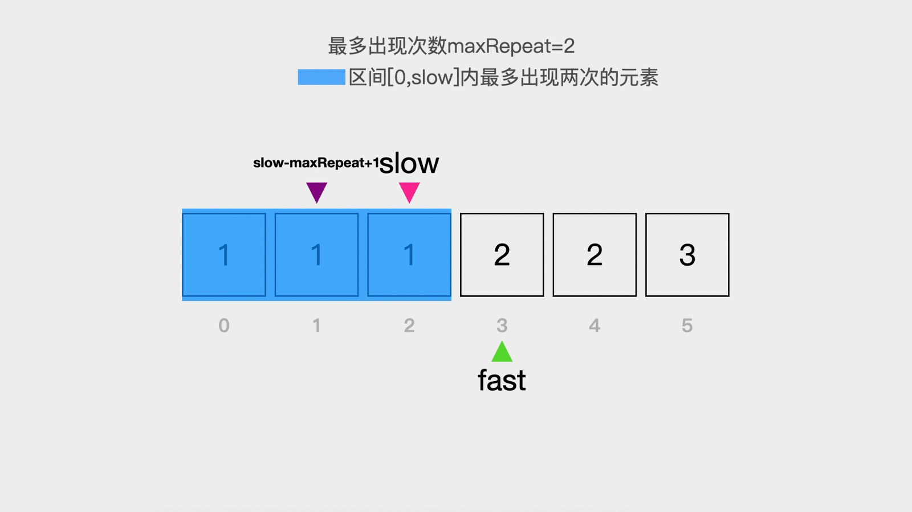


对于数组中剩余未考察的元素2，3重复上述步骤即可使得每个元素最多出现两次。

**动画演示** 配有字幕


**代码实现**

```java
public int removeDuplicates(int[] nums) {
    // 最大重复次数两次
    int maxRepeat = 2;
    // 慢指针slow指向索引为1的位置
    int slow = maxRepeat - 1;
    for(int fast = maxRepeat; fast < nums.length; fast++) {
        // nums[fast] != nums[slow - maxRepeat + 1]
        // 保证在区间[0,slow]中元素最多不会超过2次
        if (nums[fast] != nums[slow - maxRepeat + 1]) {
            // 先扩展区间
            slow++;
            // 再赋值
            nums[slow] = nums[fast];
        }
    }
    return slow + 1;
}
```

**更多内容扫描下方二维码关注公众号「编程狂想曲」查看**,如有错误可在公众号加我个人微信后指出
<p align='center'>

</p>