# 快慢指针巧解链表题目（一）


今天分享的内容是快慢指针在链表中的应用，题目有：

* LeetCode #19 删除链表的倒数第N个节点

* LeetCode #61 旋转链表

## 01 LeetCode #19 删除链表的倒数第N个节点

**题目描述：**

给你一个链表，删除链表的倒数第 n 个结点，并且返回链表的头结点。

**示例:**


输入：head = [1,2,3,4,5], n = 2
输出：[1,2,3,5]


**思路分析:**

示例给出的链表结构如下图所示：


要删除链表中的某个节点，需要知道其前一个节点。对于头节点来说，其没有前一个节点，因此，需定义虚拟头节点，如下图：

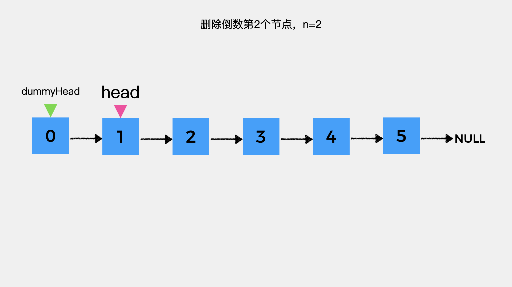


这里要删除的是链表中倒数第2个节点，其前一个节点是指针slow指向的节点。

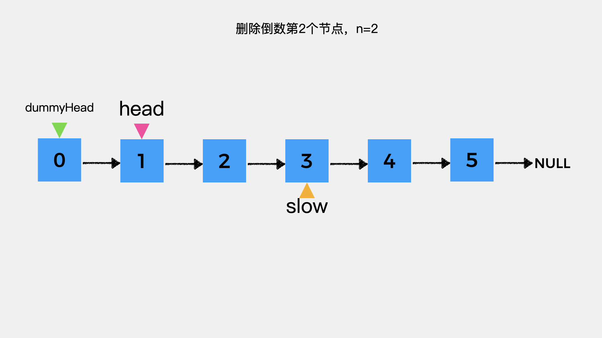


那如何确定指针slow指向的位置呢？在这里还需引入指针fast，当指针fast指向null时，它与指针slow之间相差2个节点，刚好是n=2。

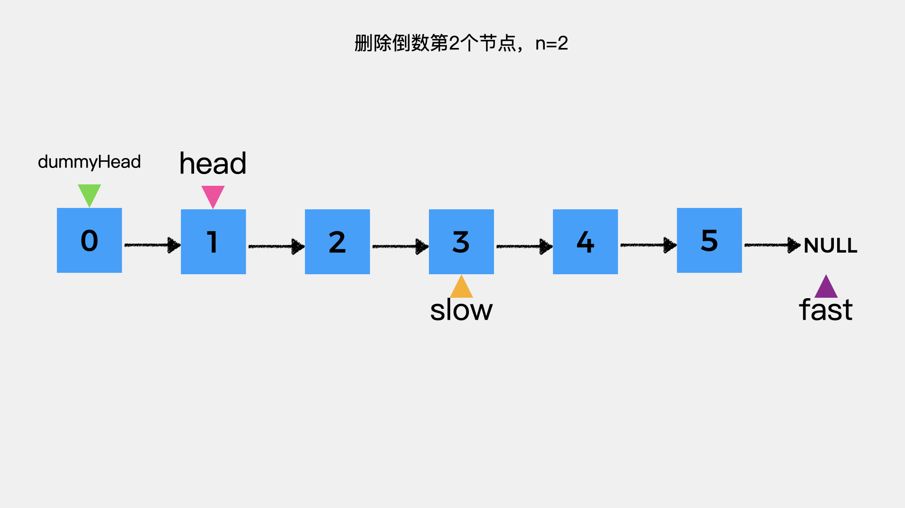


那么又如何确定指针fast的位置呢？由于我们只知道链表的头节点，要找到待删除的节点，就需要从头节点开始遍历链表。因此，定义慢指针slow和快指针fast，其初始都指向虚拟头节点。然后，我们先让快指针fast向前移动n+1步。示例中n=2，因此，fast向前移动3步。

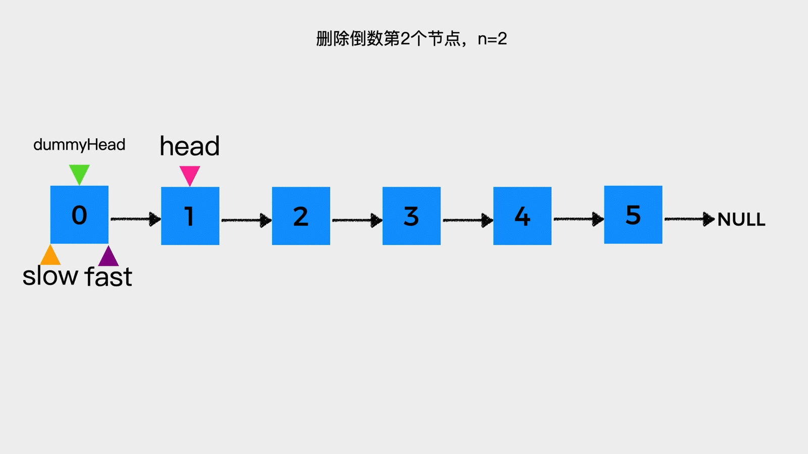


然后，让慢指针slow和快指针fast同时向前移动，每次移动一步，直到快指针fast指向null。

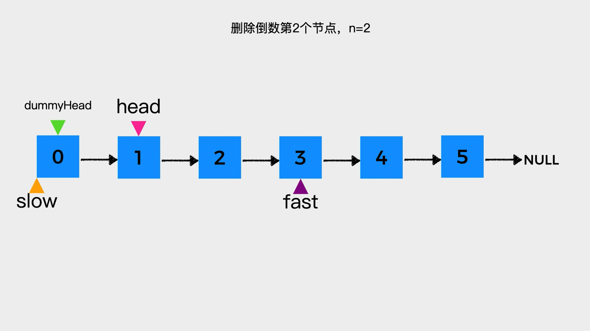


这时，慢指针slow所指节点的下一个节点就是待删除节点。

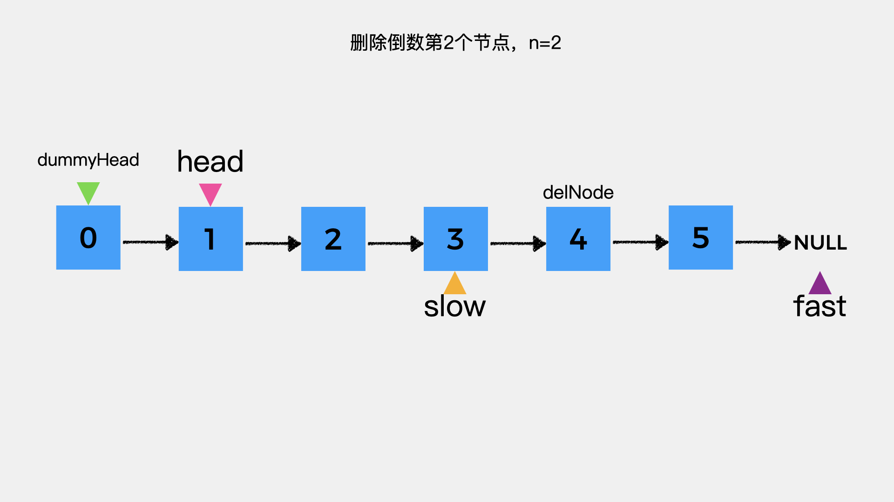


接着，只需将slow所指节点的后继指针指向待删除节点的下一个节点，然后待删除节点delNode的后继指针指向null，即可将倒数第2个节点删除。


**动画演示:**


**代码实现:**

```java
public ListNode removeNthFromEnd(ListNode head, int n) {
    ListNode dummyHead = new ListNode(0);
    dummyHead.next = head;

    // 慢指针初始指向虚拟头结点
    ListNode slow = dummyHead;
    // 快指针初始指向虚拟头结点
    ListNode fast = dummyHead;

    // 快指针先向前移动n+1步
    for(int i = 0; i <= n; i++) {
        fast = fast.next;
    }

    // 快慢指针同时向前移动，直到快指针指向null
    while (fast!=null){
        fast = fast.next;
        slow = slow.next;
    }

    // 慢指针的下一个节点即待删除节点
    ListNode delNode = slow.next;
    // 慢指针的后继指针指向待删除节点的下一个节点
    // 这样就将待删除节点删除了
    slow.next = delNode.next;
    delNode.next = null;
    return dummyHead.next;
}
````

## 02 LeetCode #61 旋转链表

**题目描述：**

给定一个链表，旋转链表，将链表每个节点向右移动 k 个位置，其中 k 是非负数。

**示例1:**

输入: 1->2->3->4->5->NULL, k = 2
输出: 4->5->1->2->3->NULL

解释:

向右旋转 1 步: 5->1->2->3->4->NULL
向右旋转 2 步: 4->5->1->2->3->NULL

**示例 2:**

输入: 0->1->2->NULL, k = 4

输出: 2->0->1->NULL

解释:

向右旋转 1 步: 2->0->1->NULL

向右旋转 2 步: 1->2->0->NULL

向右旋转 3 步: 0->1->2->NULL

向右旋转 4 步: 2->0->1->NULL


**思路分析:**

根据题目给出的示例，可以总结出：**将链表中每个节点向右移动K个位置，也就是将链表中倒数第K个节点作为头节点，其前面的所有节点放在原链表尾节点之后。**

因此整体思路就是找到倒数第K个节点的前一个节点，然后让链表首尾相连，第K个节点作为链表旋转后的新的头节点，其前一个节点作为链表旋转后的尾节点。

接下来，我们逐步看下具体过程。示例1给出的链表结构如下图所示：


首先，定义慢指针slow和快指针fast，其初始都指向链表头节点。

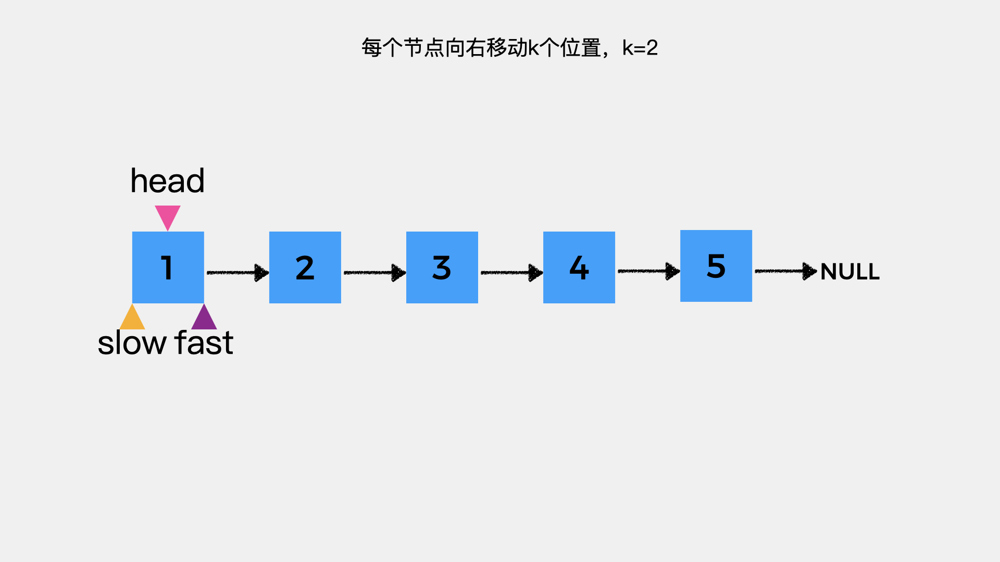


然后，让快指针fast先向前移动2步。

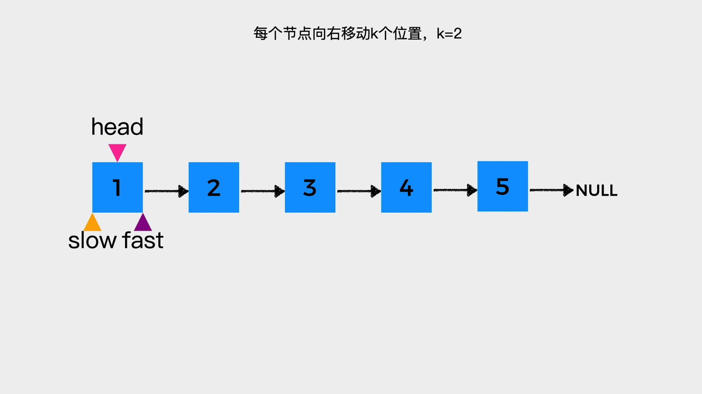


接着，慢指针slow和快指针fast同时向前移动，每次移动一步，直到快指针fast指向链表的尾节点。这里，快指针fast指向链表的尾节点，不再继续向后移动的原因是，我们需要将尾节点和链表头节点相连，因此其所指节点不能为null。

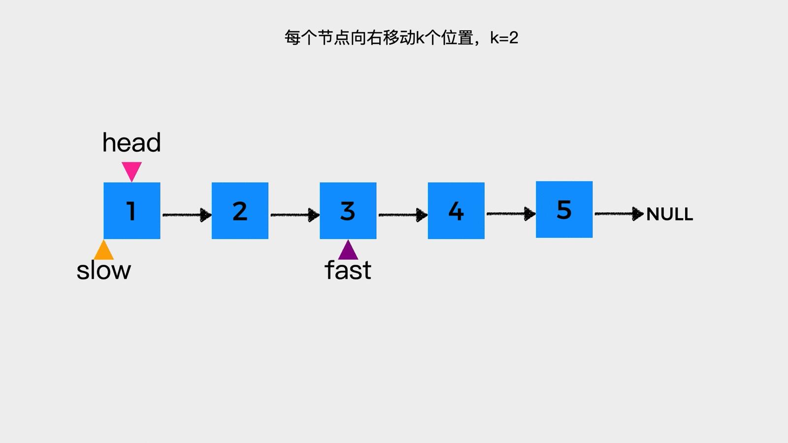


此时，慢指针slow所指节点的下一个节点就是倒数第K个节点。

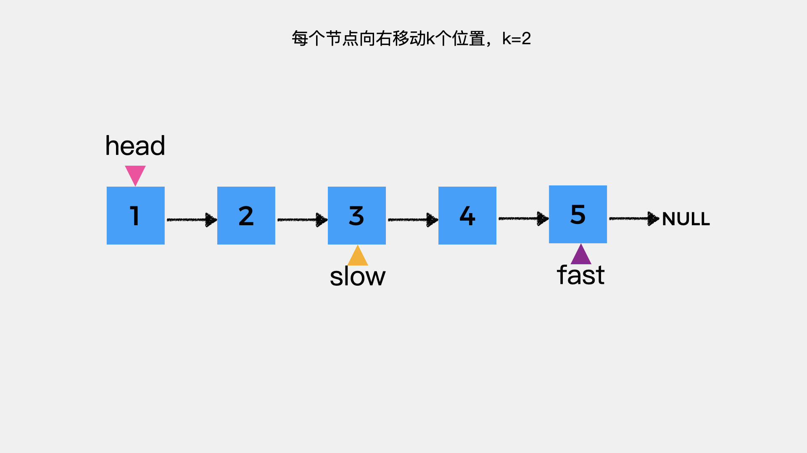

接着，要做的就是将快指针fast所指的尾节点的后继指针指向链表头节点，使链表成环。然后，倒数第K个节点作为链表旋转后的新的头节点，指针slow所指节点作为新的尾节点。

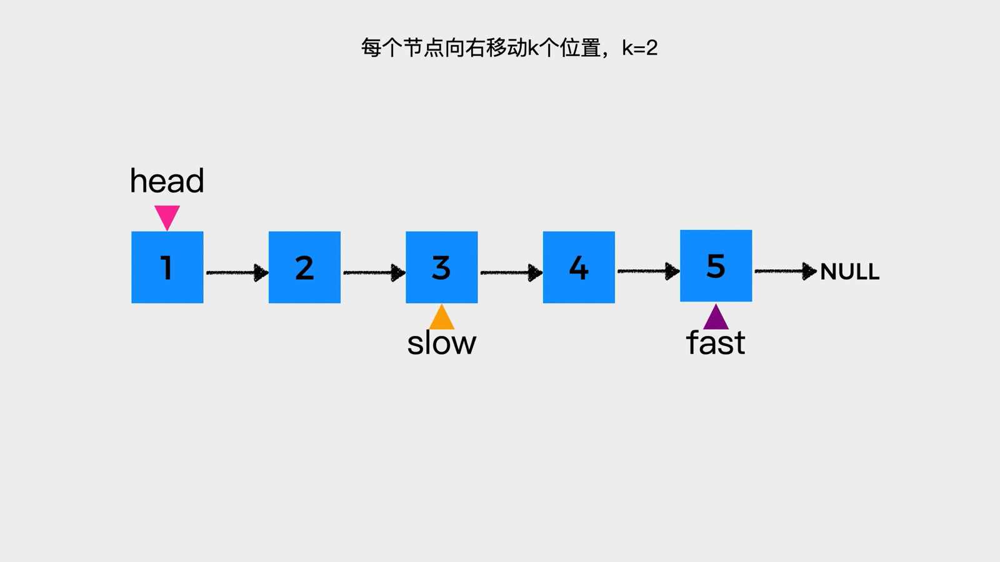


**动画演示：**

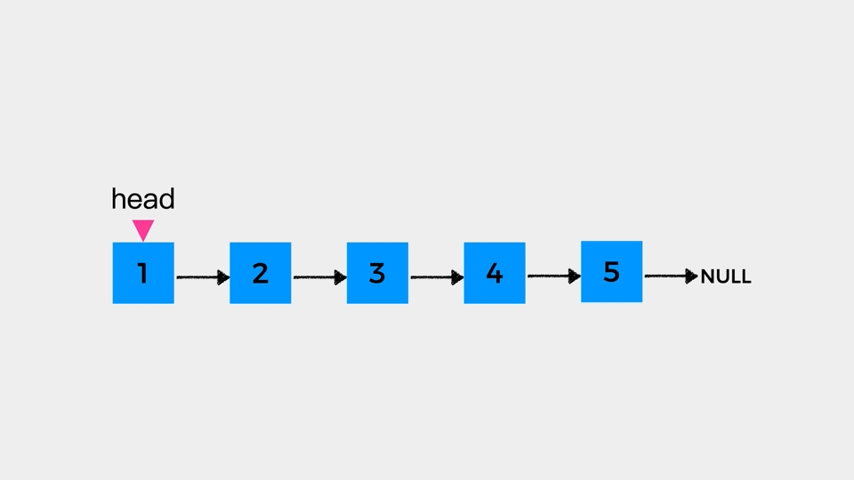


**代码实现:**

在代码的第7和第8行，先计算了链表的长度，即链表中节点个数。然后，对k取余，原因是由于最后链表首尾相连成环形链表，所以当k大于链表长度len时，对于一个节点来说其移动k个位置和移动k对len取余个位置结果是一样的。

```java
public ListNode rotateRight(ListNode head, int k) {
    if (head == null) {
        return head;
    }

    // 计算链表中节点个数
    int len = calculateLen(head);
    k = k%len;

    // 慢指针初始指向头节点
    ListNode slow = head;
    // 快指针初始指向头节点
    ListNode fast = head;

    // 快指针先向前移动k步
    for(int i = 0; i < k; i++) {
        fast= fast.next;
    }

    // 快慢指针同时向前移动，直到快指针指向的节点的
    // 下一个节点为null
    while (fast.next != null) {
        fast = fast.next;
        slow = slow.next;
    }

    // 快指针此时在链表末尾
    // 然后其指向的节点的后继指针指向头节点
    // 这时链表首尾相连成环
    fast.next = head;
    // 新的头节点是慢指针所指节点的下一个节点
    head = slow.next;
    // 慢指针所指节点的的后继指针指向null
    // 断开环
    slow.next = null;
    return head;
}

private int calculateLen(ListNode head){
    int len = 0;
    while (head!=null) {
        head = head.next;
        len++;
    }
    return len;
}
```


**更多内容扫描下方二维码关注公众号「编程狂想曲」查看**,如有错误可在公众号加我个人微信后指出
<p align='center'>

</p>