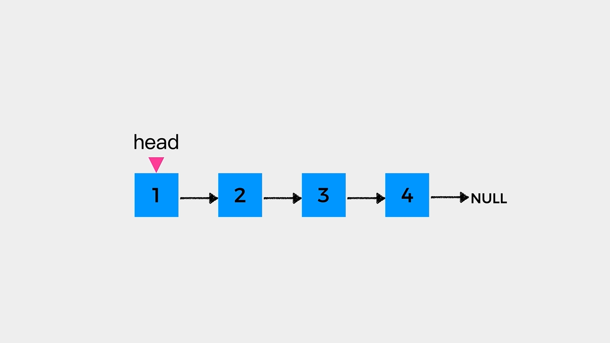
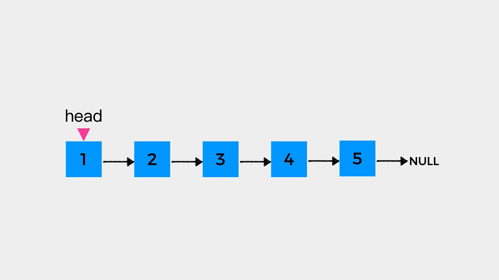
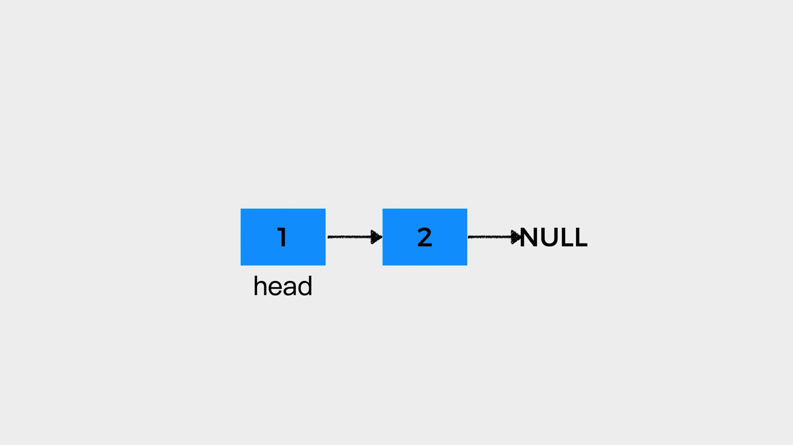
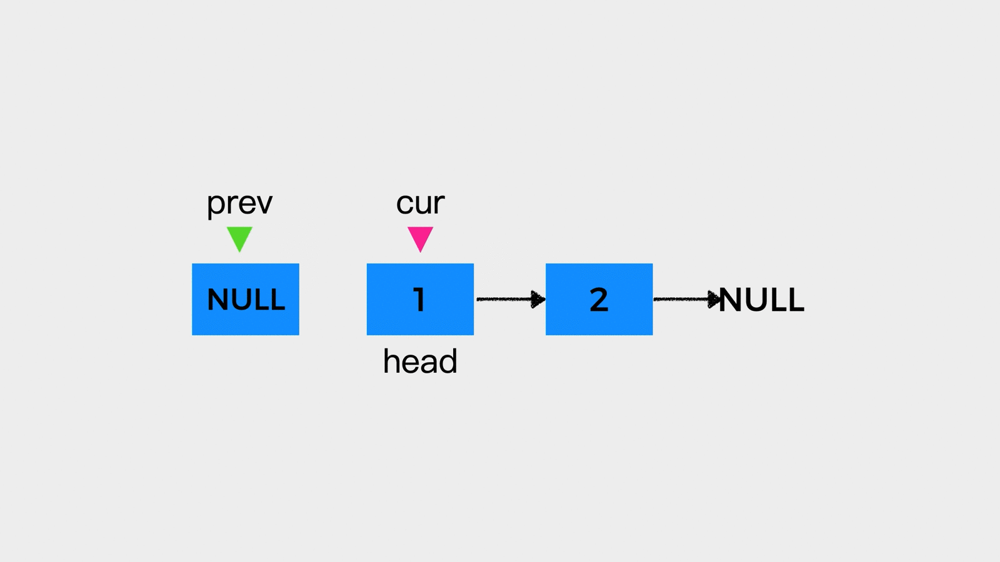
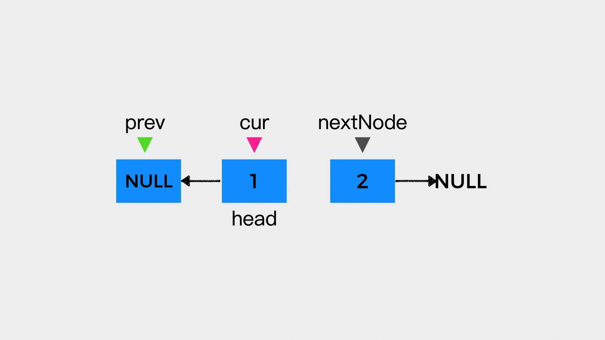
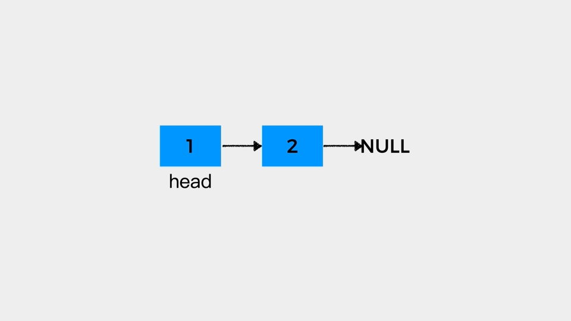
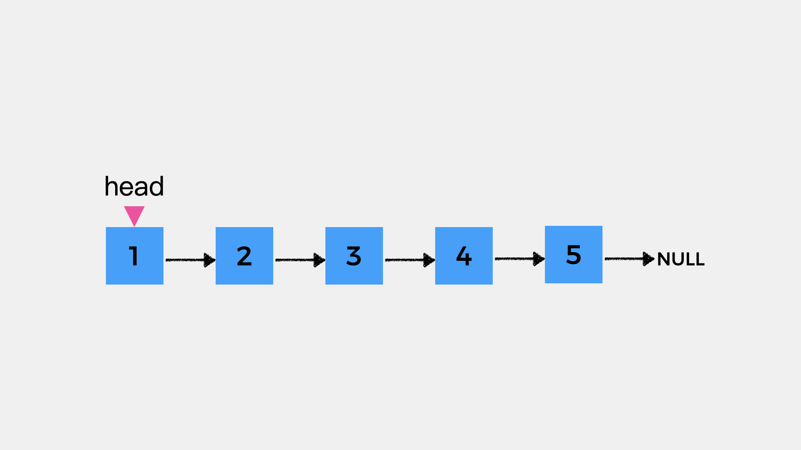
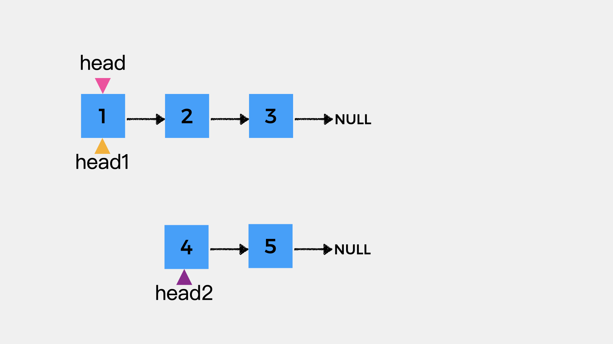
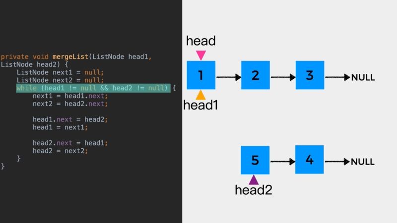

# 快慢指针巧解链表题目（二）


今天分享的题目有：

* LeetCode #876 链表的中间节点

* LeetCode #206 反转链表

* LeetCode #143 重排链表

## 01 LeetCode #876 链表的中间节点

**题目描述：**

给定一个头节点为 head 的非空单链表，返回链表的中间节点。

如果有两个中间节点，则返回第二个中间节点。

**示例:**

输入：[1,2,3,4,5]
输出：此列表中的节点 3

**思路分析:**

要找到链表的中间节点，可以定义两个指针，一个是慢指针slow，另一个是快指针fast。初始，慢指针slow和快指针fast都指向链表的头节点。然后，快指针fast每次向前移动两步，慢指针slow每次向前移动一步，当快指针fast不能继续向前移动时，慢指针slow所指的节点就是中间节点。

对于节点个数为奇数的链表来说，其中间节点只有一个；而对于节点个数为偶数的链表来说，其中间节点有两个。

接着，我们就通过动画来看下如何通过快慢指针找到链表的中间节点。

1.当快指针fast向前移动的条件是：fast.next!=null && fast.next.next != null时：

对于节点个数为奇数的链表来说，动画演示如下，此时链表的中间节点是节点3。


对于节点个数为偶数的链表来说，动画演示如下，此时链表的中间节点是节点2，即在2和3这两个中间节点中，找到是第一个中间节点。




2.当快指针fast向前移动的条件是：fast!=null && fast.next != null时：

对于节点个数为奇数的链表来说，动画演示如下，此时链表的中间节点是节点3。




对于节点个数为偶数的链表来说，动画演示如下，此时链表的中间节点是节点3，即在2和3这两个中间节点中，找到是第二个中间节点。


题目要求的是如果有两个中间节点，则返回第二个中间节点。因此，对于该题目而言，快指针fast向前移动的条件是：fast!=null && fast.next != null。

**代码实现：**

```java
public ListNode middleNode(ListNode head){
    ListNode slow = head;
    ListNode fast = head;
    while (fast != null && fast.next != null) {
        slow = slow.next;
        fast= fast.next.next;
    }
    return slow;
}
```


## 02 LeetCode #206 反转链表

**题目描述：**

反转一个单链表。

**示例:**

输入: 1->2->3->4->5->NULL
输出: 5->4->3->2->1->NULL

**思路分析:**

对于题目给出的链表，简化如下：


由于只知道链表的头节点head，因此需要从头节点head开始反转。头节点head在反转之后，就成为了链表的尾节点，而尾节点的后继指针是指向null的。因此，需要定义一个空节点，在这里我们用prev表示。同时，对于当前考察的节点，我们用cur表示。




接着要做的就是，将cur所指节点的后继指针指向prev指向的节点。但是，这么做之后，cur所指节点的原本的后继节点就从链表中丢失了。

因此，在将cur所指节点的后继指针指向prev指向的节点前，需要先用变量nextNode指向cur所指节点的原本的后继节点。




在完成cur所指节点的反转之后，就要继续反转下一个节点了。因此，先prev指向cur所指向的节点，作为下一个待反转节点反转之后的后继节点。然后，cur指向nextNode指向的节点，表示其是下一个待反转的节点。




**动画演示：**




**代码实现：**

```java

public ListNode reverseList(ListNode head) {
    ListNode prev = null;
    ListNode cur = head;
    while (cur != null) {
        ListNode nextNode = cur.next;
        cur.next = prev;
        prev = cur;
        cur = nextNode;
    }
    return prev;
}
```


**03 LeetCode #143 重排链表**

**题目描述：**

给定一个单链表 L：L0→L1→…→Ln-1→Ln ，

将其重新排列后变为：L0→Ln→L1→Ln-1→L2→Ln-2→…

你不能只是单纯的改变节点内部的值，而是需要实际的进行节点交换。

**示例1:**


给定链表 1->2->3->4->5, 重新排列为 1->5->2->4->3.

**示例2：**

给定链表 1->2->3->4, 重新排列为 1->4->2->3.

**思路分析:**

通过观察给到的示例，其结果是将原链表的前半部分和原链表的后半部分反转之后的链表进行合并得到的。

因此，整体思路就是：
* 首先，找到链表的中间节点，方法如上述的#86题；
* 接着，将链表的后半部分反转，放入如上述的#206题；
* 然后，将链表的前半部分和链表的后半部分反转后的结果进行合并。

示例1给出的链表结构如下：




中间节点是节点3，链表的前半部分和后半部分如下：




链表合并的**动画演示**如下：




整个题目的**完整代码**实现如下：

```java
public void reorderList(ListNode head) {
    if (head == null) {
        return;
    }

    // 获得中间节点
    ListNode mid = findMid(head);

    // 中间节点之后的部分进行反转
    ListNode head2 = mid.next;
    mid.next = null;
    head2 = reverseList(head2);

    // 合并
    ListNode head1 = head;
    mergeList(head1, head2);
}

// LeetCode 876
private ListNode findMid(ListNode head){
    ListNode slow = head;
    ListNode fast = head;
    while (fast.next != null && fast.next.next != null) {
        slow = slow.next;
        fast= fast.next.next;
    }
    return slow;
}

// LeetCode 206
private ListNode reverseList(ListNode head){
    ListNode prev = null;
    ListNode cur = head;
    while (cur != null) {
        ListNode nextNode = cur.next;
        cur.next = prev;
        prev =cur;
        cur = nextNode;
    }
    return prev;
}


private void mergeList(ListNode head1, ListNode head2) {
    ListNode next1 = null;
    ListNode next2 = null;
    while (head1 != null && head2 != null) {
        next1 = head1.next;
        next2 = head2.next;

        head1.next = head2;
        head1 = next1;

        head2.next = head1;
        head2 = next2;
    }
}
```


**更多内容扫描下方二维码关注公众号「编程狂想曲」查看**,如有错误可在公众号加我个人微信后指出
<p align='center'>

</p>