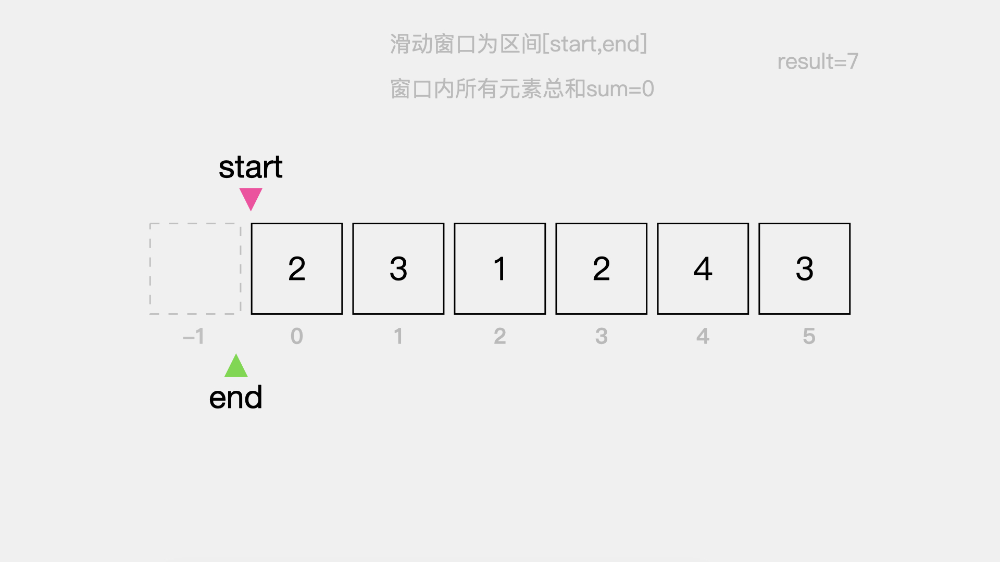
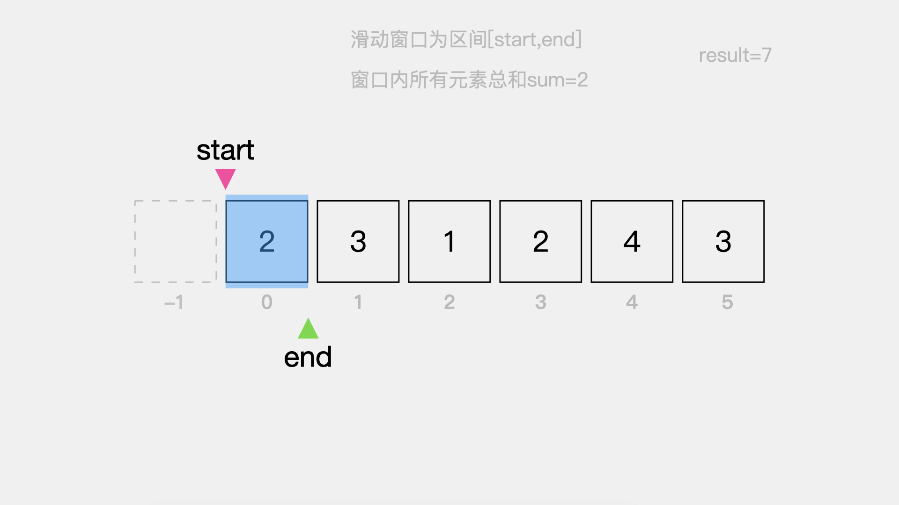
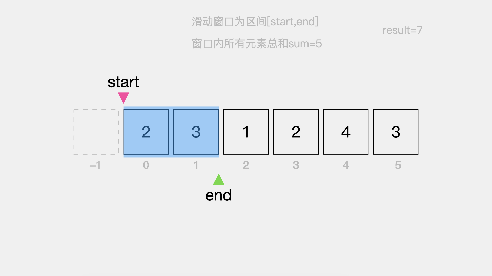
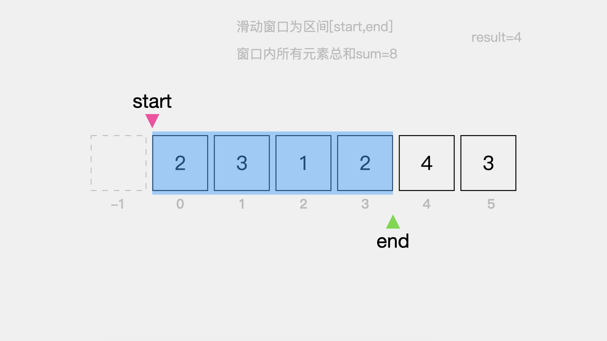
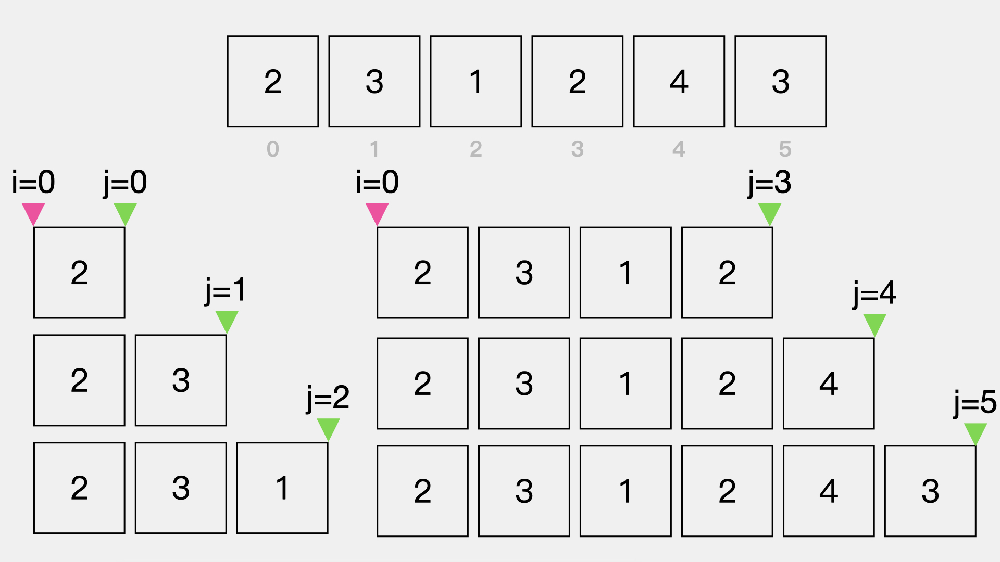
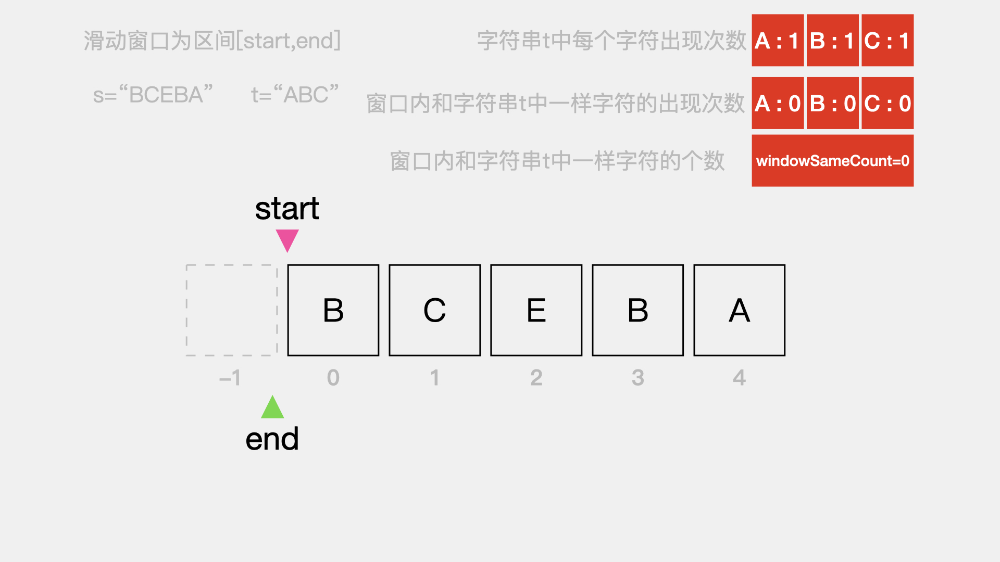
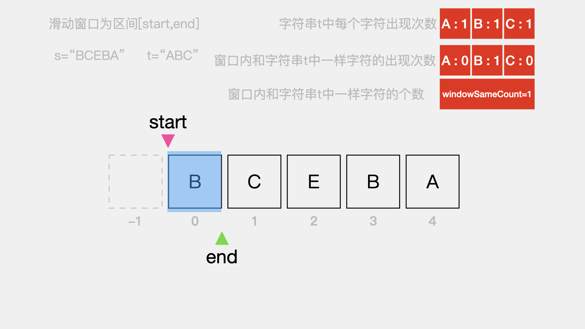
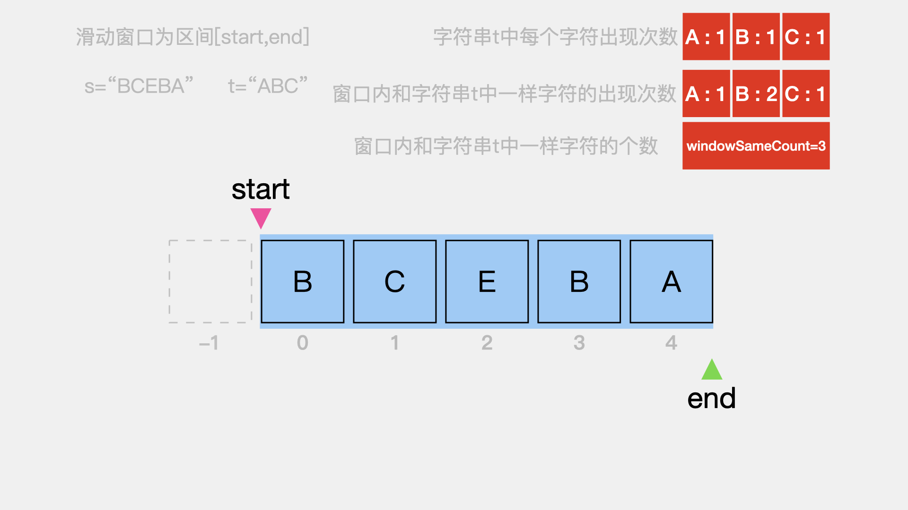
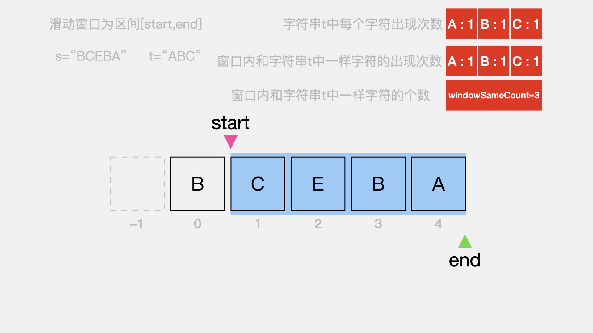

# 滑动窗口在数组及字符串中的应用


今天分享的内容是滑动窗口在数组中的应用。

分享的题目是LeetCode中的：
* 209.长度最小的子数组 难度 中等
* 438.找到字符串中所有字母异位词 难度 中等
* 76.最小覆盖子串 难度 困难

接下来，逐一看下如何用滑动窗口的思想来解答这三道题目。

## 01 LeetCode #209 长度最小的子数组

**题目描述：**

给定一个含有 n 个正整数的数组和一个正整数 s ，找出该数组中满足其和 ≥ s 的长度最小的 连续 子数组，并返回其长度。如果不存在符合条件的子数组，返回 0。

**示例:**
输入：s = 7, nums = [2,3,1,2,4,3]
输出：2
解释：子数组 [4,3] 是该条件下的长度最小的子数组。

**思路分析:**

对于该题目可以用暴力解法来解决，使用双重for循环，第一重for循环遍历整个数组，用于标定起始考察元素。然后在开始第二重for循环之前，定义变量sum，用于表示所考察元素的总和。

在第二重for循环里，先计算总和，然后和正整数s比较，如果大于等于正整数s，则记录当前考察过的元素之间的长度。详细代码如下：

```java
public int minSubArrayLen(int s, int[] nums) {
    // 初始化子数组长度为数组长度+1
    int result = nums.length + 1;
    for(int i = 0; i < nums.length; i++) {
        int sum = 0;
        for(int j = i; j < nums.length; j++) {
            sum += nums[j];
            // 如果当前累加和大于正整数s，则更新子数组长度
            if (sum >= s) {
                result = Math.min(result, j - i + 1);
            }
        }
    }
    // 如果最终result的值等于数组长度+1，则表示不存在符合条件的子数组
    return result == nums.length + 1 ? 0 : result;
}
```

接下来看下如何用滑动窗口的思想来解决该题目。首先，明确几个变量的定义，变量start表示窗口的起始位置，变量end表示窗口的结束位置，区间[start,end]用于记录当前窗口中的元素，变量sum表示窗口中所有元素的总和，变量result表示符合题意的子数组长度。

需要注意的是在这里，滑动窗口的起始位置start=0，结束位置end=-1，表示，初始状态下窗口中没有元素，因为区间[0,-1]并不存在。result的初始值给定数组长度加1。




接着，先扩大滑动窗口的右侧边界，即指针end向右移动一个位置。这时窗口区间为[0,0]，窗口内的元素是2，即sum=2。




由于sum=2小于目标值s=7，因此需要继续扩大窗口右侧边界，即指针end继续向右移动一个位置。这时，窗口区间为[0,1]，窗口内元素是2，3，即sum=5。




这时，由于sum=5依旧小于目标值s=7，因此需要继续扩大窗口右侧边界。也就是说，对于该题目，只要窗口区间[start,end]内元素总和小于目标值s=7，就需要继续扩大窗口右边界，来使sum变大。

如下图，当指针end指向索引3的位置时，窗口区间[0,3]内的元素2、3、1、2总和为8大于目标值s=7，因此需要更新result的值为4。




这时，请思考一个问题：**窗口的右侧边界还有必要继续向右扩大吗？**

答案是没有必要。因为，此时窗口内的元素总和已经大于等于目标值s=7，也就是已经找到一个连续的子数组{2,3,1,2}使得其和大于等目标值s=7了。如果继续向右扩大窗口右侧边界，只能是让窗口区间内的元素总和继续增大，伴随着的就是连续子数组的长度也在增大，而题目要求的是长度最小的连续子数组，因此，当窗口内所有元素的总和大于等目标值s=7时，就需要停止继续扩大窗口右侧边界这一动作。

这一点其实正是上面提到的暴力解法双重for循环的不足之处，即双重for循环会存在冗余的计算。如下图，最后两次计算，即j=4和j=5，在i=0时，是没必要参与计算的。

双重for循环，当i=0时，计算效果示意图



当窗口右侧边界不能扩大时，接着要做的就是缩小窗口的左侧边界，来看缩小左侧边界之后，窗口内的元素总和是否依旧大于等于目标值s=7，如果是，则继续缩小窗口左侧边界，如果不是则扩大窗口右侧边界，直到数组末尾。

**动画演示**


**代码实现**

```java
public int minSubArrayLen(int s, int[] nums) {
    if (nums.length == 0) {
        return 0;
    }
    // window [start...end]
    int start = 0;
    int end = -1;
    int sum = 0;
    int result = nums.length + 1;
    while (start < nums.length) {
        // 还有剩余元素未考察并且窗口内元素总和小于目标值s
        if (end + 1 < nums.length && sum < s) {
            end++;
            sum += nums[end];
        } else { // 尝试缩小窗口
            sum -= nums[start];
            start++;
        }

        // 窗口内元素总和大于等于目标值s则更新结果值
        if (sum >= s) {
            result = Math.min(result, end - start + 1);
        }
    }

    return result == nums.length + 1 ? 0 : result;
}
```

## 02 LeetCode #438 找到字符串中所有字母异位词

**题目描述：**

给定一个字符串 s 和一个非空字符串 p，找到 s 中所有是 p 的字母异位词的子串，返回这些子串的起始索引。
字符串只包含小写英文字母，并且字符串 s 和 p 的长度都不超过 20100。

说明：
* 字母异位词指字母相同，但排列不同的字符串。
* 不考虑答案输出的顺序。

**示例:**

输入: s: "cbaebabacd" p: "abc"
输出: [0, 6]

**解释:**

起始索引等于 0 的子串是 "cba", 它是 "abc" 的字母异位词。
起始索引等于 6 的子串是 "bac", 它是 "abc" 的字母异位词。

**思路分析:**

该题目用滑动窗口思想解决的基本思路是：

首先，计算字符串p中各个元素出现的次数，由于字符串只包含小写英文字母，所以可以用数组来记录每个元素出的次数。

接着，用变量start表示窗口的起始位置，变量end表示窗口的结束位置，区间[start,end]用于记录当前窗口中的元素。在这里扩大窗口右侧边界的条件是——字符串s还有剩余元素为考察且窗口[start,end]内的字符长度小于字符串p的长度；缩小窗口左侧边界的条件是——窗口[start,end]内字符的长度等于字符串p的长度。

当，窗口[start,end]内字符的长度等于字符串p的长度时，接着要做的就是判断窗口内的字符串是不是字符串p的字母异位词(每个字母出现次数相同，只是顺序不同)。

具体逻辑可看如下动画演示或代码实现。

**动画演示**


**代码实现**

```java
public List<Integer> findAnagrams(String s, String p) {
    List<Integer> resultList = new ArrayList<>();

    // 计算字符串p中各元素的出现次数
    int[] pFreq = new int[26];
    for(int i = 0; i < p.length(); i++) {
        pFreq[p.charAt(i)-'a']++;
    }

    // 窗口区间为[start,end]
    int start = 0, end = -1;
    while (start <s.length()) {
        // 还有剩余元素未考察，且窗口内字符串长度小于字符串p的长度
        // 则扩大窗口右侧边界
        if (end+1 < s.length() && end-start+1 <p.length()) {
            end++;
        }else {
            // 右侧边界不能继续扩大或窗口内字符串长度等于字符串p的长度
            // 则缩小左侧边界
            start++;
        }

        // 当窗口内字符串长度等于字符串p的长度时，则判断其是不是字符串p的字母异位词子串
        if (end-start+1 == p.length() && isAnagrams(s.substring(start,end+1), pFreq)) {
            resultList.add(start);
        }
    }
    return resultList;
}

// 判断当前子串是不是字符串p的字母异位词
private boolean isAnagrams(String window, int[] pFreq) {
    // 计算窗口内字符串各元素的出现次数
    int[] windowFreq = new int[26];
    for(int i = 0; i < window.length(); i++) {
        windowFreq[window.charAt(i)-'a']++;
    }

    // 比较窗口内各元素的出现次数和字符串p中各元素的出现次数是否一样
    // 如果都一样，则说明窗口内的字符串是字符串p的字母异位词子串
    // 如果不一样，则说明不是其子串
    for(int j = 0; j < 26; j++) {
        if (windowFreq[j] != pFreq[j]) {
            return false;
        }
    }
    return true;
}
```

## 03 LeetCode #76 最小覆盖子串

**题目描述：**

给你一个字符串 s 、一个字符串 t 。返回 s 中涵盖 t 所有字符的最小子串。如果 s 中不存在涵盖 t 所有字符的子串，则返回空字符串 "" 。
注意：如果 s 中存在这样的子串，我们保证它是唯一的答案。

**示例:**

输入：s = "ADOBECODEBANC", t = "ABC"
输出："BANC"

**思路分析:**

最小覆盖子串是这样的子串，不仅字符串t中的每个字符都在该子串中出现，同时该子串中那些和字符串t中字符一样的字符其出现次数要大于等于其在字符串t中出现的次数。该题目用滑动窗口思想来解决的整体思路是：

首先，统计字符串t中每个字符的出现次数。

然后，扩大窗口右侧边界，直到窗口内的字符串包含了字符串t中的每个字符，同时字符串t中的每个字符在窗口内的字符串中的出现次数要大于等于字符串t中每个字符的出现次数。

接着，尝试缩小窗口的左侧边界，看窗口内字符串能不能覆盖字符串t。

这里为了方便讲解，我们以字符串s=“BCEBA"和字符串t=”ABC"为例来看一下滑动窗口的具体实现过程。

同样的，用变量start表示窗口的起始位置，变量end表示窗口的结束位置，区间[start,end]用于记录当前窗口中的字符。其余定义如下图：




首先，向右移动指针end来扩大窗口右边界。在扩大窗口边界后，窗口内字符B的出现次数更新为1，同时该字符在字符串t中有出现，因此更新windowSameCount为1。



继续向右移动指针end来扩大窗口右边界，直到字符串t中的每个字符在窗口中都有出现，且窗口内和字符串t中的字符相同的字符A、B、C出现次数大于等于其本身在字符串t中的出现次数。

如下图，窗口[0,4]内那些和字符串t中一样的字符A、B、C其出现次数分别为1、2、1。这时字符串"BCEBA"就是满足题意的一个子串。



接着，要做的就是移动指针start来缩小窗口左侧边界。看窗口内的字符串是否依旧可以覆盖字符串t="ABC"。

如下图，当移动指针start缩小窗口左侧边界后，窗口[1,4]内的字符串依旧可以覆盖字符串t。因为字符串t中的字符A、B、C在窗口[0,4]内都有出现，且出现次数依次为1、1、1。



由于指针end已经指向字符串s最后一个字符，因此接着要做的就是移动指针start来缩小窗口范围继续看窗口内的字符串是否可以覆盖字符串t。直到指针start也指向字符串s最后一个字符。

**动画演示**


**代码实现**

```java
public String minWindow(String s, String t) {
    // 统计字符串t中每个字符的出现次数
    int[] tFreq = new int[256];
    for(int i = 0; i < t.length(); i++) {
        tFreq[t.charAt(i)]++;
    }

    // 用于记录窗口中每个字符的出现次数
    int[] windowFreq = new int[256];
    // 当前窗口中和字符串t中的字符相同的字符个数
    int windowSameCount = 0;

    int minWindowLength = s.length()+1;
    int startIndex = -1;

    int start = 0;
    int end = -1;
    while (start < s.length()) {
        if (end+1<s.length() && windowSameCount < t.length()) {
            windowFreq[s.charAt(end+1)]++;
            // 窗口中当前考察的字符的出现次数小于等于字符串t中字符出现次数
            // 则窗口中当前考察的字符是在字符串t中出现的
            if (windowFreq[s.charAt(end+1)] <= tFreq[s.charAt(end+1)]) {
                windowSameCount++;
            }
            end++;
        }else {
            // 字符串t中的字符在窗口中全部出现
            if (windowSameCount == t.length() && end - start + 1 < minWindowLength) {
                minWindowLength = end - start + 1;
                startIndex = start;
                System.out.println(s.substring(start,end+1));
            }
            // 窗口左移
            windowFreq[s.charAt(start)]--;
            if (windowFreq[s.charAt(start)] < tFreq[s.charAt(start)]) {
                windowSameCount--;
            }
            start++;
        }
    }

    if (startIndex != -1) {
        return s.substring(startIndex, startIndex+minWindowLength);
    }
    return "";
}
```


**更多内容扫描下方二维码关注公众号「编程狂想曲」查看**,如有错误可在公众号加我个人微信后指出
<p align='center'>

</p>