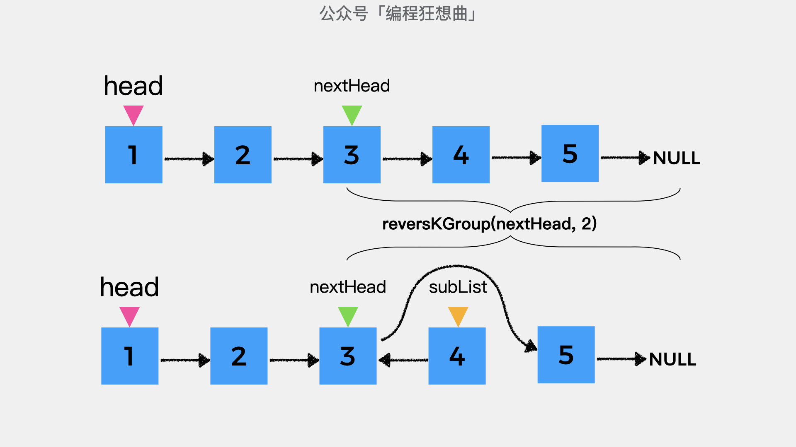
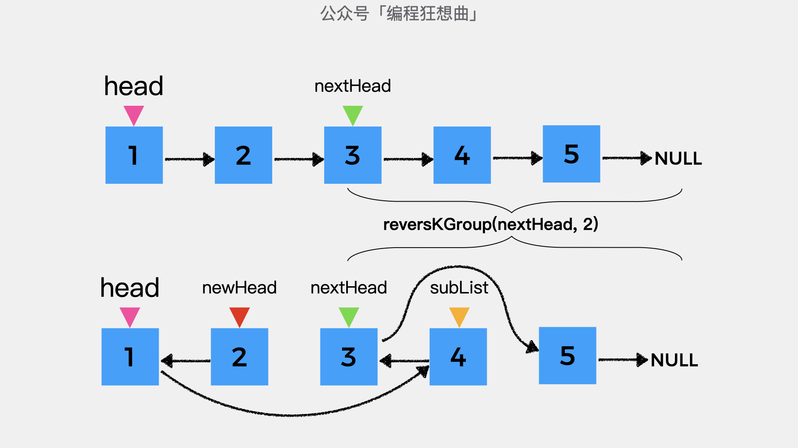
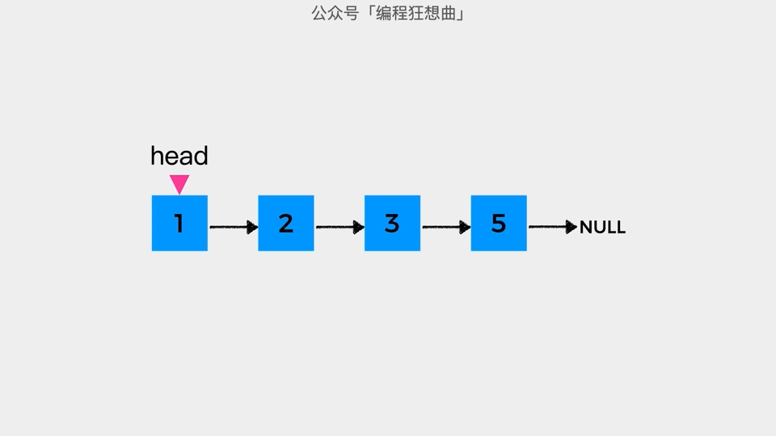

# LeetCode #25 K个一组反转链表


今天分享的内容是LeetCode #25 K个一组反转链表这个题目，详细内容如下：

**题目描述：**

给你一个链表，每 k 个节点一组进行翻转，请你返回翻转后的链表。
k 是一个正整数，它的值小于或等于链表的长度。
如果节点总数不是 k 的整数倍，那么请将最后剩余的节点保持原有顺序。

**示例:**

给你这个链表：1->2->3->4->5

当 k = 2 时，应当返回: 2->1->4->3->5

当 k = 3 时，应当返回: 3->2->1->4->5


**思路分析:**

在[宏观视角看递归](https://mp.weixin.qq.com/s?__biz=MzUzNzc2NTAxNg==&mid=2247484459&idx=1&sn=93ff9bc1bc5efce6a8a314b8000739e9&chksm=fae0b1dccd9738ca23f2527270291fe60726ec57e5b9cb716d19c9c90d5f798b15213c2169c7&scene=21#wechat_redirect)这篇文章中，我们说链表具有天然的递归属性，因为一个链表，可以看做是一个节点后挂着另一个链表，即递归中更小的子问题。

那么对于题目给定的链表其更小的子问题是什么呢？

由于是k个一组反转链表，所以对于给定的链表除去前k个节点，剩余的节点组成的链表依旧满足k个一组反转链表这个条件，这就是这个题目的子问题。

子问题有了，就可以初步写出如下的递归代码，其中subList是除去前k个节点后剩余的链表k个一组反转后的头结点。

```java
public ListNode reverseKGroup(ListNode head, int k) {
    // 递归反转链表中除去前k个节点的后续节点
    ListNode subList = reverseKGroup(除去前k个节点后剩余的链表,k);
}
```

接着，我们看下如何确定除去前k个节点后剩余的链表这个问题。

方法是从头节点head开始遍历链表，遍历的过程中记录已遍历的节点个数remainNum，同时用变量nextHead记录下一个待遍历的节点。

当remainNum与k相等时，变量nextHead指向的节点及其之后的所有节点就是除去前K个节点之后剩余的链表。至此，代码可以进一步完善如下：

```java
public ListNode reverseKGroup(ListNode head, int k) {
    // nextHead指向链表中除去k个节点之后的头节点
    // 初始指向节点head
    ListNode nextHead = head;
    // 链表中剩余节点个数
    int remainNum = 0;
    while (remainNum < k){
        remainNum++;
        nextHead = nextHead.next;
    }

    // 递归反转链表中除去前k个节点的后续节点
    ListNode subList = reverseKGroup(nextHead,k);
}
```


细心的你应该注意到，在这里有一个问题，那就是如果剩余的节点个数小于K，那么上述代码中的while循环内nextHead=nextHead.next就会出现空指针的问题。


剩余的节点个数小于K的情况，根据题意可知，这时不需要对这些节点进行反转，因此对于这种情况直接返回即可。这也是这道题目的递归终止条件。

到这里，代码可以进一步完善如下：

```java
public ListNode reverseKGroup(ListNode head, int k) {
    // nextHead指向链表中除去k个节点之后的头节点
    // 初始指向节点head
    ListNode nextHead = head;
    // 链表中剩余节点个数
    int remainNum = 0;
    while (remainNum < k){
        // 根据题意如果链表剩余节点个数不足k个
        // 则不需要反转，因此直接返回head
        if (nextHead == null) {
            return head;
        }
        remainNum++;
        nextHead = nextHead.next;
    }

    // 递归反转链表中除去前k个节点的后续节点
    ListNode subList = reverseKGroup(nextHead,k);
}
```

接着我们看下对于题目给出的示例，经过上述代码逻辑处理后是一个什么结果。


在这里我们以k=2为一组进行链表反转。因此，在除去前2个节点后，nextHead指向节点3。在经过reverseKGroup(nextHead,2)递归反转后，链表结构如下图所示。注意在这里，不要试图去在大脑中复现reverseKGroup这个递推公式的调用过程，只需知道其执行后的结果就可以了。




到此，我们完成了除去前2个节点之后，剩余节点的反转。接着要做的是反转前k=2个节点。反转后结果如下图所示：


这时，只需将head的后继指针指向变量subList所指向的节点，就完成了K个一组反转链表这个任务。




在加上反转链表中前k个节点的代码后，代码进一步完善如下：

```java
public ListNode reverseKGroup(ListNode head, int k) {
    // nextHead指向链表中除去k个节点之后的头节点
    // 初始指向节点head
    ListNode nextHead = head;
    // 链表中剩余节点个数
    int remainNum = 0;
    while (remainNum < k){
        // 根据题意如果链表剩余节点个数不足k个
        // 则不需要反转，因此直接返回head
        if (nextHead == null) {
            return head;
        }
        remainNum++;
        nextHead = nextHead.next;
    }

    // 递归反转链表中除去前k个节点的后续节点
    ListNode subList = reverseKGroup(nextHead,k);
    // 反转链表中前k个节点
    ListNode newHead = reverseTopN(head, k);
    // 前k个节点反转后，head指向的节点是反转后的链表中的最后一个节点
    // 因此head指向的节点的后继指针指向subList
    head.next = subList;
    return newHead;
}
```

最后我们看下如何反转链表中的前K个节点。反转前K=2个节点动画演示如下：




反转前K个节点的代码实现如下:

```java
private ListNode reverseTopN(ListNode head, int n) {
    ListNode prev = null;
    // 当前考察的节点
    ListNode cur = head;
    // num小于n，则表示当前节点需要反转
    for(int num = 0; num < n; num++){
        // 当前节点的下一个节点
        ListNode next = cur.next;
        // 当前节点的后继指针指向prev
        cur.next = prev;
        // prev指向当前节点
        // 表示其是next节点反转后的前一个节点
        prev = cur;
        // cur指向下一个节点
        // 表示下一个节点是待反转节点
        cur = next;
    }
    return prev;
}
```

**更多内容扫描下方二维码关注公众号「编程狂想曲」查看**,如有错误可在公众号加我个人微信后指出
<p align='center'>

</p>