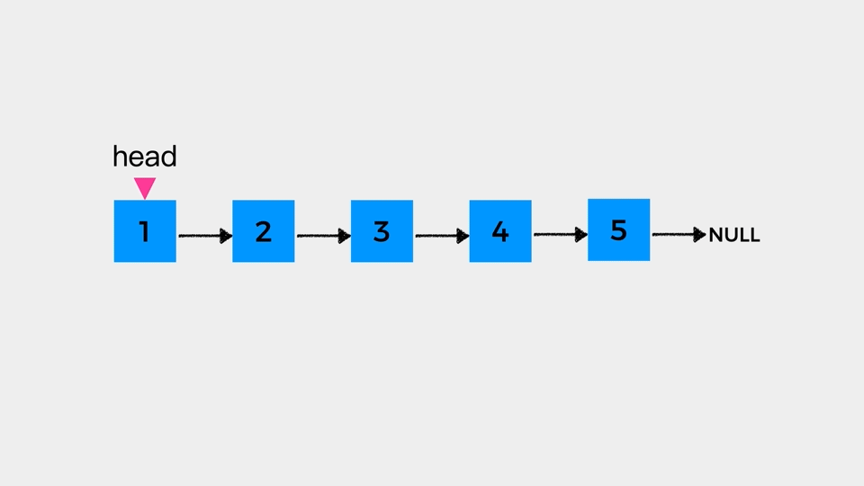

# Go-Away-Mr.Algorithm

您好，我是微木。在这里我将通过**动画演示**的方式分享算法和数据结构相关的内容。

在正式介绍本仓内容前，先啰嗦几点：

1.**还需麻烦您给本仓点个star，一是文章质量值得您的star，二是这是我持续创作的动力源泉。**

如下是我在LeetCode #19 删除链表的倒数第N个节点 这个题目的题解中制作的动画

本仓几乎所有的题目我都制作了类似这样的动画，相信一定会对您有所帮助。

2.**建议扫描上方二维码关注我的公众号「编程狂想曲」，更多内容第一时间在此发布。** 此外，可以在公众号加我微信交流。

# 目录

## 数据结构

- [数组](https://github.com/weimu21/GoAway-Mr.Algorithm/blob/main/%E6%95%B0%E6%8D%AE%E7%BB%93%E6%9E%84/%E6%95%B0%E7%BB%84.md)
- [链表](https://github.com/weimu21/GoAway-Mr.Algorithm/blob/main/%E6%95%B0%E6%8D%AE%E7%BB%93%E6%9E%84/%E9%93%BE%E8%A1%A8.md)
- [栈](https://github.com/weimu21/GoAway-Mr.Algorithm/blob/main/%E6%95%B0%E6%8D%AE%E7%BB%93%E6%9E%84/%E4%B8%8D%E5%B0%B1%E6%98%AF%E6%A0%88%E5%90%97.md)

## 算法思维

## LeetCode题解

1. 链表相关题目
    - [LeetCode #19 删除链表的倒数第N个节点](https://github.com/weimu21/GoAway-Mr.Algorithm/blob/main/LeetCode/%E5%BF%AB%E6%85%A2%E6%8C%87%E9%92%88%E5%B7%A7%E8%A7%A3%E9%93%BE%E8%A1%A8%E9%A2%98%E7%9B%AE%EF%BC%88%E4%B8%80%EF%BC%89.md)  
    - [LeetCode #21 合并两个有序列表](https://github.com/weimu21/GoAway-Mr.Algorithm/blob/main/LeetCode/%E8%99%9A%E6%8B%9F%E5%A4%B4%E7%BB%93%E7%82%B9%E5%9C%A8%E9%93%BE%E8%A1%A8%E4%B8%AD%E7%9A%84%E5%BA%94%E7%94%A8.md)
    - [LeetCode #24两两交换链表中节点](https://github.com/weimu21/GoAway-Mr.Algorithm/blob/main/LeetCode/%E4%B8%A4%E4%B8%A4%E4%BA%A4%E6%8D%A2%E9%93%BE%E8%A1%A8%E4%B8%AD%E7%9A%84%E8%8A%82%E7%82%B9.md)  
    - [LeetCode #25 K个一组反转链表](https://github.com/weimu21/GoAway-Mr.Algorithm/blob/main/LeetCode/%E9%80%92%E5%BD%92%20%7C%20K%E4%B8%AA%E4%B8%80%E7%BB%84%E5%8F%8D%E8%BD%AC%E9%93%BE%E8%A1%A8.md)  
    - [LeetCode #61 旋转链表](https://github.com/weimu21/GoAway-Mr.Algorithm/blob/main/LeetCode/%E5%BF%AB%E6%85%A2%E6%8C%87%E9%92%88%E5%B7%A7%E8%A7%A3%E9%93%BE%E8%A1%A8%E9%A2%98%E7%9B%AE%EF%BC%88%E4%B8%80%EF%BC%89.md)  
    - [LeetCode #82 删除排序列表中的重复元素||](https://github.com/weimu21/GoAway-Mr.Algorithm/blob/main/LeetCode/%E8%99%9A%E6%8B%9F%E5%A4%B4%E7%BB%93%E7%82%B9%E5%9C%A8%E9%93%BE%E8%A1%A8%E4%B8%AD%E7%9A%84%E5%BA%94%E7%94%A8.md)
    - [LeetCode #83 删除排序列表中的重复元素](https://github.com/weimu21/GoAway-Mr.Algorithm/blob/main/LeetCode/%E8%99%9A%E6%8B%9F%E5%A4%B4%E7%BB%93%E7%82%B9%E5%9C%A8%E9%93%BE%E8%A1%A8%E4%B8%AD%E7%9A%84%E5%BA%94%E7%94%A8.md)
    - [LeetCode #143 重排链表](https://github.com/weimu21/GoAway-Mr.Algorithm/blob/main/LeetCode/%E5%BF%AB%E6%85%A2%E6%8C%87%E9%92%88%E5%B7%A7%E8%A7%A3%E9%93%BE%E8%A1%A8%E9%A2%98%E7%9B%AE%EF%BC%88%E4%BA%8C%EF%BC%89.md)  
    - [LeetCode #206 反转链表](https://github.com/weimu21/GoAway-Mr.Algorithm/blob/main/LeetCode/%E5%BF%AB%E6%85%A2%E6%8C%87%E9%92%88%E5%B7%A7%E8%A7%A3%E9%93%BE%E8%A1%A8%E9%A2%98%E7%9B%AE%EF%BC%88%E4%BA%8C%EF%BC%89.md)  
    - [LeetCode #876 链表的中间节点](https://github.com/weimu21/GoAway-Mr.Algorithm/blob/main/LeetCode/%E5%BF%AB%E6%85%A2%E6%8C%87%E9%92%88%E5%B7%A7%E8%A7%A3%E9%93%BE%E8%A1%A8%E9%A2%98%E7%9B%AE%EF%BC%88%E4%BA%8C%EF%BC%89.md)  

    
    
2. 栈相关题目
    - [LeetCode #150 逆波兰表达式求值](https://github.com/weimu21/GoAway-Mr.Algorithm/blob/main/%E6%95%B0%E6%8D%AE%E7%BB%93%E6%9E%84/%E4%B8%8D%E5%B0%B1%E6%98%AF%E6%A0%88%E5%90%97.md) 
    - [LeetCode #155 最小栈](https://github.com/weimu21/GoAway-Mr.Algorithm/blob/main/LeetCode/%E5%8D%95%E8%B0%83%E6%A0%88%E5%B7%A7%E8%A7%A3%E4%B8%8B%E4%B8%80%E4%B8%AA%E6%9B%B4%E5%A4%A7%E5%85%83%E7%B4%A0.md)    
    - [LeetCode #496 下一个更大元素I](https://github.com/weimu21/GoAway-Mr.Algorithm/blob/main/LeetCode/%E5%8D%95%E8%B0%83%E6%A0%88%E5%B7%A7%E8%A7%A3%E4%B8%8B%E4%B8%80%E4%B8%AA%E6%9B%B4%E5%A4%A7%E5%85%83%E7%B4%A0.md) 
    - [LeetCode #503 下一个更大元素II](https://github.com/weimu21/GoAway-Mr.Algorithm/blob/main/LeetCode/%E5%8D%95%E8%B0%83%E6%A0%88%E5%B7%A7%E8%A7%A3%E4%B8%8B%E4%B8%80%E4%B8%AA%E6%9B%B4%E5%A4%A7%E5%85%83%E7%B4%A0.md) 
    - [LeetCode #844 比较含退格的字符串](https://github.com/weimu21/GoAway-Mr.Algorithm/blob/main/%E6%95%B0%E6%8D%AE%E7%BB%93%E6%9E%84/%E4%B8%8D%E5%B0%B1%E6%98%AF%E6%A0%88%E5%90%97.md) 
    