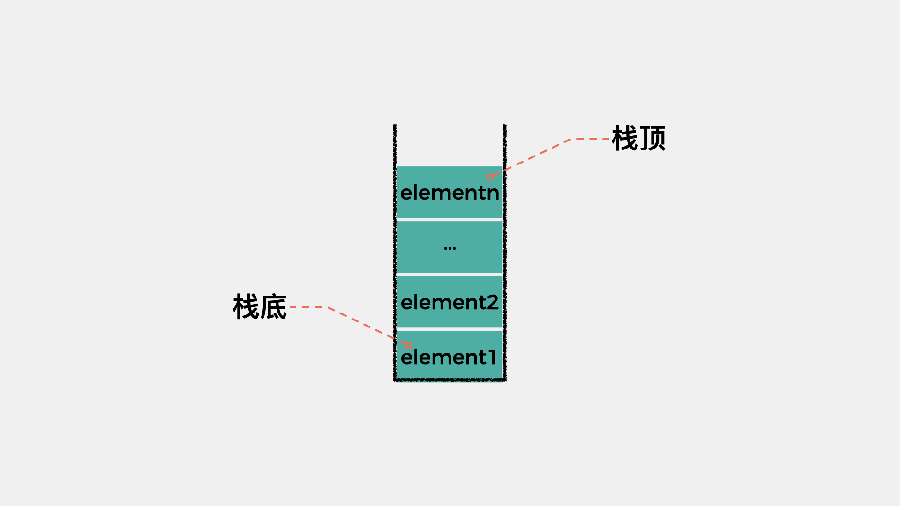
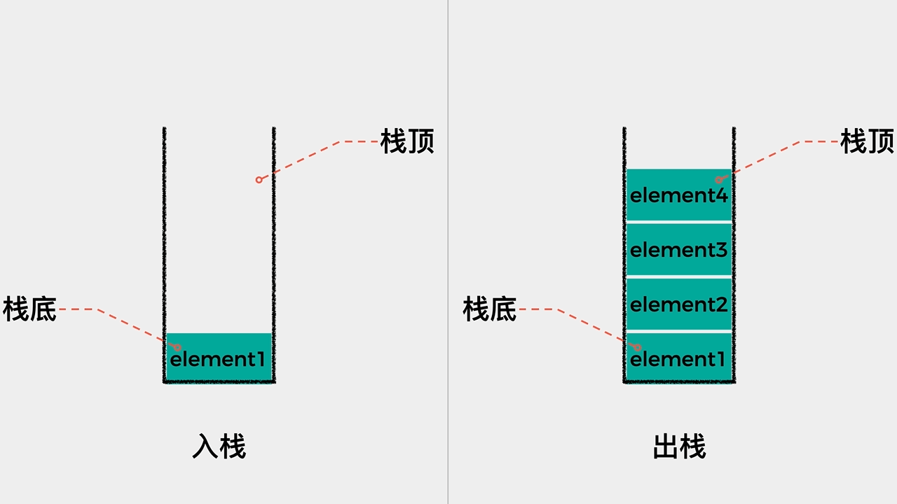
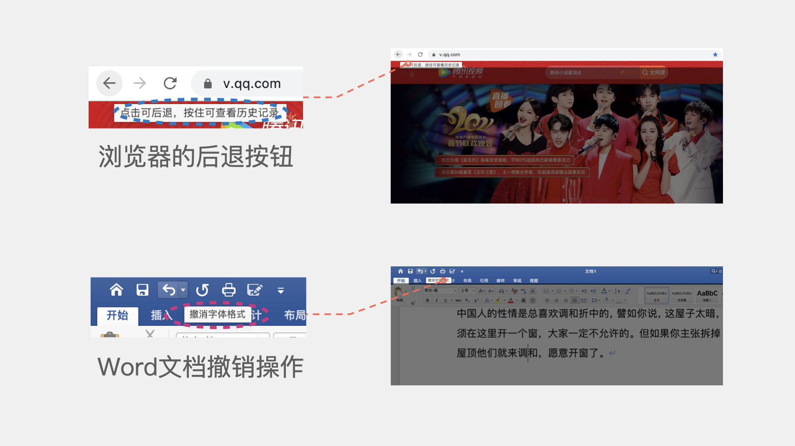
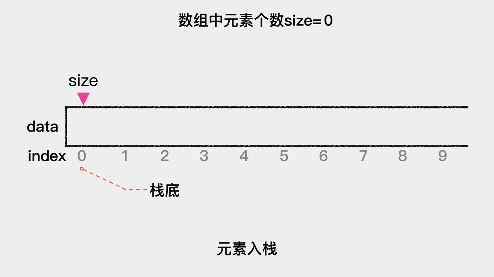
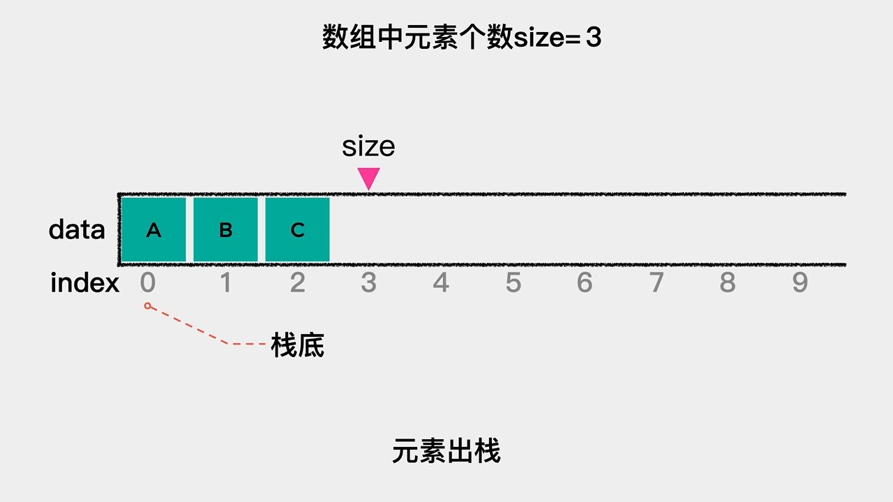
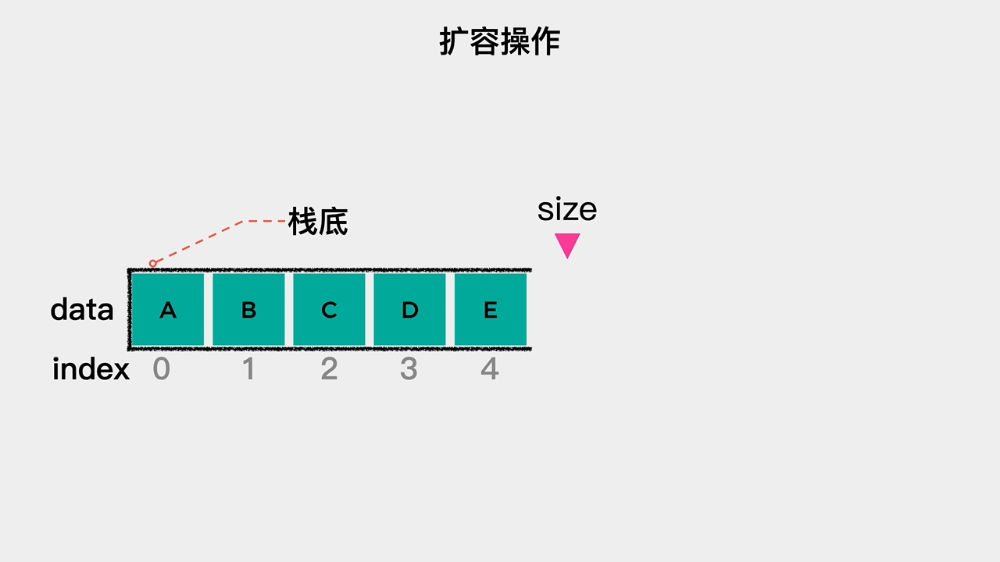
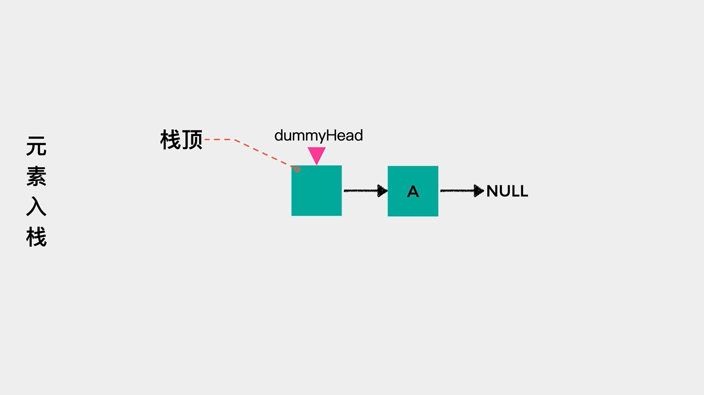
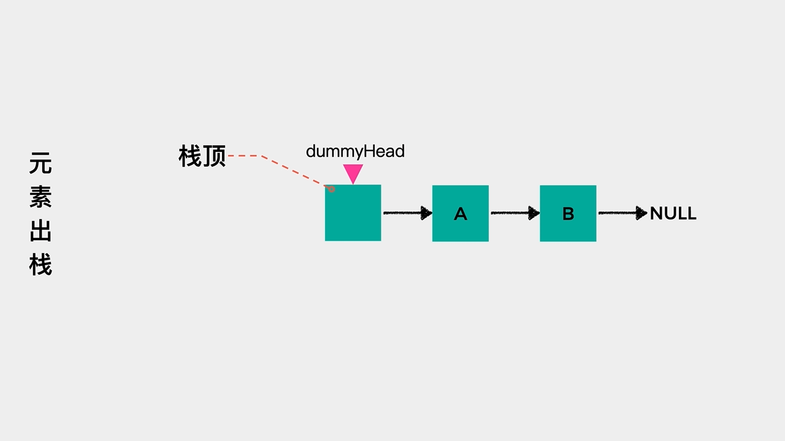
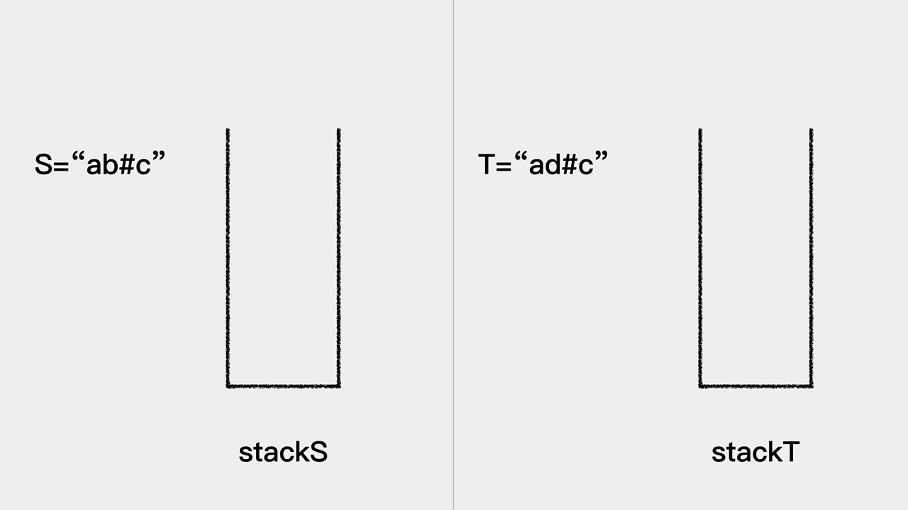
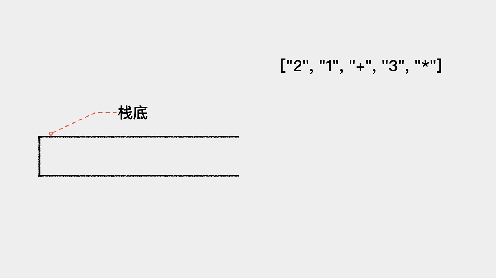

# 栈


今天分享的内容是栈这种数据结构，主要内容有：

* 01.栈的定义及应用

* 02.顺序栈的介绍及实现

* 03.链式栈的介绍及实现

* 04.顺序栈与链式栈的简单比较

* 05.栈在字符串比较，表达式求值中的应用


## 01 栈的定义及应用

栈（stack）是一种先进后出，后出先进的数据结构。之所以这样，是因为栈是操作受限的线性表，允许元素进出的一端称为栈顶（top），不允许元素进出的一端称为栈底（bottom）。




栈的操作一般有两种，一是入栈（push），即将元素放入栈中；另一个操作是出栈（pop），即从栈中取出元素。





我们说栈是一种操作受限的线性表，只能在一端对元素进行操作，那么栈这种数据结构有哪些应用场景呢？

其实，我们上网时用到的浏览器的后退查看历史记录功能，在Word文档中撤销当前操作这个功能都是栈这种数据结构的具体应用场景。




# 02 顺序栈的介绍及实现

我们把用数组（关于数组的介绍可以看浅谈数组这篇文章）来实现的栈称为顺序栈，由于入栈、出栈这些操作都是在栈顶这一端完成的。因此，在用数组实现栈时，需要思考的一个问题就是：

**是把索引为0的一端作为栈顶呢？还是作为栈底呢？**

如果把索引为0的一端作为栈顶，那么元素入栈，即向数组索引为0的位置增加元素时，需要把之前的元素向后移动一个位置。同理，元素出栈，即删除索引为0的元素时，需要把之后的元素向前移动一个位置。这就增加了操作的时间复杂度。

因此，应该把索引为0的一端作为栈底，这样不论是元素入栈，还是元素出栈，都不需要移动其它元素，这时其时间复杂度是O(1)。


**基于简单数组的实现**

基于简单数组的实现，代码如下：

```java
public class StaticArrayStack<E> {
    
    /**
     * 数组
     */
    private E[] data;

    /**
     * 数组中元素个数
     */
    private int size;

    public StaticArrayStack(int capacity){
        this.data = (E[])new Object[capacity];
        this.size = 0;
    }

    public StaticArrayStack(){
        this(10);
    }

    /**
     * 元素入栈
     * @param e 入栈元素
     */
    public void push(E e){
        if (size == data.length) {
            throw new IllegalArgumentException("Stack is full.");
        }
        data[size++]=e;
    }

    /**
     * 元素出栈
     */
    public E pop(){
        if (size == 0){
            return null;
        }
        E res = data[size-1];
        size--;
        return res;
    }
}
```

元素入栈的动画演示如下：




元素出栈的动画演示如下：




**基于动态数组的实现**

基于简单数组实现的栈，存在一个弊端，就是在初始化时，数组的容量已经确定了，这样当数组满时，元素就无法入栈了。

为了解决这个问题，可以用动态数组来实现栈。所谓，动态数组就是在数组容量达到其最大容量时，对其进行扩容，在这里扩容为之前的2倍。然后，将原数组中的元素依次拷贝只扩容后的数组内，动画演示如下：




相比较于基于简单数组的实现，基于动态数组的实现，代码的主要变边是在元素入栈时，增加了是否需要扩容的判断，如果当前数组中元素个数等于数组容量，则扩容为之前容量的2倍，代码实现如下。

```java
public class DynamicArrayStack<E> {
    
    private E[] data;

    /**
     * 数组中元素个数
     */
    private int size;

    public DynamicArrayStack(int capacity){
        this.data = (E[])new Object[capacity];
        this.size = 0;
    }

    public DynamicArrayStack(){
        this(10);
    }

    /**
     * 元素入栈
     * @param e
     */
    public void push(E e){
        // 如果数组中元素个数等于数组容量
        // 则扩容为原来的2倍
        if (size == data.length){
            resize(2*data.length);
        }

        data[size++]=e;
    }

    /**
     * 数组扩容
     * @param newCapacity
     */
    private void resize(int newCapacity){
        E[] newData = (E[])(new Object[newCapacity]);
        for(int i = 0; i < size; i++){
            newData[i] = data[i];
        }
        data = newData;
    }

    /**
     * 元素出栈
     */
    public E pop(){
        if (size == 0){
            return null;
        }
        E res = data[size-1];
        size--;

        return res;
    }
}
```

此时，基于动态数组实现的栈，其元素入栈这个操作的时间复杂度是多少呢？

上述代码中的push方法是每次向数组末尾添加一个元素，然后当数组满时，进行扩容，扩容为原有数组的2倍；resize方法是用于扩容的，所谓的扩容就是新开辟一个容量大小为newCapacity的数组，然后将原数组的元素依次复制到新数组中，这个操作的时间复杂度T(n)=O(n)。

接着看下push方法的时间复杂度。对于push这个方法来说，其中有两个操作，一个是向数组末尾添加元素，每次执行添加操作时，时间复杂度是O(1)；一个是扩容，每次扩容的时间复杂度是O(n)。那么，push方法的时间复杂度是O(n)吗？

扩容这一步，是在数组满的情况下才会触发执行，也就是在扩容之前，会有n次向数组末尾添加元素的操作，且每次操作耗时是1，总耗时为n。扩容操作在数组满时触发一次，耗时是n，即将数组添加满并进行扩容总共需要n+1次操作，这些操作总耗时是2n。

因此，在将扩容这个操作的耗时均摊到之前每次添加元素到数组末尾这个操作上时，每次操作耗时约为2，即将数组添加满并进行扩容操作，其时间复杂度不是O(n)，而是O(1)。关于时间复杂度的更多内容可以查看满满的一篇，全是复杂度分析核心知识点这篇文章。


## 03链式栈的介绍及实现

我们把用链表（关于链表的更多介绍可以查看数据结构 #2 36张图带你深刻理解链表这篇文章）实现的栈称为链式栈。

对于链表而言，我们只知道其头节点，因此在用链表实现栈时，应该把链表的头节点作为栈顶，这样不论是元素入栈，即增加节点至链表头部，还是元素出栈，即删除链表头节点，其时间复杂度都是O(1)。

基于链表实现的栈，代码如下：

```java
public class LinkedListStack<E> {
    /**
     * 定义节点Node
     */
    private class Node{
        private E e;
        private Node next;

        public Node(E e){
            this.e = e;
            this.next = null;
        }
        public Node(){}
    }

    /**
     * 虚拟头结点
     */
    private Node dummyHead;

    /**
     * 链表中元素个数
     */
    private int size;

    public LinkedListStack(){
        dummyHead = new Node();
        size=0;
    }

    /**
     * 元素入栈
     * @param e
     */
    public void push(E e){
        Node prev = dummyHead;
        Node newNode = new Node(e);
        Node nextNode = prev.next;
        prev.next = newNode;
        newNode.next = nextNode;
        size++;
    }

    /**
     * 元素出栈
     * @return
     */
    public E pop(){
        if (size == 0) {
            throw new EmptyStackException();
        }
        Node prev = dummyHead;
        Node delNode = prev.next;
        Node nextNode = delNode.next;
        prev.next = nextNode;
        delNode.next = null;
        size--;
        return delNode.e;
    }
}
```

元素入栈——增加节点至链表头部，动画演示如下：




元素出栈——删除链表头节点，动画演示如下：




## 04顺序栈与链式栈的简单比较

在时间复杂度方面，顺序栈与链式栈不论是元素入栈还是元素出栈，其时间复杂度都是O(1)。

在空间性能方面，顺序栈由于需要事先确定一个固定容量，因此，可能会有空间浪费的问题；链式栈，虽然不需要事先确定固定容量，但是每个元素都有一个指针域，因此增加了内存开销。

在使用时，如果元素数量变化是不可预测的，建议使用链式栈；如果元素数量在可控范围内，那么建议使用顺序栈。

## 05 栈在字符串比较，表达式求值中的应用

我们通过LeetCode中的两道题目来看下栈的简单应用，题目有：

* LeetCode #844 比较含退格的字符串

* LeetCode #150 逆波兰表达式求值

### 栈在字符串比较中的应用

**题目描述：**

给定 S 和 T 两个字符串，当它们分别被输入到空白的文本编辑器后，判断二者是否相等，并返回结果。 # 代表退格字符。

**示例:**

输入：S = "ab#c", T = "ad#c"
输出：true
解释：S 和 T 都会变成 “ac”。

**思路分析:**

该题目用栈求解的思路是：

首先遍历每个字符。

然后，如果当前考察的字符不是退格符#，则将其入栈；如果当前考察的字符是退格符#，则将栈顶元素出栈。

最后，比较栈中的字符转换为字符串之后是否相等。

动画演示：




代码实现：

```java
public boolean backspaceCompare(String S, String T) {
    return helper(S).equals(helper(T));
}

private String helper(String str) {
    Stack<Character> stack = new Stack<>();
    for(int i = 0; i < str.length(); i++) {
        Character c = str.charAt(i);

        // 如果当前考察字符不是退格符#，则将其入栈
        if (c != '#') {
            stack.push(c);
        }else if (!stack.isEmpty()) {
            // 如果当前考察字符是退格符#且栈不为空
            // 则栈顶元素出栈
            stack.pop();
        }
    }
    return stack.toString();
}
```

### 栈在表达式求值中的应用

**题目描述：**

根据 逆波兰表示法，求表达式的值。

有效的运算符包括 +, -, *, / 。每个运算对象可以是整数，也可以是另一个逆波兰表达式。

**示例:**

输入: ["2", "1", "+", "3", "*"]
输出: 9
解释: 该算式转化为常见的中缀算术表达式为：((2 + 1) * 3) = 9

**思路分析:**

该题目用栈求解的思路是：

首先，对于给定的字符串数组进行遍历，对每个元素进行考察。

然后，如果当前考察的元素不属于+、 -、*、/ ，则将其入栈；如果当前考察的元素属于+、 -、*、/，则将栈顶元素及其后面一个元素出栈。接着，将出栈的两个元素进行表达式求值运算，并将计算结果入栈。

最后，当字符串数组中的所有元素考察完毕时，将栈顶元素出栈，就是最终计算结果。

动画演示：




代码实现：

```java
public int evalRPN(String[] tokens) {
    Stack<Integer> stack = new Stack<>();
    for(int i = 0; i < tokens.length; i++) {
        String cur = tokens[i];
        if ("+".equals(cur)) {
            stack.push(stack.pop() + stack.pop());
        }else if ("-".equals(cur)) {
            Integer num1 = stack.pop();
            Integer num2 = stack.pop();
            stack.push(num2 - num1);
        }else if ("*".equals(cur)) {
            stack.push(stack.pop() * stack.pop());
        }else if ("/".equals(cur)) {
            Integer num1 = stack.pop();
            Integer num2 = stack.pop();
            stack.push(num2 / num1);
        }else {
            stack.push(Integer.valueOf(cur));
        }
    }
    return stack.pop();
}
```

**更多内容扫描下方二维码关注公众号「编程狂想曲」查看**,如有错误可在公众号加我个人微信后指出
<p align='center'>

</p>