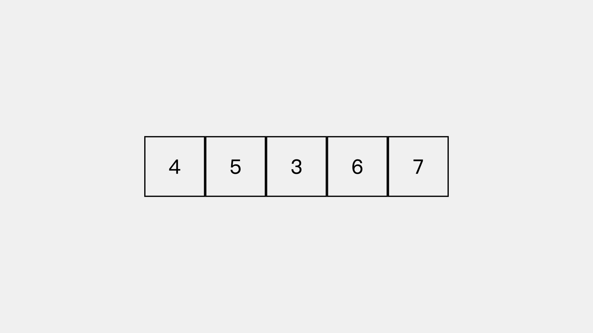
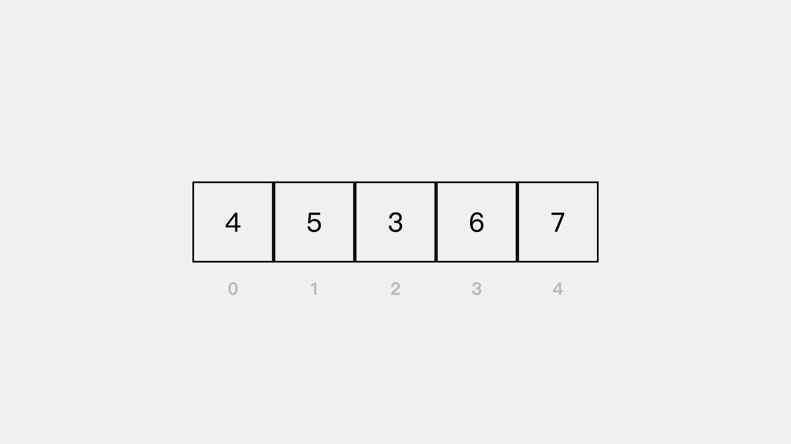
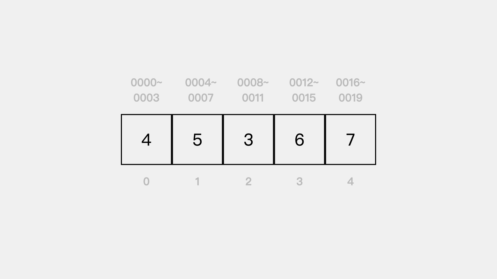
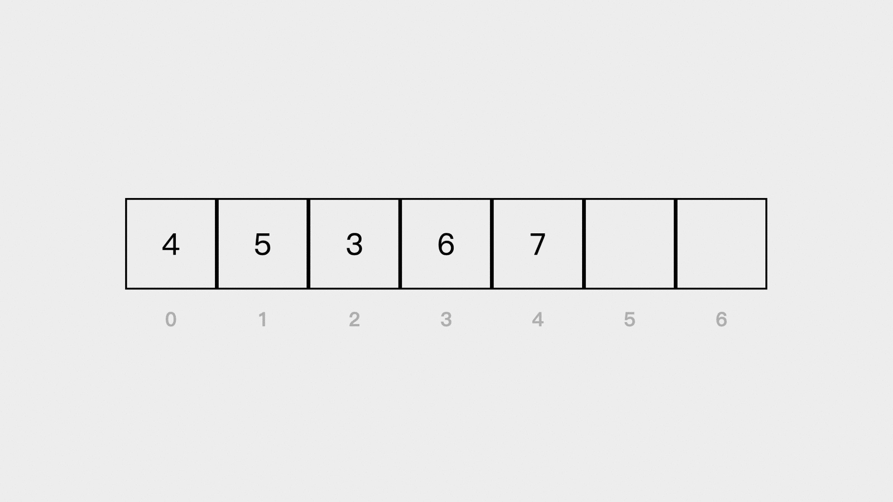
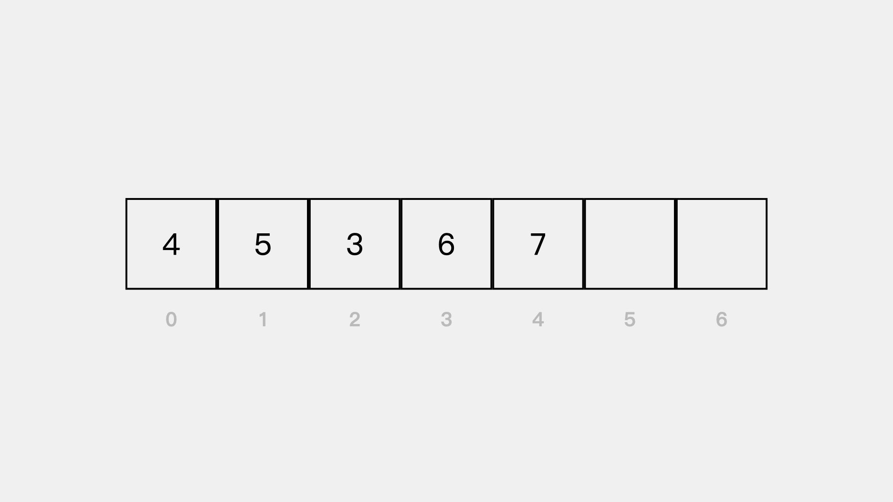
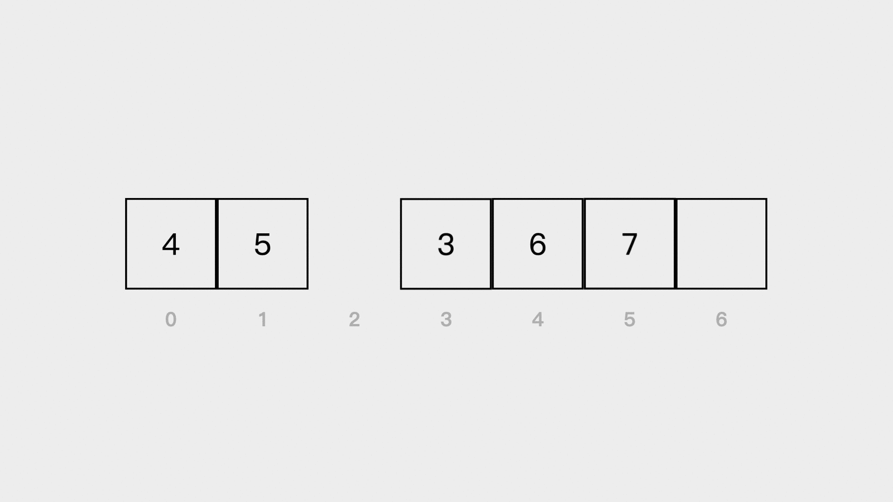
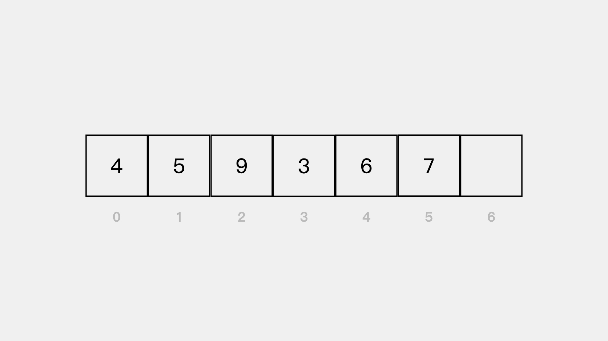
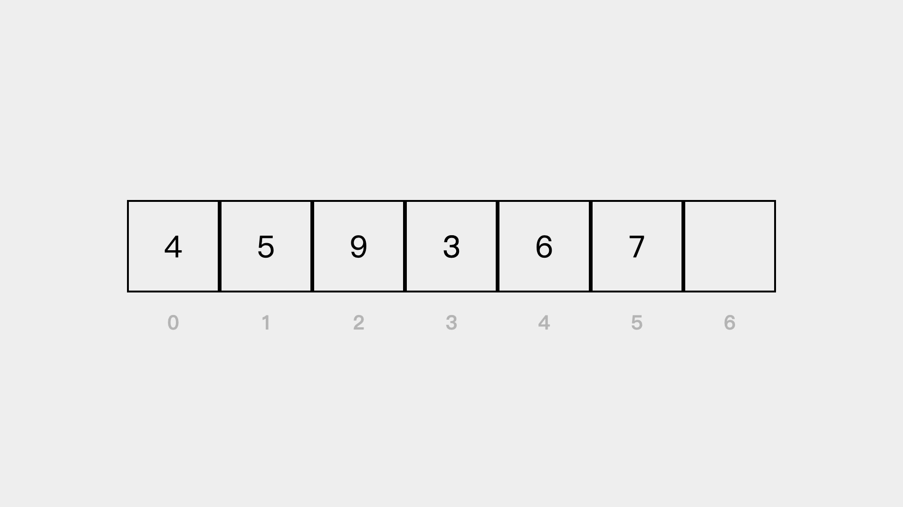

# 浅谈数组


在Java语言中，数组是有序数据的集合，数组中的每个元素必须是相同的数据类型。

所谓有序数据的集合，表达的是数组是一种线性表的数据结构，即数组中的数据像一条线一样排在一起。


<p align='center'>
<font>线性表示例</font>
</p>


由于数组是一种线性结构，因此它在内存中是用一块连续的内存空间存储的。而这种存储方式，让数组具备了”随机访问“的特性。

在解释为什么数组具有”随机访问“这个特性之前，先介绍数组中的一个概念：索引。

索引，有时也称之为下标，它是从零开始的。数组中的每个元素都对应着一个下标。


<p align='center'>
<font>数组中的索引</font>
</p>


## 01 随机访问

接着，解释下为什么数组具有”随机访问“的特性。

在新建一个数组时，数组中第一个元素的内存地址称为基础地址，而数组在内存中是连续存储的。因此，在知道新建数组的基础地址之后，就可以通过寻址公式计算出数组中任意元素在内存中的地址。

这里，我们以数组int[] arr = {4, 5, 3, 6, 7}为例讲解。


<p align='center'>
<font>数组内存地址</font>
</p>


数组的第一个元素是4，int类型占用4个字节，因此元素4的内存地址可以表示为0000~0003。

假如我们想访问数组中的第二个元素，即下标为1的元素。我们可以用寻址公式：arr[i]_address = base_address + i*data_type_size来计算。其中base_address表示数组第一个元素在内存中的基础地址，i表示索引，data_type_size表示当前元素类型占用的字节数。

在这里base_address=0000，i=1，data_type_size=4，因此arr[1]_address = 0004。在知道第二个元素在内存中地址之后，就可以快速访问该元素了。


## 02 数组中的操作

对于数组中的操作，我们接下来看下增加元素和删除元素这两个操作。

### 增加元素

**在数组末尾增加元素**。如下新建了一个可以容纳7个元素的数组，已经存储了4，5，3，6，7这5个元素。


<p align='center'>
<font>数组arr[7]</font>
</p>


现在想在数组末尾增加一个元素2，怎么增加呢？直接将元素2插入下标5所在的位置即可。


<p align='center'>
<font>在数组末尾插入元素2</font>
</p>


**在数组指定位置增加元素**。现在想在如下数组的第三个位置，即索引为2的位置增加元素9，怎么增加呢？


<p align='center'>
<font>数组arr[7]</font>
</p>


我们需要将索引2及其之后的元素依次向后移动一位。需要注意是从数组末尾开始移动。


<p align='center'>
<font>移动元素7，6，3</font>
</p>


在将元素7，6，3依次向后移动一位之后，接着就可将元素9插入索引2所指向的位置了。


<p align='center'>
<font>插入元素9</font>
</p>


```java
private int[] arr = new int[7];

// 在index索引的位置插入一个新元素e
public void add(int index, int e){
    // size 为当前数组中所存储的元素个数
    for(int i = size - 1; i >= index ; i --){
        arr[i + 1] = arr[i];
    }
    arr[index] = e;
    size ++;}
}
```

### 删除元素

**删除数组末尾的元素**。比如，我们想删除如下数组末尾的元素2，直接将其删除即可。


<p align='center'>
<font>删除末尾元素2</font>
</p>

**删除数组中指定位置的元素**。比如现在想删除如下数组中的元素9怎么删除呢？




在删除数组中指定位置的元素时，需要做的就是，将其之后的元素依次向前移动一位，即将要删除元素后面的元素的值，依次赋予它前面元素所在的位置。


<p align='center'>
<font>删除指定位置的元素</font>
</p>

在将要删除元素后面的元素的值，依次赋予它前面元素所在的位置后，我们发现数组末尾的元素还是存在的，那么这时需要做的就是对其赋值为null。

```java
private int[] arr = new int[7];

// 从数组中删除index位置的元素, 返回删除的元素
public int remove(int index){
    int ret = arr[index];
    // size 当前数组中所存储的元素格式
    for(int i = index + 1 ; i < size ; i ++) {
        arr[i - 1] = arr[i];
    }
    
    size --;
    arr[size] = null;
    return ret;
}
```

**更多内容扫描下方二维码关注公众号「编程狂想曲」查看**,如有错误可在公众号加我个人微信后指出
<p align='center'>

</p>