# 链表

在浅谈数组这篇文章中，我们说到数组在内存中是用一块连续的内存空间存储的。由于是用连续内存空间存储的，那么就会出现，明明还剩50M内存，但由于不是连续的，而导致在创建一个大小为50M的数组时，申请内存失败。

那有没有一种数据结构是不需要占用连续的内存空间的呢？有，就是今天分享的链表这种数据结构。

文章内容主要包括以下几点：

* 什么是链表

* 单链表的基本操作：增、删、改、查

* LeetCode #206 反转单列表

* 循环链表及LeetCode #141 环形链表检测

* 双向链表及其增加删除操作


## 01 什么是链表

链表是线性表的一种，但在内存中不一定是连续存储的，而是可以存在于内存中未被占用的任意位置。基于此，链表这种数据结构，除了要存储数据元素的信息外，还需要存储它的后继元素的存储地址。链表的组成结构如下图：

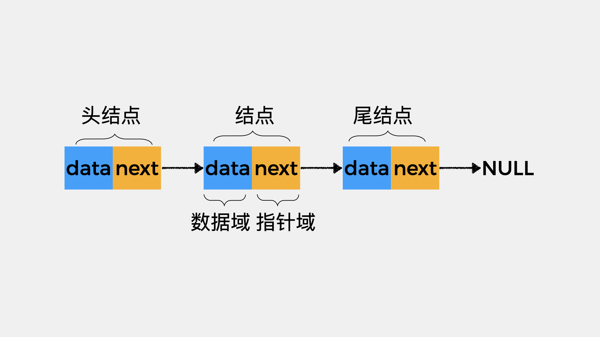


接着介绍下链表中几个重要概念：

**结点**——链表所占用的一个内存块，一个结点包括数据域和指针域两部分。数据域用于存储数据信息data，指针域用于存储下个结点的地址next，通常叫做后继指针。

**头结点**——链表中的第一个结点，只要知道了头结点在内存中的地址，就可根据其指针域存储的下一个结点的地址找到下一个结点。

**尾结点**——链表中的最后一个结点，由于是链表中的最后一个结点，它的指针域存储的不是下一个结点的地址而是NULL，以此来表示是链表的尾结点。

## 02 链表的基本操作：增、删、改、查

**1.向链表指定位置添加新的结点**

我们看下如何向链表的指定位置增加一个节点node。

由于链表的每个节点都存储了下一个节点的指针，因此，要想在指定位置增加一个节点node，就需要知道指定位置的前一个节点。首先明确下几个变量的含义：

* 变量prev——表示前一个节点，比如节点2的前一个节点就是节点1。

* 变量head——表示头结点所在位置。

* 变量node——表示要添加的节点。

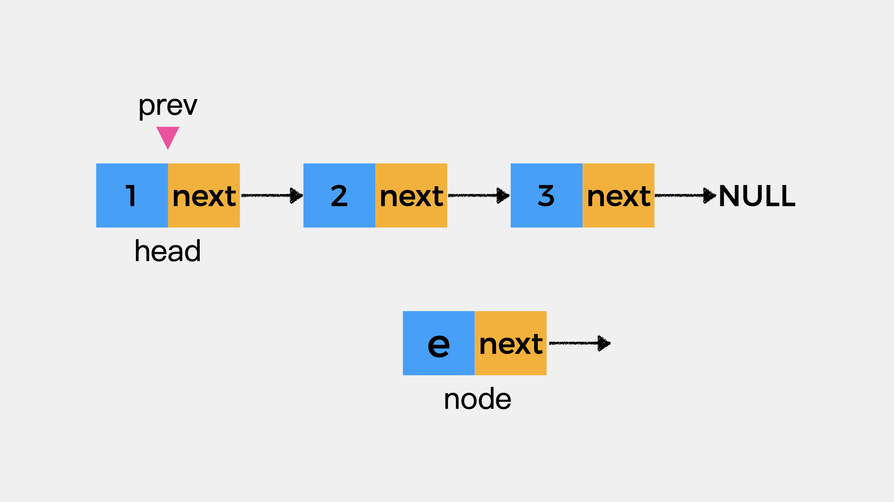


接着看下，如何将结点node添加到结点3所在的位置。首先，将变量prev向后移动一个位置，指向结点3的前一个结点2所在的位置。


接着，将结点node的后继指针指向变量prev所指向结点的下一个结点，即node.next=prev.next，如下图：

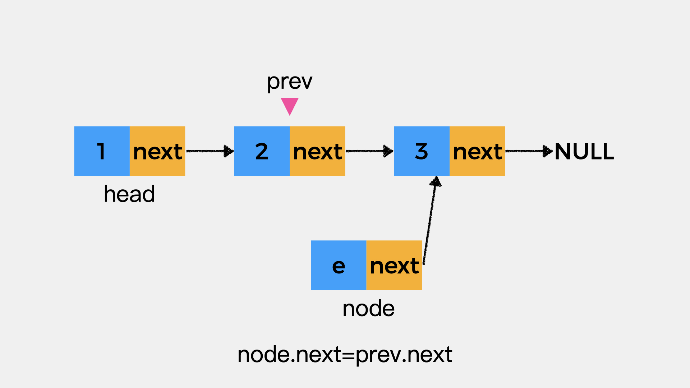


接着将变量prev所指向的结点的后继指针next指向node结点，即prev.next=node。这时，就将结点node添加到了原来结点3所在的位置。

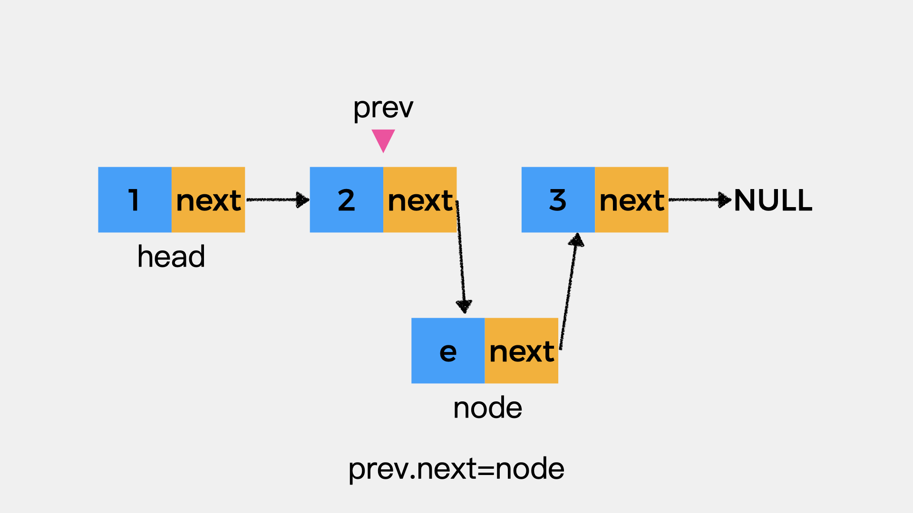


这时请思考一个问题，**在刚才添加结点node到链表中时，执行了两个语句，分别是：node.next=prev.next和prev.next=node。那么，如果这两个语句的执行顺序反过来是什么结果呢？**

还是以下图为例来进行说明，即将结点node添加到结点3所在的位置。

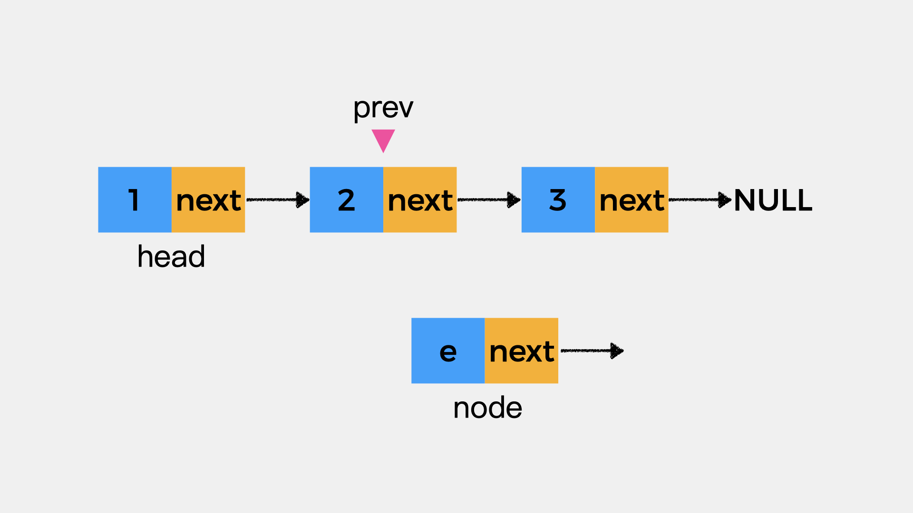


先执行prev.next=node后，结果如下图：


在执行node.next=prev.next之后，结果如下图。原因在于当执行完prev.next=node之后，结点node成为了变量prev所指向的结点的下一个结点，因此在执行node.next=prev.next时，结点node指向了自己。这时我们发现，链表断开了。这是**在链表操作中特别需要注意的一个地方，要小心别丢失了指针。**

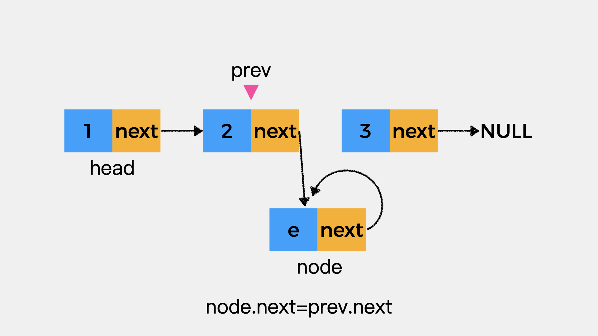


在将结点node添加到链表指定位置时，我们借助了变量prev——用以表示待添加结点所在位置的前一个节点。那么，如果我们是将结点node添加到头结点head所在的位置，这时头结点head之前没有结点了，那改怎么办呢？

这时就要介绍一个链表操作中常用的一个方法了：**设置虚拟头结点dummyHead，来简化操作难度。**

所谓虚拟头结点就是一个只存储下一个结点指针地址但不存储任何元素信息的节点。虚拟头结点的示例如下图，在有了虚拟头结点后，在向链表的头结点head所在位置添加元素时，操作方式就和向链表其它位置添加元素统一起来了。

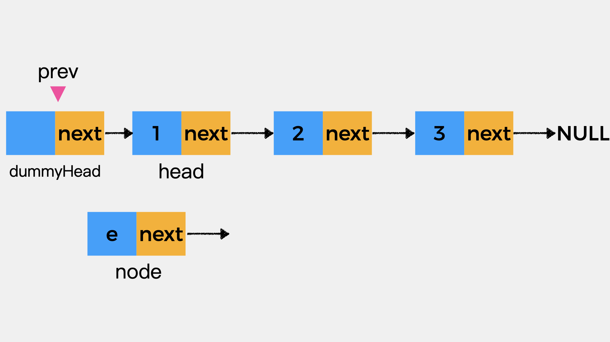


**向链表指定位置添加结点时间复杂度分析：**

* 如果是向链表头添加结点，则只需将新的结点的后继指针指向当前链表的头结点即可，时间复杂度是O(1)；

* 如果是向链表末尾添加结点，则需从头遍历链表直到尾部结点，因此此时的时间复杂度是O(n)；

* 如果是向链表任意位置添加结点，那么平均来看时间复杂度就是O(n)。


**2.删除链表指定位置的结点**

删除链表指定位置的结点，还是借助虚拟头结点来简化操作。如下图，假设要删除链表中第二个结点2。

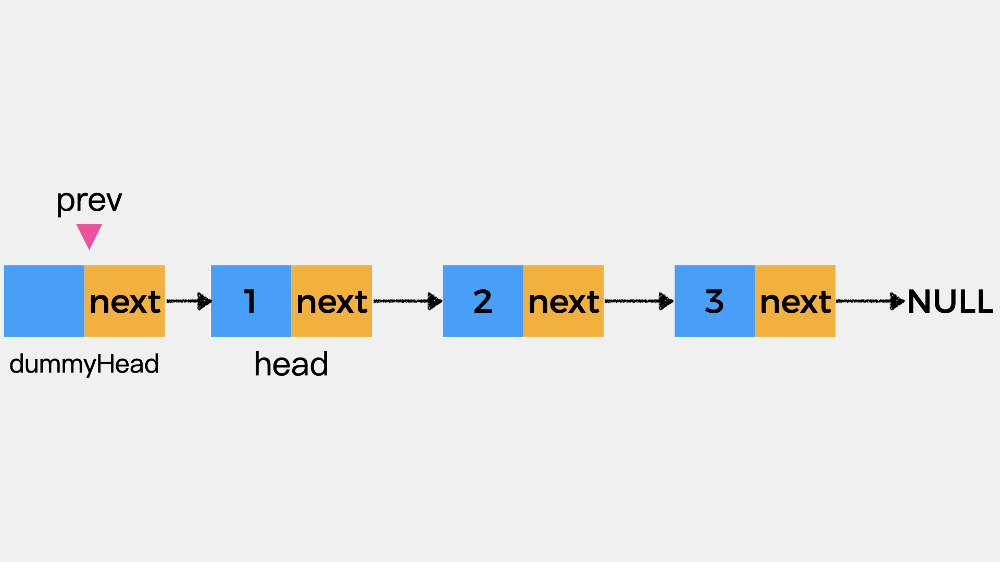


首先，将变量prev向后移动一个位置，指向待删除结点的前一个结点。

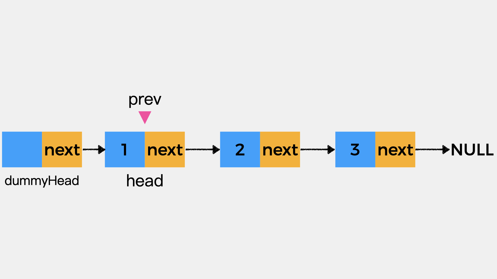


接着，执行语句prev.next=delNode.next，即将变量prev所指向结点的后继指针next指向待删除结点的下一个结点，如下图：

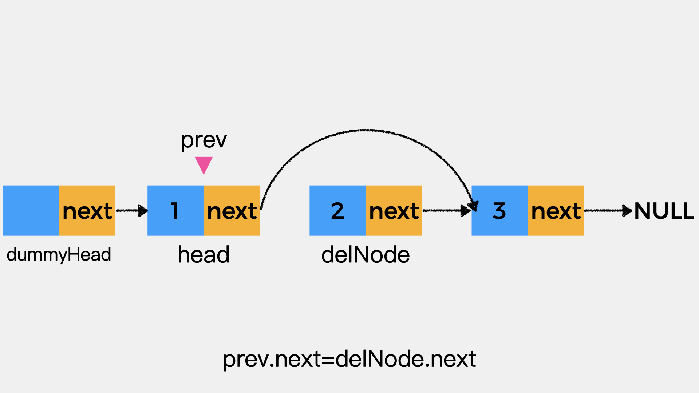


最后，执行delNode.next=null就可将待删除结点从链表中释放，如下图：

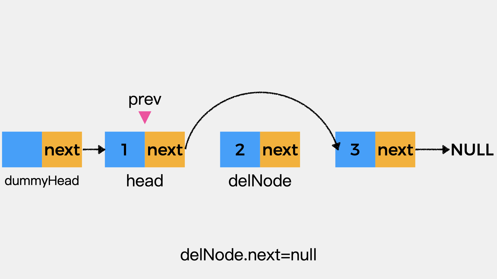


**删除链表指定位置结点时间复杂度分析：**

* 如果是删除头结点，则虚拟头结点就是头结点的前一个结点，因此时间复杂度是O(1)；

* 如果是删除链表末尾添加结点，则需从头遍历链表直到尾部结点的前一个结点，因此此时的时间复杂度是O(n)；

* 如果是删除链表中任意结点，那么平均来看时间复杂度就是O(n)。

**3.修改链表指定位置结点的值**

在修改链表指定位置结点的值时，可以不借助虚拟头结点dummyHead了。我们用变量cur表示当前所考察的结点。比如，我们要修改链表中结点2的值，该怎么做呢？


首先，将变量cur指向待修改的那个结点，如下图：


然后执行cur.e=22(e表示当前结点数据域所存储的元素值)就可将链表结点2的值修改为22。

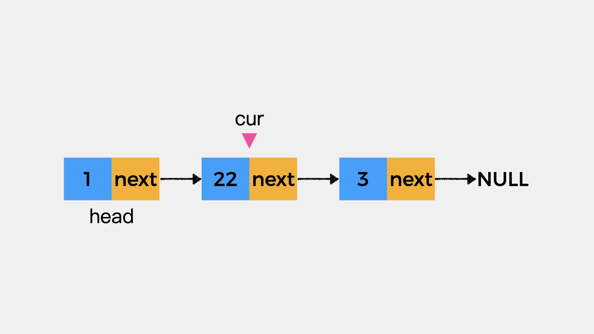


**修改链表指定位置结点的值时间复杂度分析：**

* 由于链表不支持随机访问，因此要修改某个结点的值，只能从头遍历链表，找到要修改的结点，这个过程时间复杂度是O(n)。然后，修改值这一个动作的时间复杂度是O(1)，因此修改链表指定位置结点的值的时间复杂度整体是O(n)；


**4.判断链表中是否包含某个元素**

判断链表中是否包含某个元素，同样可以不借助虚拟头结点dummyHead。用变量cur表示当前考察的结点，然后依次遍历链表中的每个结点，判断当前考察的结点数据域所存储的值是不是和目标值相等。

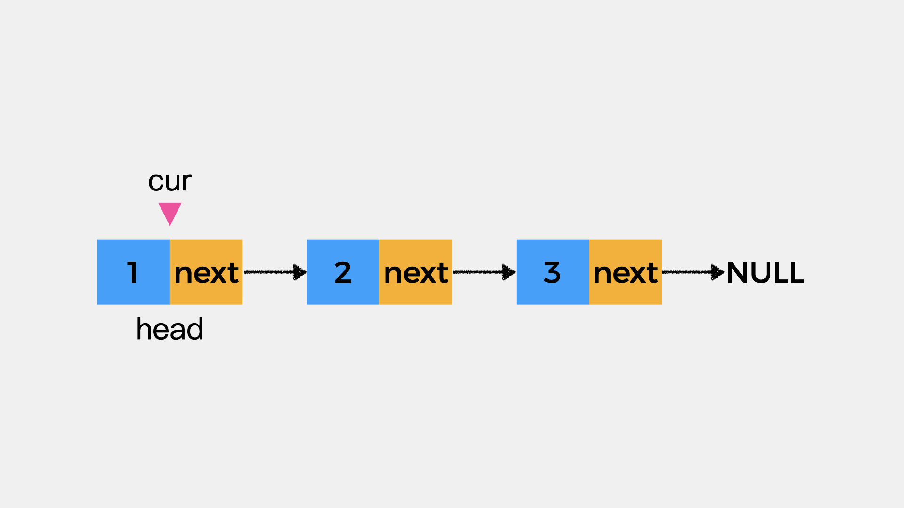


比如，我们要判断链表中是否包含元素2，那么当变量cur指向下图的结点时，就可以判定链表中包含元素2。

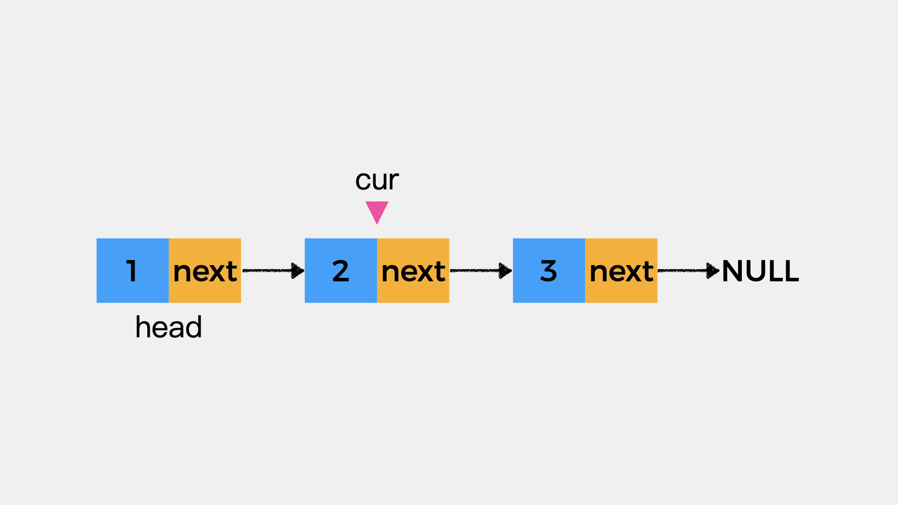


**判断链表中是否包含某个元素的值时间复杂度分析：**
* 要判断链表中是否包含某个元素，只能从头遍历链表，然后拿当前考察的结点数据域的值和目标值比对，因此时间复杂度整体上是O(n)；


## 03通过单链表反转，来看如何写出正确的链表代码

LeetCode#206号题目是关于单链表反转的，题目给出的示例是：

输入: 1->2->3->4->5->NULL 

输出: 5->4->3->2->1->NULL


根据题目给出的输入示例，构造出下的链表结构。
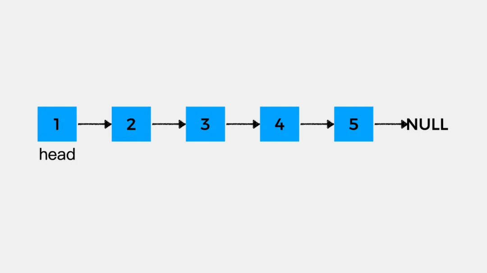


然后定义虚拟结点prev，其数据域值为NULL。定义变量cur指向链表中的头结点。
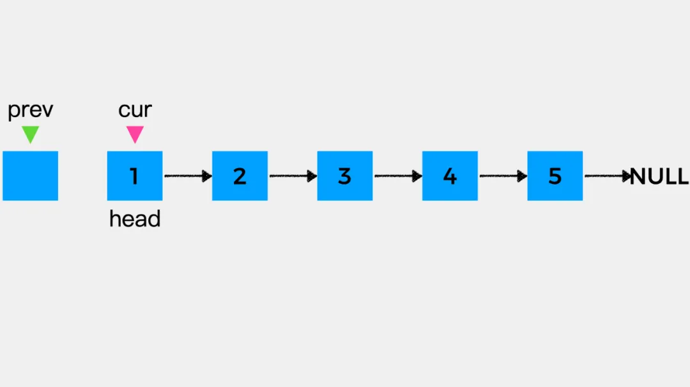


接着，开始遍历链表，对于变量cur所指向的下一个结点，我们用变量nextNode表示。
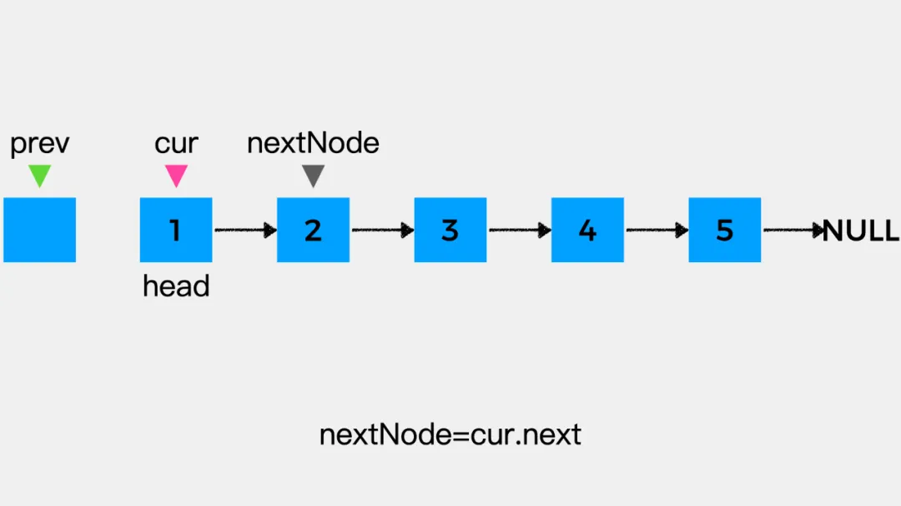

再接着，将变量cur所指向的结点的后继指针指向虚拟结点prev，即cur.next=prev。


之后，将变量prev指向当前考察的结点，即prev=cur。
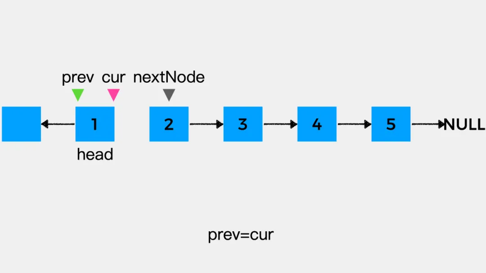


最后，将变量cur指向nextNode，即下一个待考察的结点。这时，就将变量prev指向的结点反转过来了。
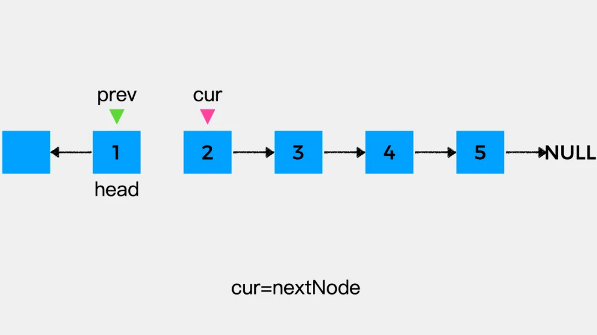


对于剩余未考察的结点，重复上述步骤即可将链表反转。

**动画演示**
为了方便演示，对题目给出的链表数据进行了删除


**代码实现**
```java
public ListNode reverseList(ListNode head) {
    ListNode prev = null;
    ListNode cur = head;
    while (cur != null) {
        ListNode nextNode = cur.next;
        cur.next = prev;
        prev = cur;
        cur = nextNode;
    }
    return prev;
}

```

## 04循环链表

如果我们将单链表的尾结点的后继指针由指向NULL改为指向单链表的头结点，会是什么样的呢？结果如下图：

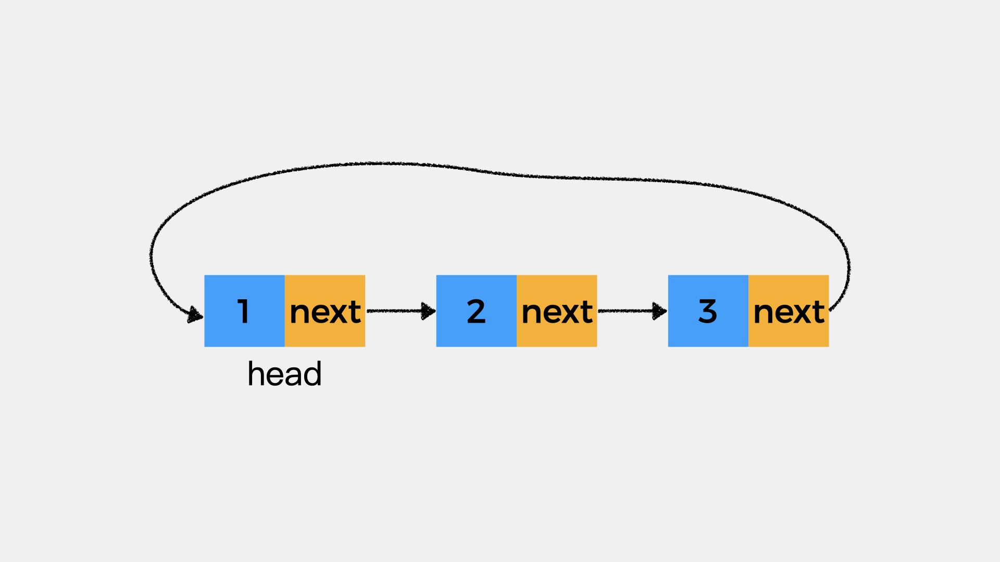


对于这种尾结点的后继指针指向头结点的单链表，我们称之为**循环链表。**

接着看下LeetCode#141环形链表检测这个问题，题目描述如下：

给定一个链表，判断链表中是否有环。


如果链表中有某个节点，可以通过连续跟踪 next 指针再次到达，则链表中存在环。 为了表示给定链表中的环，我们使用整数 pos 来表示链表尾连接到链表中的位置（索引从 0 开始）。 如果 pos 是 -1，则在该链表中没有环。注意：pos 不作为参数进行传递，仅仅是为了标识链表的实际情况。 


如果链表中存在环，则返回 true 。 否则，返回 false 。

来源：力扣（LeetCode）

**示例：**


输入：head = [3,2,0,-4], pos = 1

输出：true

解释：链表中有一个环，其尾部连接到第二个节点。


**思路分析**

要判断列表中是否有环，可以定义一个慢指针slow指向链表的头结点，快指针fast指向头结点的下一个结点。然后，慢指针slow每次向前移动一个位置，快指针fast每次向前移动两个位置。这样，如果链表中存在环，快指针就会先进入环，然后追上慢指针。具体思路，可看如下的动画演示：

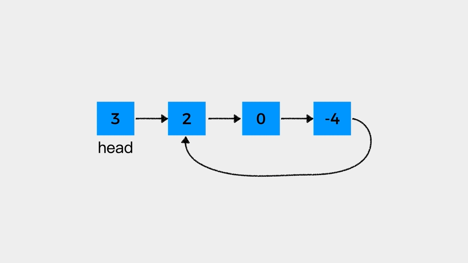


这里你可能会问**为什么慢指针slow初始指向链表头结点而快指针fast初始指向链表头结点的下一个结点？**

原因在于在如下的代码实现中，while循环的判断条件是slow!=fast，如果slow和fast都指向头结点，则while循环就不会执行。

**代码实现**
```java
public boolean hasCycle(ListNode head) {
    if (head == null || head.next == null) {
        return false;
    }

    ListNode slow = head;
    ListNode fast = head.next;
    while (slow != fast) {
        if (fast == null || fast.next == null) {
            return false;
        }
        fast = fast.next.next;
        slow = slow.next;
    }
    return true;
}
```

那代码中为什么是慢指针slow每次向后移动一个位置，而快指针fast是向后移动两个位置呢？如果fast也向后移动一个位置会是什么样呢？

快指针fast每次向后移动两个位置，如果链表中有环，就会先进入环，从而和慢指针slow相遇，但如果fast每次向后移动一个位置，那么它和慢指针slow之间，一直有一个结点距离，即使链表中有环，也不会相遇。


## 05 双向链表

在单链表中由于每个结点都会存储下一个结点的地址，因此，在单链表中查找下一个结点的时间复杂度是O(1)。但如果是要查找上一个结点，那么最坏时间复杂度就是O(n)了，因为每次都要从头开始遍历查找链表中的每个结点。

为了解决这个问题呢，就有了双向链表。双向链表是在单链表的基础上，再设置一个指向其前驱结点的指针，如下图。

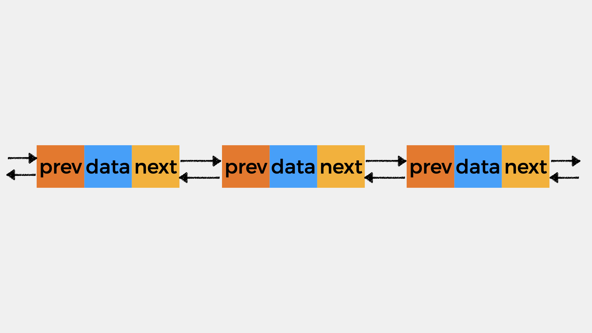


由于双向链表的结点有个前驱指针指向前一个结点，因此双向链表支持在O(1)的时间复杂度下找到前驱结点。

**双向链表中添加结点**

双向链表初始如下图，变量cur指向当前考察结点。我们看下如何在当前考察的结点之后添加结点node。


第一步先执行node.prev=cur，即将变量cur指向的结点作为新增结点node的前驱结点。

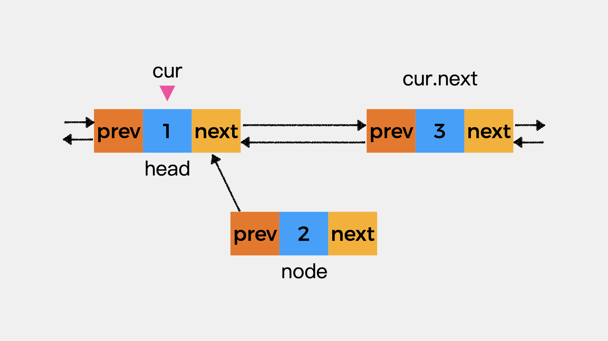


第二步执行node.next=cur.next，即将变量cur指向的结点的下一个结点作为新增结点node的下一个结点。

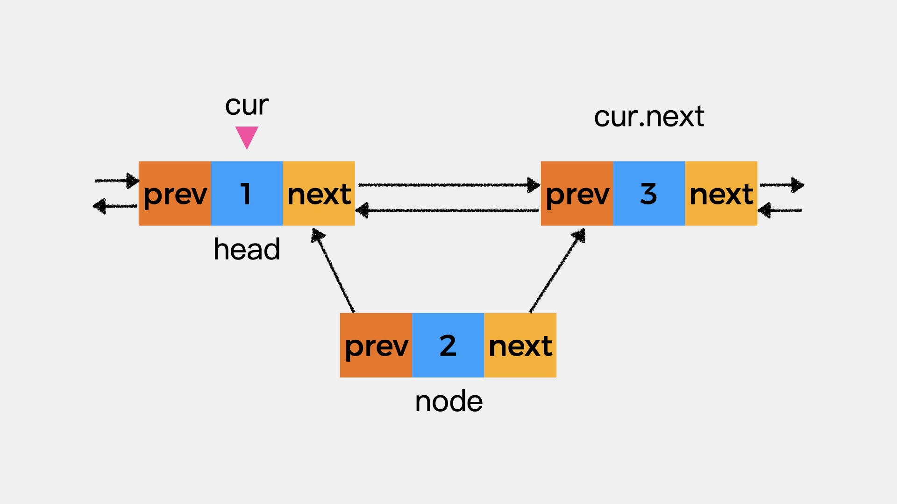


第三步执行cur.next.prev=node，即将新增的结点node作为变量cur所指向的结点的下一个结点的前驱结点。

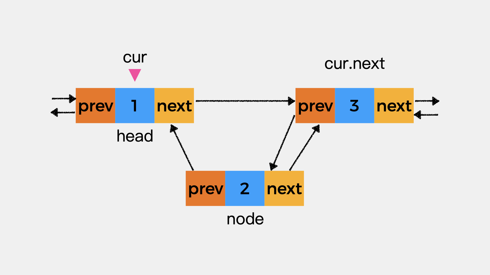


第四步执行cur.next=node，即将新增结点作为当前考察结点的后继结点。这时，就完成了将结点node添加到链表中这一操作。

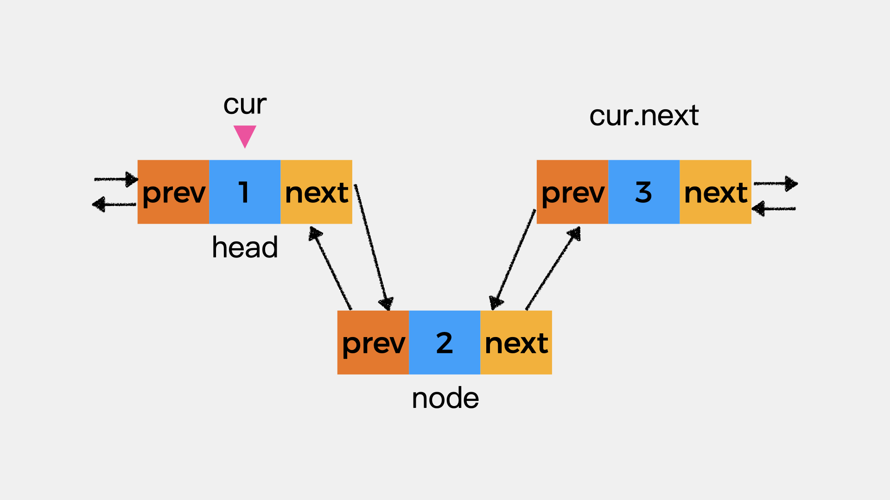


同样，对于上述四个步骤的执行要注意先后顺序，防止出现指针丢失的情况。

**双向链表中删除结点**

如下图，假设现在要删除变量cur所指向的结点，该怎么操作呢？

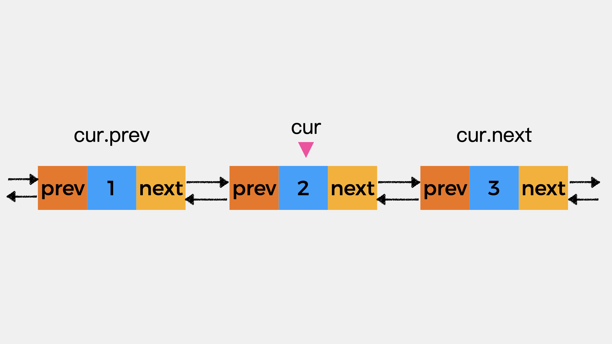


第一步，执行cur.prev.next=cur.next，即将当前结点的下一个结点，作为当前结点前驱结点的后继结点。

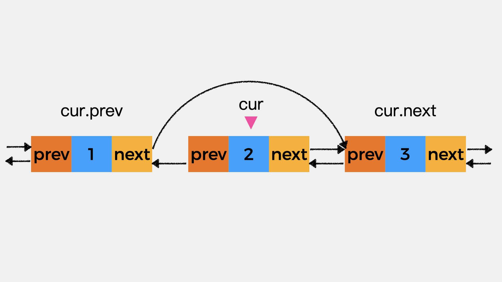


第二步执行，cur.next.prev=cur.prev，即将当前结点的前一个结点，作为当前结点的后继结点的前驱结点。


最后，执行cur.prev=null，cur.next=null即可将当前结点与原有链表断开。

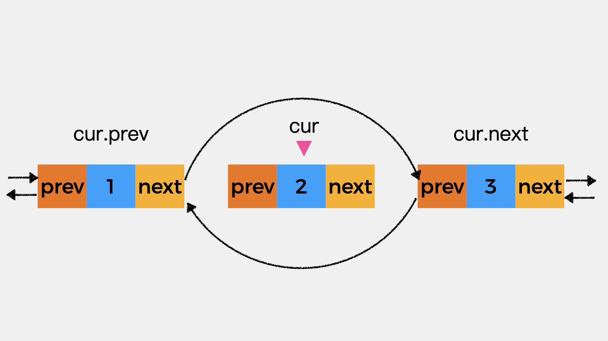

