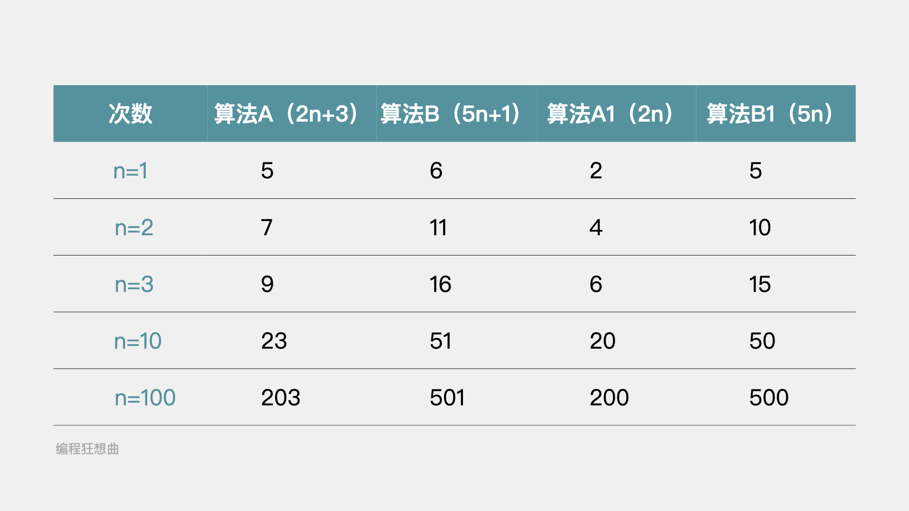
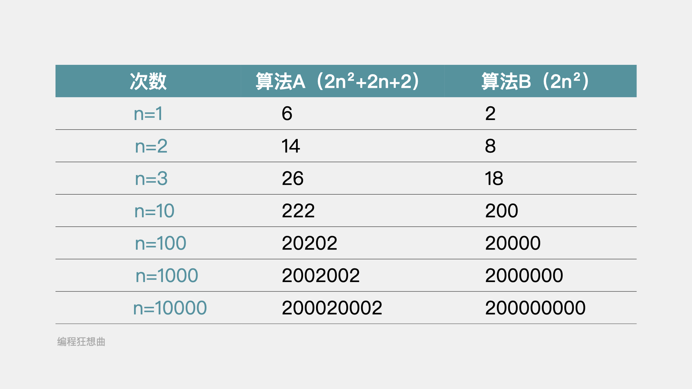
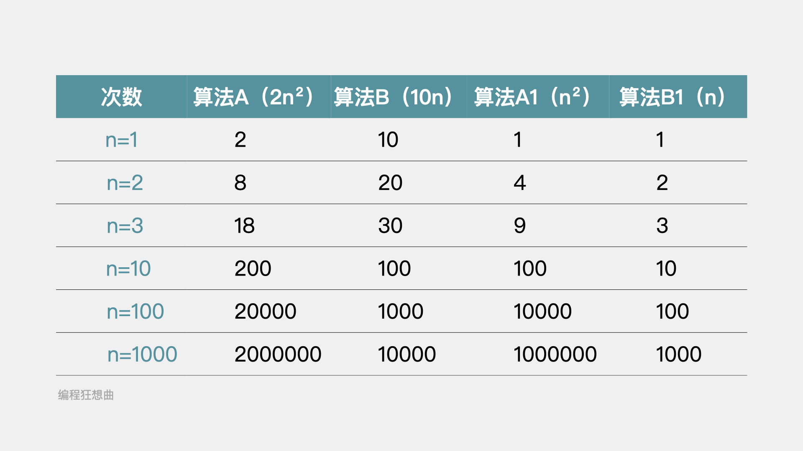
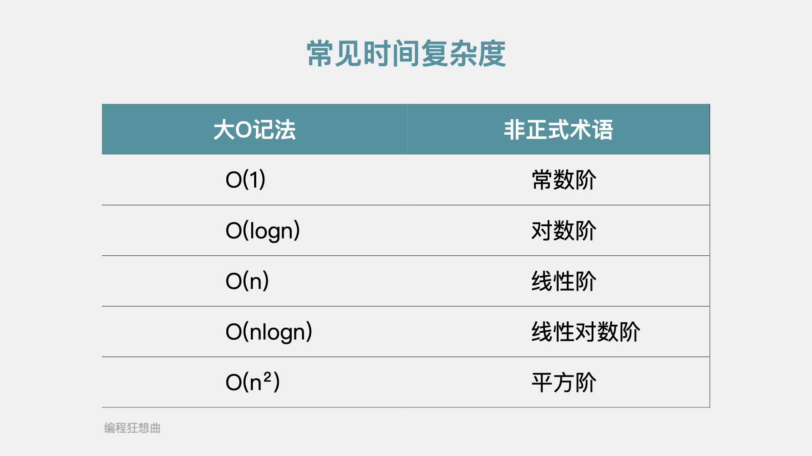
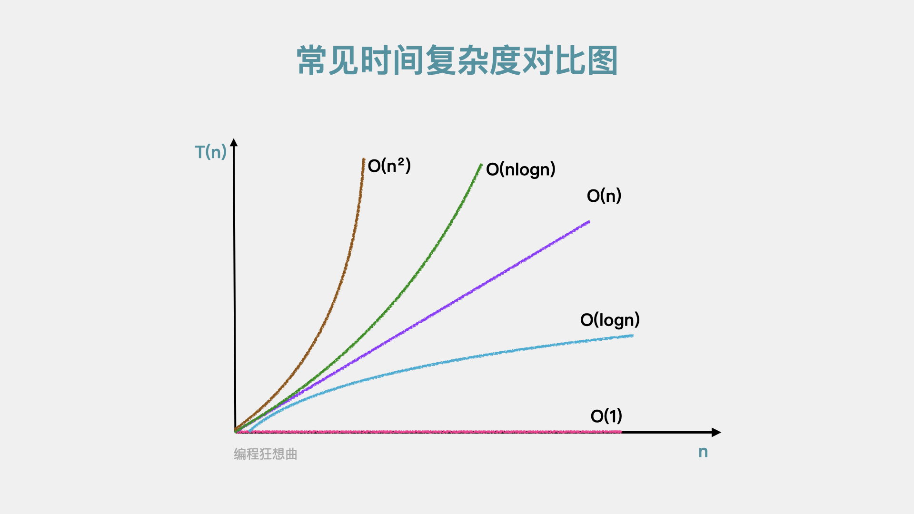
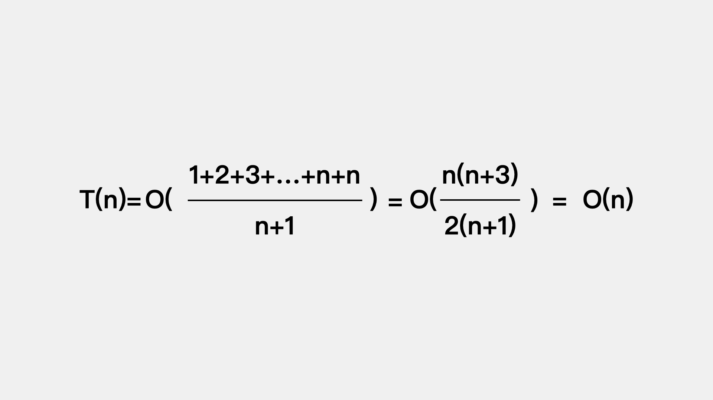

# 满满的一篇，全是复杂度分析核心知识点


今天分享的内容是算法的复杂度分析。

文章内容包括以下几点：
* 时间复杂度大O记法
* 时间复杂度分析
* 常见时间复杂度
* 最好、最坏、平均情况时间复杂度
* 均摊时间复杂度
* 空间复杂度


在淘宝或京东等电商平台进行网络购物时，当输入商品关键字时，就会出现相关的物品推荐；在高德地图上输入起始位置和目标位置，就会有相关路线推荐的推荐。这些APP之所以能根据几个关键字，就给出用户相关的推荐，是因为在其背后有算法在支撑。

提到算法，有两个问题是不可避免的，一个是时间复杂度，可以理解为算法的运行时间，如果算法运行时间太长，那这个算法就没法用；另一个是算法的空间复杂度，可以理解为把算法存储在计算机中需要多大的空间，如果需要空间太大，那这个算法也没法用。因此，需要对一个算法的时间复杂度和空间复杂度进行分析，来确定该算法的可行性。

时间复杂度的分析，一般有两种方法：
* 事后统计法
* 事前分析法


**事后统计法是用测试程序和数据来运行已编写好的算法，对其执行时间进行比较。** 这种方法看似可以精确的计算算法的执行时间，但存在一些不足：
* 一是使用事后统计法的一个前提是，算法已编写好，而编写算法需要大量时间和精力，同时测试程序和数据的准备也是耗时巨大的，这就会出现算法编写好了，测试之后发现用不了的情况，白白浪费大量时间和精力。
* 二是算法的运行依赖计算机硬件和软件因素。同一个算法在不同的计算机上执行时间是不一样的。在不确定这个算法会用在什么样的计算机上时，少量的测试结果不具备可靠性。
* 三是算法的执行时间受数据规模的影响。比如对于几个数字的排序，不论是使用选择排序还是插入排序，亦或是快速排序，其执行耗时的差异基本没有。

事前分析法是不依赖具体的测试程序和数据，根据统计方法对算法执行效率进行分析的方法。

## 01 时间复杂度大O记法

那么，如何在不运行代码的情况下对代码的执行效率进行分析呢？来看一个例子。

```java
public void calculateSum(int n) {
    int sum = 0; // 执行一次
    for(int i = 0; i < n; i++) { // 循环执行n次
        int base = i; // 循环执行n次
        for(int j = 0; j < n; j++) { // 循环执行n*n次
            sum += base + j; // 循环执行n*n次
        }
    }
}
```

假设每个代码语句每执行一次的耗时是一样的，记为unitTime，所有代码的执行时间，记作T(n)。基于此，上述代码的执行总耗时为T(n)=(1+n+n+n*n+n*n)unitTime=(2n²+2n+1)unitTime。

根据T(n)=(2n²+2n+1)unitTime，可以得出结论：**对于一个算法来说，其所有代码的执行总时间T(n)与其每行代码的执行次数n成正比。**

对于T(n)=(2n²+2n+1)unitTime来说，由于unitTime表示代码中一条语句执行一次的耗时，在这里要分析的是代码执行总时间T(n)和代码执行次数n之间的关系，因此可以不考虑unitTime。此外，2n²+2n+1表示的代码语句的执行总次数，可以将其抽象为f(n)=2n²+2n+1。也就是说，我们用f(n)来抽象表示一个算法的执行总次数。因此可以推导出所有代码的执行总时间T(n)和每行代码的执行次数n之间的关系是：
**T(n)=O(f(n))**

公式中的O表示代码的执行总时间T(n)和其执行总次数f(n)成正比。这种表示法，称之为大O记法。**大O记法T(n)=O(f(n))，表示随问题规模n的增大，算法执行时间的增长率和f(n)的增长率相同，表示的是算法的渐近时间复杂度，简称时间复杂度。**

## 02 时间复杂度分析

时间复杂度分析有一个基本的法则，就是四则运算法则。

一是加法法则，如果算法的代码是平行增加的，那么就需要加上相应的时间复杂度。

二是乘法法则，如果算法的代码增加的是循环内的嵌套或者函数的嵌套，那么就需要乘上相应的时间复杂度。

如下代码是我们在推导大O记法时用到的，最后推导出其时间复杂度是T(n)=O(2n²+2n+1)，在推导过程就用到了加法法则和乘法法则。

```java
public void calculateSum(int n) {
    int sum = 0; // 执行一次
    for(int i = 0; i < n; i++) { // 循环执行n次
        int base = i; // 循环执行n次
        for(int j = 0; j < n; j++) { // 循环执行n*n次 乘法法则
            sum += base + j; // 循环执行n*n次 乘法法则
        }
    }
}
```

第二行代码的时间复杂度是T2(n)=1;第三行、第四行代码的时间复杂度分别是T3(n)=O(n)，T4(n)=O(n)；第五行和第六行代码它们本身会执行n次，但由于是在循环内，所以根据乘法法则，其时间复杂度分别是T5(n)=O(n²)，T6(n)=O(n²)。

最后根据加法法则，整段代码的时间复杂度就是:

T(n)=T2(n)+T3(n)+T4(n)+T5(n)+T6(n)=O(1)+O(n)+O(n)+O(n²)+O(n²)=O(2n²+2n+1)

三是减法法则，如果是去掉算法中平行的代码，就需要减掉相应的时间复杂度。

四是除法法则，如果是去掉嵌套内的循环或函数，就需要除去相应的时间复杂度。

对于减法法则和除法法则就不做具体示例说明了，接着我们看下时间复杂度分析另外几个常用的结论：
* 加法常数项可以忽略
* 除去最高阶项，其它次项可以忽略
* 与最高次项相乘的常数可以忽略

接着依次解释下。

**加法常数项可以忽略**

如下图，算法B与算法A相比，在不同的执行次数下，算法B都是劣于算法A的。在将算法B的加法常数项1和算法A的加法常数项3去掉后，得到算法B1和算法A1，但此时，在不同的执行次数下，算法B1还是劣于算法A1。由此可知，加法常数项对算法的复杂度几乎无影响。



**除去最高阶项，其它次项可以忽略**

如下图，算法B相比于算法A，少了加法常数项2和次低项2n。但是，随着执行次数n的增大，算法A的执行效率越来越趋近与算法B。

因此，在进行算法的时间复杂度分析时，应主要关注最高阶项。



**与最高次项相乘的常数可以忽略**

如下图，随着执行次数n的增加，算法A开始劣于算法B。在将与算法A和算法B的高阶项相乘的常数去掉后，得到算法A1和算法B1。

对于算法A1和算法B1来说，随着执行次数n的增加，算法A1的执行效率还是劣于算法B1的执行效率。也就是说，在进行算法的时间复杂度分析时，与最高次项相乘的常数并不重要。



## 03 常见时间复杂度

常见时间复杂度主要有一下几种：



**常数阶 O(1)**

如下代码共有三行，每行代码都是只执行一次，因此这段代码的运行次数函数是f(n)=3。那么，按照大O记法，其时间复杂度是不是要记作T(n)=O(3)呢？

```java
public void sum(int n) {
    int sum = 0; // 执行一次
    sum = n*2; // 执行一次
    System.out.println(sum); // 执行一次
}
```

不是的，原因是大O记法中，有一个基本法则：**用常数1取代运行时间中的所有加法常数。因此，这段代码的时间复杂度是T(n)=O(1)。**

一般来说，对于这种与问题规模n无关，执行时间恒定的算法，其时间复杂度都记作O(1)，又称之为常数阶。

**对数阶 O(logn)**

如下代码所示，其时间复杂度是多少呢？

```java
public void logarithm(int n) {
    int count = 1;
    while (count <= n) {
        count = count*2;
    }
}
```

该段代码什么时候会停止执行呢？是当count大于n时。也就是说多少个2相乘后其结果值会大于n，即2^x=n。由2^x=n可以得到x=log2n，所以这段代码时间复杂度是O(log2n)。

**线性阶 O(n)**

线性阶表示代码要执行n次，如下for循环中的代码，第二行和第三行代码都执行n次，即f(n)=2n。根据前面的分析，与最高次项相乘的常数2是可以忽略的，因此这段代码的时间复杂度是O(n)。

```java
public void circle(int n) {
    for(int i = 0; i < n; i++) { // 执行n次
        System.out.println(i); // 执行n次
    }
}
```

**线性对数阶 O(nlogn)**

线性对数阶O(nlogn)就是将一段时间复杂度为O(logn)的代码执行n次，如下代码所示。

```java
public void logarithm(int n) {
    int count = 1;
    for(int i = 0; i < n; i++) {
        while (count <= n) {
            count = count*2;
        }
    }
}
```

**平方阶 O(n²)**

如下代码是个双重for循环，其内循环的时间复杂度是线性阶O(n)。对于外循环来说，是将内循环这个时间复杂度为O(n)代码在执行n次，所以整个这段代码的时间复杂度为O(n²)。

```java
public void square(int n) {
    for(int i = 0; i < n; i++){
        for(int j = 0; j <n; j++) {
            System.out.println(i+j);
        }
    }
}
```

当内层循环和外层循环的次数不一致时，时间复杂度又该怎么表示呢？如下，内层循环执行m次，其时间复杂度为O(m)，外层循环执行次数为n次，其时间复杂度为O(m)。整段代码的时间复杂度是就是O(m*n)，即循环的时间复杂度等于循环体的时间复杂度乘以该循环运行次数。

```java
public void square(int n, int m) {
    for(int i = 0; i < n; i++){
        for(int j = 0; j <m; j++) {
            System.out.println(i+j);
        }
    }
}
```

对于上述这些常见时间复杂度，它们的执行次数T(n)和问题规模n的关系如下图：



## 04 最好、最坏、平均情况时间复杂度

我们以判断一个目标值在数组中是否存在为例来看一下如何进行最好、最坏、平均情况时间复杂度的分析。我们假设目标值在数组中要么唯一存在要么不存在，代码如下：

```java
public boolean exist(int target, int[] arr) {
    boolean exist = false; // 执行一次
    int n = arr.length; // 执行一次
    for(int i = 0; i < n; i++) { // 执行n次
        if (arr[i] == target) { // 执行n次
            exist= true; // 执行一次
        }
    }
    return exist; // 执行一次
}
```

对于上述代码其总执行次数f(n)=2n+4，即其时间复杂度用大O记法表示是T(n)=O(2n+4)，根据之前的分析加法常数项和最高次项的常数项都可以忽略，因此T(n)=O(n)。

对于上述代码来说，由于已经假定目标值是唯一存在的，因此当在数组中找到目标值时，其后剩余元素就不用继续考察了。优化后的代码如下：

```java
public boolean exist(int target, int[] arr) {
    boolean exist = false; // 执行一次
    int n = arr.length; // 执行一次
    for(int i = 0; i < n; i++) { // 还是执行n次吗
        if (arr[i] == target) { // 还是执行n次吗
            exist= true; // 执行一次
            break;
        }
    }
    return exist; // 执行一次
}
```

对于优化后的代码来说，第四行和第五行不一定会执行n次。这时，上述的时间复杂度分析就不适用于这种情况了。

如果目标值存在于数组中第一个位置，那么数组中剩余元素就不用考虑了，因此上述代码的时间复杂度是O(1)。对于这种最理想情况的时间复杂度我们称之为**最好情况时间复杂度。**

如果目标值存在于数组中最后一个位置，那么数组中的每个元素都需要和目标值进行比较，因此上述代码的时间复杂度是O(n)。对于这种最坏情况下的时间复杂度我们称之为**最坏情况时间复杂度。**

但是，不论是最好情况还是最坏情况，都是极端情况下才会发生的，因此为了更好的表示一个算法的时间复杂度，我们需要引入**平均情况时间复杂度。**

还是以上述优化后的代码为例看下如何进行平均情况时间复杂度计算。目标值在数组中和目标值不在数组中是两个基本情况，当目标值在数组中时，其可能在数组中的任意位置，即对于判断目标值是否在数组中这个算法来说一共有n+1中情况。

我们把这n+1种情况下需要考察数组中的元素个数加起来在除以n+1，就可以得到一个平均情况时间复杂度，即：




## 05均摊时间复杂度

之前介绍的复杂度分析是基于一个算法从头运行到尾，我们来看其时间复杂度是怎么样的。有时，会出现一个算法的复杂度比较高，但是该算法是和其它操作是一起的，**在将这个较高复杂度的算法和其它操作一起进行复杂度分析时，需要将其均摊到其它操作上，这种分析称之为均摊复杂度分析。**

我们以如下代码来看下如何进行均摊复杂度分析。

```java
public class MyVector {

    private int[] data;
    private int size; // 数组中已存储的元素格式
    private int capacity; // 数组中可容纳的最大元素个数

    public MyVector() {
        data = new int[10];
        size= 0;
        capacity = 10;
    }
    
    // 向数组末尾添加元素
    public void pushBack(int e) {
        // 如果原有数组已满，则扩容为原数组的2倍
        if (size == capacity) {
            resize(2*capacity);
        }
        data[size++] = e;
    }

    public void resize(int newCapacity) {
        if (newCapacity < size) {
            return;
        }
        int[] newData = new int[newCapacity];
        // 把原有数组中的元素一次复制到新的数组中
        for(int i = 0; i < size; i++) {
            newData[i] = data[i];
        }

        data = newData;
        capacity = newCapacity;
    }
}
```

上述代码中的pushBack方法是每次向数组末尾添加一个元素，然后当数组满时，进行扩容，扩容为原有数组的2倍；resize方法是用于扩容的，所谓的扩容就是新开辟一个容量大小为newCapacity的数组，然后将原数组的元素依次复制到新数组中。根据之前对时间复杂度的分析，resize方法的时间复杂度T(n)=O(n)。

接着看下pushBack方法的时间复杂度。对于pushBack这个方法来说，其中有两个操作，一个是向数组末尾添加元素，每次执行添加操作时，时间复杂度是O(1)；一个是扩容，每次扩容的时间复杂度是O(n)。那么，pushBack方法的时间复杂度是O(n)吗？

扩容这一步，是在数组满的情况下才会触发执行，也就是在扩容之前，会有n次向数组末尾添加元素的操作，且每次操作耗时是1，总耗时为n。扩容操作在数组满时触发一次，耗时是n，即将数组添加满并进行扩容总共需要n+1次操作，这些操作总耗时是2n。

因此，在将扩容这个操作的耗时均摊到之前每次添加元素到数组末尾这个操作上时，每次操作耗时约为2，即将数组添加满并进行扩容操作，其时间复杂度不是O(n)，而是O(1)。这种时间复杂度分析的方法，称之为均摊时间复杂度分析。

## 06 空间复杂度

关于算法的空间复杂度《大话数据结构》这本书中是这么说的:

算法的空间复杂度通过计算算法所需的存储空间实现，算法空间复杂度的计算公式记作:S(n)=O(f(n))，其中n为问题的规模，f(n)为语句关于n所占存储空间的函数。

在平时的开发中更多的是用空间换时间，因此关于算法的空间复杂度就介绍到这里。


**更多内容扫描下方二维码关注公众号「编程狂想曲」查看**,如有错误可在公众号加我个人微信后指出
<p align='center'>

</p>